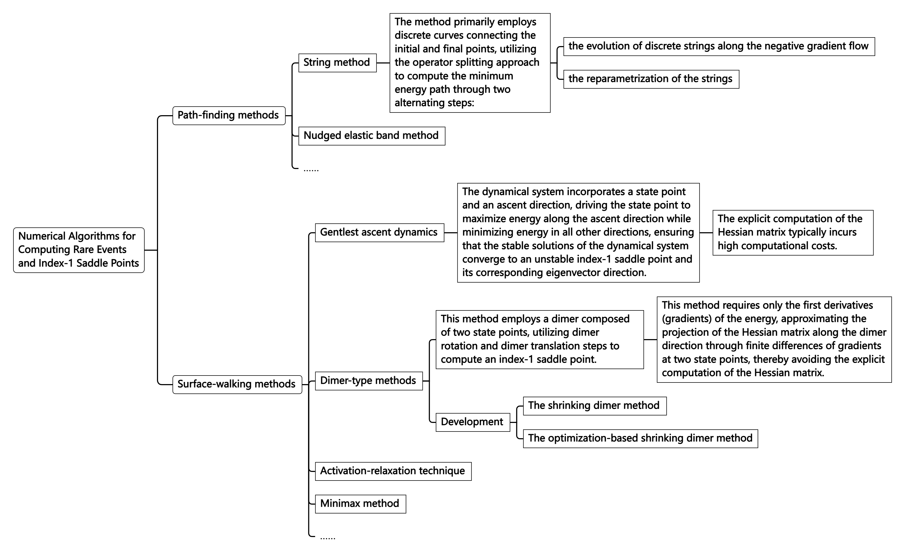

Many practical problems in physics, chemistry, and other fields can be
reduced to the problem of finding the minima of nonlinear functions or
functionals with multiple variables. These applications span materials
science, soft matter, condensed matter physics, life sciences, data
science, and more. A common feature of these multi-solution problems is
that the energy landscape corresponding to the function or functional of
the physical variables has many minima, each corresponding to a
metastable state in physics, with different minima separated by energy
barriers. These variables could represent the positions of amino acids
in protein folding, the atomic positions in atomic clusters, continuous
field variables describing the self-assembly of block copolymers, or the
parameters of neural networks, among others.

The equilibrium states of nonlinear problems correspond to the
stationary points (equilibrium points) that satisfy the equation
$\nabla E(\boldsymbol{x})=0$. Non-degenerate stationary points on the
energy landscape (i.e., points where the Hessian matrix has no zero
eigenvalues) can be classified using the Morse index from Morse theory.
The Morse index is the dimension of the largest negative definite
subspace of the Hessian matrix at the stationary point, which is
equivalent to the number of negative eigenvalues of the Hessian matrix.
Specifically, a stationary point with a Morse index of 0 corresponds to
a stable minimum, while an unstable saddle point has a non-zero Morse
index. For example, an index-$k$ saddle point is a stationary point
where the Hessian matrix has $k$ negative eigenvalues.

In particular, index-1 saddle points are often referred to as transition
states, which are points located on the smallest energy barrier between
two minima. The minimum energy path is a continuous curve on the energy
landscape connecting two minima via the transition state. Transition
states play a crucial role in many scientific fields, such as
identifying critical nuclei and transition paths in phase transitions,
calculating transition rates in chemical reactions, and applications in
biology.

Finding all stationary points is essential for understanding the energy
landscape. However, due to the instability of saddle points, computing
unstable saddle points is typically much more challenging than computing
stable minima. In recent years, many renowned mathematicians,
physicists, and chemists have developed a series of numerical algorithms
for computing rare events and index-1 saddle points. These algorithms
can be broadly divided into two categories (as shown in Figure 1):

*Figure 1:Numerical Algorithms for Computing Rare Events and Index-1 Saddle Points*

Compared to index-1 saddle points, the development of computational
methods for higher-index saddle points has been much slower. This is
partly because higher-index saddle points have more unstable directions,
rendering some techniques used for index-1 saddle point algorithms
inapplicable. Additionally, the physical significance and role of
higher-index saddle points in practical problems are not yet well
understood, providing insufficient motivation to address this issue. In
fact, many studies have pointed out that the number of higher-index
saddle points in nonlinear problems far exceeds that of minima and
index-1 saddle points. Therefore, finding all solutions of complex
systems and understanding the connections between different solutions
remains a very important and challenging scientific problem in
computational mathematics.

In recent years, we have proposed a new concept called the \"solution
landscape\". First, we define the solution landscape as a path diagram
that includes all solutions and the connections between them. Here, the
solutions encompass all stable minima and unstable saddle points, while
the path diagram describes the hierarchical structure where different
minima are connected by corresponding index-1 saddle points, and
lower-index saddle points are connected by higher-index saddle points,
as shown in Figure [2](#fig:enter-label){reference-type="ref"
reference="fig:enter-label"}. We can intuitively liken the solution
landscape to a family tree, where the first generation corresponds to
the highest-index saddle points of the system, and the youngest
generation represents the minima of the system. In this family tree, all
minima are not isolated; starting from the first generation, one can
follow a path to connect to every minimum.

*Figure 2:Illustration of the solution landscape, where $k$-saddle represents an index-$k$ saddle point*

Although the definition of the solution landscape is intuitive,
numerically computing the solution landscape remains highly challenging.
The main difficulty in constructing the solution landscape lies in
efficiently computing the various saddle points within it. Existing
methods for solving the nonlinear equation $\nabla E(\boldsymbol{x})=0$,
including homotopy methods and deflation techniques, can find multiple
equilibrium solutions. However, as more solutions are found, the
computation of the remaining equilibrium solutions requires increasingly
fine-tuning of initial guesses, making the process more difficult and
hard to determine whether all solutions have been found. Moreover, these
methods typically yield a collection of equilibrium solutions without
revealing the connections between different solutions. To overcome this
challenge, we have developed a new saddle point dynamics approach, which
transforms the computation of unstable higher-index saddle points into
finding stable solutions of higher-index saddle point dynamics. This
approach also provides the connections between different saddle points
and minima in the solution landscape.

# References

1. Zhang, L. (2023). Construction of solution landscapes for complex systems. _Mathematica Numerica Sinica_, ​**45**(3), 267-283. [https://doi.org/10.12286/jssx.j2023-1121](https://doi.org/10.12286/jssx.j2023-1121)
