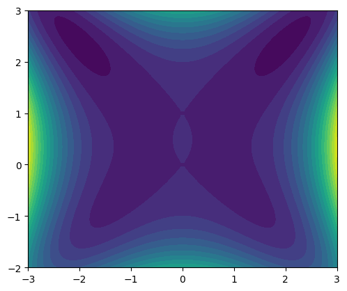

We test the example whose heatmap resembles a butterfly shape and the energy function is shown by 

$$
\begin{aligned}
E(x,y)=x^{4}-1.5x^{2}y^{2}+y^{4}-2y^{3}+y^{2}+x^{2}y-2x^{2}.
\end{aligned}
$$

First, we add the path of the `soluscape-1.0` directory to the system path.


```python
import sys
import os

sys.path.append(os.path.abspath(os.path.join(os.getcwd(), '..', 'soluscape-1.0')))
```

Then, we import the main class.


```python
from soluscape import Landscape
import numpy as np
# import packages needed
```

We define the energy function.


```python
energyfunction = 'x1**4 -1.5*x1**2*x2**2+ x2**4 - 2*x2**3 + x2**2 + x1**2*x2 - 2*x1**2' 
# given energy function
```


```python
# parameter initialization
x0 = np.array([0.1, 0.1]) # initial point
dt = 1e-2 # time step
k = 2 # the maximum index of saddle point
acceme = 'none'
maxiter = 10000 # max iter
```

We initialize the solver and run it.


```python
MyLandscape = Landscape(MaxIndex=k, AutoGrad=True, EnergyFunction=energyfunction, 
                        EigenMethod='euler', EigenMaxIter=1, InitialPoint=x0, 
                        TimeStep=dt, Acceleration=acceme, MaxIter=maxiter, 
                        EigenCombination='all', PerturbationNumber=1, 
                        PerturbationRadius=1e-2, Verbose=True, ReportInterval=100)
# Instantiation
MyLandscape.Run()
# Calculate
```

    HiSD Solver Configuration:
    ------------------------------
    [HiSD] Current parameters (initialized):
    [Config Sync] `Dim` parameter auto-adjusted to 2 based on `InitialPoint` dimensionality.
    Parameter `NumericalGrad` not specified - using default value False.
    Using `EnergyFunction` instead of `Grad` - enabling auto-differentiation mode.
    Parameter `Momentum` not specified - using default value 0.0.
    Parameter `BBStep` not specified - using default value False.
    Parameter `DimerLength` not specified - using default value 1e-05.
    Parameter `Tolerance` not specified - using default value 1e-06.
    Parameter `NesterovChoice` not specified - using default value 1.
    Parameter `SearchArea` not specified - using default value 1000.0.
    Parameter `NesterovRestart` not specified - using default value None.
    Parameter `HessianDimerLength` not specified - using default value 1e-05.
    Parameter `EigenStepSize` not specified - using default value 1e-05.
    Parameter `ExactHessian` not specified - using default value False.
    Parameter `PrecisionTol` not specified - using default value 1e-05.
    Parameter 'GradientSystem' not provided. Enabling automatic symmetry detection.
    Parameter 'SymmetryCheck' not provided. Defaulting to True with automatic detection.
    
    
    Gradient system detected. Activating HiSD algorithm.
    
    
    Landscape Configuration:
    ------------------------------
    [Landscape] Current parameters (initialized):
    Parameter `SameJudgementMethod` not specified - using default value <function LandscapeCheckParam.<locals>.<lambda> at 0x000002EBD1A2F240>.
    Parameter `PerturbationMethod` not specified - using default value uniform.
    Parameter `InitialEigenVectors` not specified - using default value None.
    Parameter `SaveTrajectory` not specified - using default value True.
    Parameter `MaxIndexGap` not specified - using default value 1.
    
    
    Start running:
    ------------------------------
    
    
    
    
    From initial point search index-2:
    ------------------------------
    
    
    Iteration: 100|| Norm of gradient: 0.176823
    Iteration: 200|| Norm of gradient: 0.084819
    Iteration: 300|| Norm of gradient: 0.032330
    Iteration: 400|| Norm of gradient: 0.011899
    Iteration: 500|| Norm of gradient: 0.004359
    Iteration: 600|| Norm of gradient: 0.001596
    Iteration: 700|| Norm of gradient: 0.000584
    Iteration: 800|| Norm of gradient: 0.000214
    Iteration: 900|| Norm of gradient: 0.000078
    Iteration: 1000|| Norm of gradient: 0.000029
    Iteration: 1100|| Norm of gradient: 0.000010
    Iteration: 1200|| Norm of gradient: 0.000004
    Iteration: 1300|| Norm of gradient: 0.000001
    Non-degenerate saddle point identified: Morse index =2 (number of negative eigenvalues).
    
    
    From saddle point (index-2, ID-0) search index-1:
    ------------------------------
    
    
    Iteration: 100|| Norm of gradient: 0.023111
    Iteration: 200|| Norm of gradient: 0.061258
    Iteration: 300|| Norm of gradient: 0.144118
    Iteration: 400|| Norm of gradient: 0.183221
    Iteration: 500|| Norm of gradient: 0.063280
    Iteration: 600|| Norm of gradient: 0.010152
    Iteration: 700|| Norm of gradient: 0.001384
    Iteration: 800|| Norm of gradient: 0.000184
    Iteration: 900|| Norm of gradient: 0.000024
    Iteration: 1000|| Norm of gradient: 0.000003
    Non-degenerate saddle point identified: Morse index =1 (number of negative eigenvalues).
    
    
    From saddle point (index-2, ID-0) search index-1:
    ------------------------------
    
    
    Iteration: 100|| Norm of gradient: 0.023108
    Iteration: 200|| Norm of gradient: 0.061250
    Iteration: 300|| Norm of gradient: 0.144105
    Iteration: 400|| Norm of gradient: 0.183230
    Iteration: 500|| Norm of gradient: 0.063294
    Iteration: 600|| Norm of gradient: 0.010155
    Iteration: 700|| Norm of gradient: 0.001384
    Iteration: 800|| Norm of gradient: 0.000184
    Iteration: 900|| Norm of gradient: 0.000024
    Iteration: 1000|| Norm of gradient: 0.000003
    Non-degenerate saddle point identified: Morse index =1 (number of negative eigenvalues).
    
    
    From saddle point (index-2, ID-0) search index-1:
    ------------------------------
    
    
    Iteration: 100|| Norm of gradient: 0.069550
    Iteration: 200|| Norm of gradient: 1.384067
    Iteration: 300|| Norm of gradient: 0.016423
    Iteration: 400|| Norm of gradient: 0.000428
    Iteration: 500|| Norm of gradient: 0.000011
    Non-degenerate saddle point identified: Morse index =1 (number of negative eigenvalues).
    
    
    From saddle point (index-2, ID-0) search index-1:
    ------------------------------
    
    
    Iteration: 100|| Norm of gradient: 0.070554
    Iteration: 200|| Norm of gradient: 1.382590
    Iteration: 300|| Norm of gradient: 0.016414
    Iteration: 400|| Norm of gradient: 0.000428
    Iteration: 500|| Norm of gradient: 0.000011
    Non-degenerate saddle point identified: Morse index =1 (number of negative eigenvalues).
    
    
    From saddle point (index-1, ID-1) search index-0:
    ------------------------------
    
    
    Iteration: 100|| Norm of gradient: 2.756656
    Iteration: 200|| Norm of gradient: 0.097628
    Iteration: 300|| Norm of gradient: 0.000156
    Non-degenerate saddle point identified: Morse index =0 (number of negative eigenvalues).
    
    
    From saddle point (index-1, ID-1) search index-0:
    ------------------------------
    
    
    Iteration: 100|| Norm of gradient: 2.764937
    Iteration: 200|| Norm of gradient: 0.095612
    Iteration: 300|| Norm of gradient: 0.000153
    Non-degenerate saddle point identified: Morse index =0 (number of negative eigenvalues).
    
    
    From saddle point (index-1, ID-2) search index-0:
    ------------------------------
    
    
    Iteration: 100|| Norm of gradient: 0.683724
    Iteration: 200|| Norm of gradient: 0.630702
    Iteration: 300|| Norm of gradient: 0.021770
    Iteration: 400|| Norm of gradient: 0.000515
    Iteration: 500|| Norm of gradient: 0.000012
    Non-degenerate saddle point identified: Morse index =0 (number of negative eigenvalues).
    
    
    From saddle point (index-1, ID-2) search index-0:
    ------------------------------
    
    
    Iteration: 100|| Norm of gradient: 0.694268
    Iteration: 200|| Norm of gradient: 0.622645
    Iteration: 300|| Norm of gradient: 0.021346
    Iteration: 400|| Norm of gradient: 0.000505
    Iteration: 500|| Norm of gradient: 0.000012
    Non-degenerate saddle point identified: Morse index =0 (number of negative eigenvalues).
    
    
    From saddle point (index-1, ID-3) search index-0:
    ------------------------------
    
    
    Iteration: 100|| Norm of gradient: 0.785689
    Iteration: 200|| Norm of gradient: 0.693273
    Iteration: 300|| Norm of gradient: 0.001260
    Iteration: 400|| Norm of gradient: 0.000002
    Non-degenerate saddle point identified: Morse index =0 (number of negative eigenvalues).
    
    
    From saddle point (index-1, ID-3) search index-0:
    ------------------------------
    
    
    Iteration: 100|| Norm of gradient: 0.554195
    Iteration: 200|| Norm of gradient: 0.361167
    Iteration: 300|| Norm of gradient: 0.010264
    Iteration: 400|| Norm of gradient: 0.000242
    Iteration: 500|| Norm of gradient: 0.000006
    Non-degenerate saddle point identified: Morse index =0 (number of negative eigenvalues).
    
    
    From saddle point (index-1, ID-4) search index-0:
    ------------------------------
    
    
    Iteration: 100|| Norm of gradient: 0.815094
    Iteration: 200|| Norm of gradient: 0.215346
    Iteration: 300|| Norm of gradient: 0.005622
    Iteration: 400|| Norm of gradient: 0.000132
    Iteration: 500|| Norm of gradient: 0.000003
    Non-degenerate saddle point identified: Morse index =0 (number of negative eigenvalues).
    
    
    From saddle point (index-1, ID-4) search index-0:
    ------------------------------
    
    
    Iteration: 100|| Norm of gradient: 1.425148
    Iteration: 200|| Norm of gradient: 0.275918
    Iteration: 300|| Norm of gradient: 0.000457
    Non-degenerate saddle point identified: Morse index =0 (number of negative eigenvalues).
    

We draw the search trajectory.


```python
MyLandscape.DrawTrajectory(ContourGridNum=100, ContourGridOut=25, DetailedTraj=True)
# Draw the search path.
```


    

    


We can also draw the solution landscape and save the data.


```python
MyLandscape.DrawConnection()
MyLandscape.Save('output\Ex_Butterfly')
# Save the data
```


    

    


Then, we save the search trajectory.


```python
import json

detail = MyLandscape.DetailRecord
output = {
            "Start ID": [row[1] for row in detail],
            "End ID": [row[0] for row in detail],
            "Path Positions": [row[2].tolist() for row in detail],
            "Path Times": [row[3].tolist() for row in detail]
        }

with open('output\Ex_ButterflyDetail.json', 'w') as f:
    json.dump(output, f)
```

Moreover, we can do more post-processing using the output data. We will generate the motiion graph of search trajectory as an example.


```python
import matplotlib.pyplot as plt
from matplotlib.animation import FuncAnimation
from matplotlib.colors import Colormap

def animateSL(fig: plt.Figure,
              ax: plt.Axes,
              saddleinfo: dict,
              trajinfo: dict,
              ColorsMI: Colormap = plt.get_cmap("tab10"),
              ColorTraj: list|str = "blue",
              dt_per_frame: float = 0.2,
              fps: int = None):
    IDs: list[int] = saddleinfo["IDs"] # Tags of saddles
    coords: list[np.ndarray] = saddleinfo["coords"] # Coordinates
    MIs: list[int] = saddleinfo["MIs"] # Morse indices
    parentIDs: list[list[int]] = saddleinfo["parentIDs"] # Parent saddles

    trajectories: list[np.ndarray] = trajinfo["trajectories"] # Trajectories
    times: list[np.ndarray] = trajinfo["times"] # times

    startIDs: list[int] = trajinfo["startIDs"] # Starting saddle"s tag
    endIDs: list[int] = trajinfo["endIDs"] # Ending saddle"s tag

    N_traj = len(trajectories) # Number of trajectories
    assert N_traj == len(times) == len(startIDs) == len(endIDs)
    for i, traj, time in zip(range(N_traj), trajectories, times):
        assert len(traj) == len(time), f"Different length of {i}-th trajectory and time"

    trajectoriesFrom: list[list[int]] = [[] for _ in range(len(IDs))]
    for i, startID in enumerate(startIDs):
        if startID >= 0:
            trajectoriesFrom[startID].append(i)

    colorSaddle: list[tuple] = [ColorsMI(MI) for MI in MIs]
    if isinstance(ColorTraj, str):
        colorTraj: list[str] = [ColorTraj] * N_traj

    ZORDER_TRAJ = 100000
    ZORDER_SADDLE = 200000
    ZORDER_TEXT = 300000

    if fps is None:
        fps = 1 / dt_per_frame
    
    lentraj = [len(traj) for traj in trajectories]

    saddleArtists = [ax.plot([], [], "o", color=colorSaddle[i], zorder=ZORDER_SADDLE)[0] for i in range(len(IDs))]
    trajArtists = [ax.plot([], [], color=colorTraj[i], zorder=ZORDER_TRAJ)[0] for i in range(N_traj)]
    startArtists = [ax.plot([], [], color=colorTraj[i], zorder=ZORDER_TRAJ, linestyle="--")[0] for i in range(N_traj)]
    endArtists = [ax.plot([], [], color=colorTraj[i], zorder=ZORDER_TRAJ, linestyle="--")[0] for i in range(N_traj)]

    _awakeMoment = np.ones(len(IDs)) * np.inf # Activation moment of each saddle
    _pendingTraj = []

    plotSaddle = lambda id: saddleArtists[id].set_data([coords[id][0]], [coords[id][1]])
    startTraj = lambda i: startArtists[i].set_data([coords[startIDs[i]][0], trajectories[i][0, 0]],
                                                   [coords[startIDs[i]][1], trajectories[i][0, 1]])
    endTraj = lambda i: endArtists[i].set_data([trajectories[i][-1, 0], coords[endIDs[i]][0]],
                                               [trajectories[i][-1, 1], coords[endIDs[i]][1]])

    def init_frame():
        nonlocal _awakeMoment, _pendingTraj
        for id, parentID in enumerate(parentIDs):
            if -1 in parentID:
                plotSaddle(id)
                _awakeMoment[id] = 0.0
                for i in trajectoriesFrom[id]:
                    startTraj(i)
                    _pendingTraj.append(i)
        return saddleArtists + trajArtists + startArtists + endArtists

    def frame_generator():
        nonlocal _awakeMoment, _pendingTraj
        pointer = np.zeros(N_traj, dtype=int)
        _pendingSaddle = []
        _pendingTraj_temp = []
        current_time = 0.0
        while _pendingTraj:
            current_time += dt_per_frame
            while _pendingTraj or _pendingSaddle:
                if _pendingTraj:
                    i = _pendingTraj.pop(0)
                    startID = startIDs[i]
                    while pointer[i] < lentraj[i] and times[i][pointer[i]] + _awakeMoment[startID] <= current_time:
                        pointer[i] += 1
                    trajArtists[i].set_data(trajectories[i][:pointer[i], 0], trajectories[i][:pointer[i], 1])
                    if pointer[i] == lentraj[i]:
                        endTraj(i)
                        endID = endIDs[i]
                        if not endID in _pendingSaddle:
                            _pendingSaddle.append(endID)
                        if _awakeMoment[endID] > times[i][-1] + _awakeMoment[startID]:
                            _awakeMoment[endID] = times[i][-1] + _awakeMoment[startID]
                            _pendingSaddle.sort(key=lambda id: _awakeMoment[id])
                    else:
                        _pendingTraj_temp.append(i)
                else:
                    id = _pendingSaddle.pop(0)
                    plotSaddle(id)
                    _pendingTraj += trajectoriesFrom[id]
            yield saddleArtists + trajArtists + startArtists + endArtists
            _pendingTraj = _pendingTraj_temp.copy()
            _pendingTraj_temp.clear()
    
    return FuncAnimation(fig,
                         lambda frame: frame,
                         frame_generator,
                         init_frame,
                         blit=True,
                         interval=dt_per_frame * 1000,
                         cache_frame_data=False)
```


```python
import json
dpi: float = 100
xlim = [-3, 3]
ylim = [-2, 3]

fig, ax = plt.subplots(dpi=dpi)
ax.set_xlim(xlim)
ax.set_ylim(ylim)
ax.set_aspect("equal")

x, y = np.meshgrid(np.linspace(xlim[0], xlim[1], 100), np.linspace(ylim[0], ylim[1], 100))
z = x**4 - 1.5*x**2*y**2 + y**4 - 2*y**3 + y**2 + x**2*y - 2*x**2 # SPECIFIC

contourf_args: dict = {"levels": 20}
if "levels" in contourf_args and contourf_args["levels"] >= 0:
    ax.contourf(x, y, z, **contourf_args)
```


    

    


```python
with open("output\Ex_Butterfly.json", "r") as f:
    saddle_data = json.load(f) # Load the data
saddleinfo = {"IDs": saddle_data["SaddleID"],
              "coords": np.array(saddle_data["Position"])[:, :, 0],
              "MIs": saddle_data["MorseIndex"],
              "parentIDs": saddle_data["FatherSet"]}

with open("output\Ex_ButterflyDetail.json", "r") as f:
    traj_data = json.load(f) # Load the data
trajinfo = {"trajectories": [np.array(traj) for traj in traj_data["Path Positions"]],
            "times": [time for time in traj_data["Path Times"]],
            "startIDs": traj_data["Start ID"],
            "endIDs": traj_data["End ID"]}

ani = animateSL(fig, ax, saddleinfo, trajinfo, dt_per_frame=0.02)
```

We can export the animation to different file types.


```python
ani.save("output\Ex_Butterfly.mp4", writer="ffmpeg") # Must install ffmpeg
```

The generated animated image is displayed as follows:


<video controls width="100%">
  <source src="https://raw.githubusercontent.com/HiSDpackage/soluscape/main/_Examples/output/Ex_Butterfly.mp4" type="video/mp4">
  Your browser does not support the video tag.
</video>
