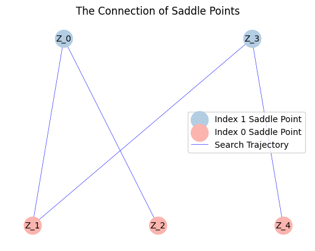

我们测试由Müller-Brown势函数给出的示例:

$$
\begin{aligned}
E_{MB}(x,y)=\sum_{i=1}^{4}A_{i}\exp [a_{i}(x-\bar{x}_{i})^{2}+b_{i}(x-\bar{x}_{i})(y-\bar{y}_{i})+c_{i}(y-\bar{y}_{i})^{2}].
\end{aligned}
$$

我们将参数设置为：

$$
\begin{aligned}
A &= [-200,-100,-170,15], \\
a &= [-1,-1,-6.5,0.7], b=[0,0,11,0.6], c=[-10,-10,-6.5,0.7], \\
\bar{x} &= [1,0,-0.5,-1], \bar{y}=[0,0.5,1.5,1].
\end{aligned}
$$

首先，我们将 `solscape-1.0` 目录的路径添加到系统路径中：


```python
import sys
import os

sys.path.append(os.path.abspath(os.path.join(os.getcwd(), '..', 'solscape-1.0')))

```

接着，我们导入主类：


```python
from solscape import Landscape
import numpy as np

# import packages needed
```

定义能量函数：


```python
MBP_energyfunc='-200*exp(-1*(x1-1)**2-10*(x2-0)**2)-100*exp(-1*(x1-0)**2-10*(x2-0.5)**2)-170*exp(-6.5*(x1+0.5)**2' \
'+11*(x1+0.5)*(x2-1.5)-6.5*(x2-1.5)**2)+15*exp(0.7*(x1+1)**2+0.6*(x1+1)*(x2-1)+0.7*(x2-1)**2)'
```

初始化求解器并运行它：


```python
# parameter initialization
x0 = np.array([0.15, 0.25]) # initial point
dt = 4e-4 # time step
k = 1 # the maximum index of saddle point
acceme = 'none' # use the heavy ball to accelerate
maxiter = 5000 # max iter
```


```python
MyLandscape = Landscape(MaxIndex=k, AutoGrad=True, ExactHessian=True, EnergyFunction=MBP_energyfunc, 
                        InitialPoint=x0, TimeStep=dt, Acceleration=acceme,
                        EigenStepSize=1e-7, MaxIter=maxiter,EigenMethod='euler', Verbose=True, ReportInterval=100)
# Instantiation
MyLandscape.Run()
# Calculate
```

    HiSD Solver Configuration:
    ------------------------------
    [HiSD] Current parameters (initialized):
    [Config Sync] `Dim` parameter auto-adjusted to 2 based on `InitialPoint` dimensionality.
    Parameter `NumericalGrad` not specified - using default value False.
    Using `EnergyFunction` instead of `Grad` - enabling auto-differentiation mode.
    Parameter `Momentum` not specified - using default value 0.0.
    Parameter `BBStep` not specified - using default value False.
    Parameter `DimerLength` not specified - using default value 1e-05.
    Parameter `Tolerance` not specified - using default value 1e-06.
    Parameter `NesterovChoice` not specified - using default value 1.
    Parameter `SearchArea` not specified - using default value 1000.0.
    Parameter `NesterovRestart` not specified - using default value None.
    Parameter `EigenMaxIter` not specified - using default value 10.
    Parameter `HessianDimerLength` not specified - using default value 1e-05.
    Parameter `PrecisionTol` not specified - using default value 1e-05.
    Parameter 'GradientSystem' not provided. Enabling automatic symmetry detection.
    Parameter 'SymmetryCheck' not provided. Defaulting to True with automatic detection.
    
    
    Gradient system detected. Activating HiOSD algorithm.
    
    
    Landscape Configuration:
    ------------------------------
    [Landscape] Current parameters (initialized):
    Parameter `SameJudgementMethod` not specified - using default value <function LandscapeCheckParam.<locals>.<lambda> at 0x00000171B807B380>.
    Parameter `PerturbationMethod` not specified - using default value uniform.
    Parameter `PerturbationRadius` not specified - using default value 0.0001.
    Parameter `InitialEigenVectors` not specified - using default value None.
    Parameter `PerturbationNumber` not specified - using default value 2.
    Parameter `SaveTrajectory` not specified - using default value True.
    Parameter `MaxIndexGap` not specified - using default value 1.
    Parameter `EigenCombination` not specified - using default value all.
    
    
    Start running:
    ------------------------------
    
    
    
    
    From initial point search index-1:
    ------------------------------
    
    
    Non-degenerate saddle point identified: Morse index =1 (number of negative eigenvalues).
    
    
    From saddle point (index-1, ID-0) search index-0:
    ------------------------------
    
    
    Iteration: 100|| Norm of gradient: 0.070045
    Iteration: 200|| Norm of gradient: 0.000007
    Non-degenerate saddle point identified: Morse index =0 (number of negative eigenvalues).
    
    
    From saddle point (index-1, ID-0) search index-0:
    ------------------------------
    
    
    Iteration: 100|| Norm of gradient: 0.000010
    Non-degenerate saddle point identified: Morse index =0 (number of negative eigenvalues).
    
    
    From saddle point (index-1, ID-0) search index-0:
    ------------------------------
    
    
    Iteration: 100|| Norm of gradient: 0.000011
    Non-degenerate saddle point identified: Morse index =0 (number of negative eigenvalues).
    
    
    From saddle point (index-1, ID-0) search index-0:
    ------------------------------
    
    
    Iteration: 100|| Norm of gradient: 0.073083
    Iteration: 200|| Norm of gradient: 0.000007
    Non-degenerate saddle point identified: Morse index =0 (number of negative eigenvalues).
    
我们可以绘制搜索轨迹。

```python
MyLandscape.DrawTrajectory(ContourGridNum=100, ContourGridOut=25, DetailedTraj=True)
# Draw the search path. But because of the large dimension, we cannot draw the picture.
```


    

    


我们也可以绘制解景观。


```python
MyLandscape.DrawConnection()
```


    

    


然而，这个解景观并不完整。我们从ID-1鞍点重新启动算法。


```python
MyLandscape.RestartFromSaddle(1,-np.array([[-0.01],[0]]),1)
# Calculate
```

    
    
    From initial point search index-1:
    ------------------------------
    
    
    Iteration: 100|| Norm of gradient: 3.005940
    Iteration: 200|| Norm of gradient: 0.692884
    Iteration: 300|| Norm of gradient: 0.000017
    Non-degenerate saddle point identified: Morse index =1 (number of negative eigenvalues).
    
    
    From saddle point (index-1, ID-3) search index-0:
    ------------------------------
    
    
    Iteration: 100|| Norm of gradient: 0.002506
    Non-degenerate saddle point identified: Morse index =0 (number of negative eigenvalues).
    
    
    From saddle point (index-1, ID-3) search index-0:
    ------------------------------
    
    
    Iteration: 100|| Norm of gradient: 0.349978
    Iteration: 200|| Norm of gradient: 0.000033
    Non-degenerate saddle point identified: Morse index =0 (number of negative eigenvalues).
    
    
    From saddle point (index-1, ID-3) search index-0:
    ------------------------------
    
    
    Iteration: 100|| Norm of gradient: 0.392811
    Iteration: 200|| Norm of gradient: 0.000038
    Non-degenerate saddle point identified: Morse index =0 (number of negative eigenvalues).
    
    
    From saddle point (index-1, ID-3) search index-0:
    ------------------------------
    
    
    Iteration: 100|| Norm of gradient: 0.003133
    Non-degenerate saddle point identified: Morse index =0 (number of negative eigenvalues).
    


```python
MyLandscape.DrawTrajectory(ContourGridNum=100, ContourGridOut=25, DetailedTraj=True)
# Draw the search path. But because of the large dimension, we cannot draw the picture.
```


    

    


从输出结果中，我们可以得到一个完整的解景观。


```python
MyLandscape.DrawConnection()
MyLandscape.Save('output\Ex_MBP','pickle')
# Save the data
```


    

    


    

    

