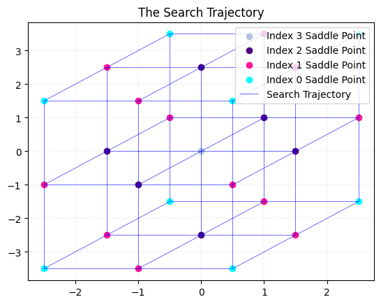
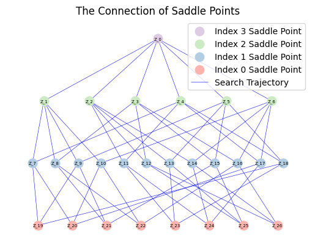

We test the example whose energy function is shown by 
\begin{aligned}
E(x)=\sum_{j=1}^{n}j(x_{j}^{2}-1)^{2}.
\end{aligned}

In particular,we take $n=3$.It is obvious that there are 27 saddle points 
$$
(a,b,c),a,b,c \in \{-1,0,1\}
$$
who happen to be the vertices, face centers, and body center of a cube.

First, we add the path of the `soluscape-1.0` directory to the system path.


```python
import sys
import os

sys.path.append(os.path.abspath(os.path.join(os.getcwd(), '..', 'soluscape-1.0')))

```

Then, we import the main class.


```python
from soluscape import Landscape
import numpy as np

# import packages needed
```

We define the energy function in 3-D.


```python
energyfunction=""
for i in range(3):
    energyfunction+=str(i+1)+"*(x"+str(i+1)+"**2-1)**2+"
energyfunction=energyfunction[:-1]
```

We initialize the solver and run it.


```python
# parameter initialization
x0 = np.array([0 for i in range(3)]) # initial point
dt = 1e-3 # time step
k = 3 # the maximum index of saddle point
acceme = 'nesterov'
neschoice = 2
nesres = 100
mom = 0.8
maxiter = 1000 # max iter
```


```python
MyLandscape = Landscape(MaxIndex=k, AutoGrad=True, EnergyFunction=energyfunction, InitialPoint=x0, 
                        TimeStep=dt, Acceleration=acceme, EigenCombination='all',
                        EigenMethod='euler', BBStep=False, NesterovChoice=neschoice, NesterovRestart=nesres, 
                        Momentum=mom, MaxIter=maxiter, Verbose=True, ReportInterval=100, 
                        EigenMaxIter=10, PerturbationRadius=1e-2)
# Instantiation
MyLandscape.Run()
# Calculate
```

    HiSD Solver Configuration:
    ------------------------------
    [HiSD] Current parameters (initialized):
    [Config Sync] `Dim` parameter auto-adjusted to 3 based on `InitialPoint` dimensionality.
    Parameter `NumericalGrad` not specified - using default value False.
    Using `EnergyFunction` instead of `Grad` - enabling auto-differentiation mode.
    Parameter `DimerLength` not specified - using default value 1e-05.
    Parameter `Tolerance` not specified - using default value 1e-06.
    Parameter `SearchArea` not specified - using default value 1000.0.
    Parameter `HessianDimerLength` not specified - using default value 1e-05.
    Parameter `EigenStepSize` not specified - using default value 1e-05.
    Parameter `ExactHessian` not specified - using default value False.
    Parameter `PrecisionTol` not specified - using default value 1e-05.
    Parameter 'GradientSystem' not provided. Enabling automatic symmetry detection.
    Parameter 'SymmetryCheck' not provided. Defaulting to True with automatic detection.
    
    
    Gradient system detected. Activating HiOSD algorithm.
    
    
    Landscape Configuration:
    ------------------------------
    [Landscape] Current parameters (initialized):
    Parameter `SameJudgementMethod` not specified - using default value <function LandscapeCheckParam.<locals>.<lambda> at 0x00000250D34C2B60>.
    Parameter `PerturbationMethod` not specified - using default value uniform.
    Parameter `InitialEigenVectors` not specified - using default value None.
    Parameter `PerturbationNumber` not specified - using default value 2.
    Parameter `SaveTrajectory` not specified - using default value True.
    Parameter `MaxIndexGap` not specified - using default value 1.
    
    
    Start running:
    ------------------------------
    
    
    
    
    From initial point search index-3:
    ------------------------------
    
    
    Iteration: 100|| Norm of gradient: 0.000395
    Iteration: 200|| Norm of gradient: 0.000011
    Non-degenerate saddle point identified: Morse index =3 (number of negative eigenvalues).
    
    
    From saddle point (index-3, ID-0) search index-2:
    ------------------------------
    
    
    Iteration: 100|| Norm of gradient: 0.701095
    Iteration: 200|| Norm of gradient: 0.120058
    Iteration: 300|| Norm of gradient: 0.002034
    Iteration: 400|| Norm of gradient: 0.000060
    Non-degenerate saddle point identified: Morse index =2 (number of negative eigenvalues).
    
    
    From saddle point (index-3, ID-0) search index-2:
    ------------------------------
    
    
    Iteration: 100|| Norm of gradient: 0.701121
    Iteration: 200|| Norm of gradient: 0.120000
    Iteration: 300|| Norm of gradient: 0.002032
    Iteration: 400|| Norm of gradient: 0.000059
    Non-degenerate saddle point identified: Morse index =2 (number of negative eigenvalues).
    
    
    From saddle point (index-3, ID-0) search index-2:
    ------------------------------
    
    
    Iteration: 100|| Norm of gradient: 0.877872
    Iteration: 200|| Norm of gradient: 0.157527
    Iteration: 300|| Norm of gradient: 0.006545
    Iteration: 400|| Norm of gradient: 0.000194
    Non-degenerate saddle point identified: Morse index =2 (number of negative eigenvalues).
    
    
    From saddle point (index-3, ID-0) search index-2:
    ------------------------------
    
    
    Iteration: 100|| Norm of gradient: 0.877896
    Iteration: 200|| Norm of gradient: 0.157552
    Iteration: 300|| Norm of gradient: 0.006546
    Iteration: 400|| Norm of gradient: 0.000194
    Non-degenerate saddle point identified: Morse index =2 (number of negative eigenvalues).
    
    
    From saddle point (index-3, ID-0) search index-2:
    ------------------------------
    
    
    Iteration: 100|| Norm of gradient: 3.268317
    Iteration: 200|| Norm of gradient: 0.001273
    Iteration: 300|| Norm of gradient: 0.000014
    Non-degenerate saddle point identified: Morse index =2 (number of negative eigenvalues).
    
    
    From saddle point (index-3, ID-0) search index-2:
    ------------------------------
    
    
    Iteration: 100|| Norm of gradient: 3.268640
    Iteration: 200|| Norm of gradient: 0.001272
    Iteration: 300|| Norm of gradient: 0.000014
    Non-degenerate saddle point identified: Morse index =2 (number of negative eigenvalues).
    
    
    From saddle point (index-3, ID-0) search index-2:
    ------------------------------
    
    
    Iteration: 100|| Norm of gradient: 2.725669
    Iteration: 200|| Norm of gradient: 0.289363
    Iteration: 300|| Norm of gradient: 0.000828
    Non-degenerate saddle point identified: Morse index =2 (number of negative eigenvalues).
    
    
    From saddle point (index-3, ID-0) search index-2:
    ------------------------------
    
    
    Iteration: 100|| Norm of gradient: 2.725944
    Iteration: 200|| Norm of gradient: 0.289275
    Iteration: 300|| Norm of gradient: 0.000828
    Non-degenerate saddle point identified: Morse index =2 (number of negative eigenvalues).
    
    
    From saddle point (index-3, ID-0) search index-2:
    ------------------------------
    
    
    Iteration: 100|| Norm of gradient: 2.721569
    Iteration: 200|| Norm of gradient: 0.019025
    Iteration: 300|| Norm of gradient: 0.000049
    Non-degenerate saddle point identified: Morse index =2 (number of negative eigenvalues).
    
    
    From saddle point (index-3, ID-0) search index-2:
    ------------------------------
    
    
    Iteration: 100|| Norm of gradient: 2.721581
    Iteration: 200|| Norm of gradient: 0.019025
    Iteration: 300|| Norm of gradient: 0.000049
    Non-degenerate saddle point identified: Morse index =2 (number of negative eigenvalues).
    
    
    From saddle point (index-3, ID-0) search index-2:
    ------------------------------
    
    
    Iteration: 100|| Norm of gradient: 2.739767
    Iteration: 200|| Norm of gradient: 0.018057
    Iteration: 300|| Norm of gradient: 0.000046
    Non-degenerate saddle point identified: Morse index =2 (number of negative eigenvalues).
    
    
    From saddle point (index-3, ID-0) search index-2:
    ------------------------------
    
    
    Iteration: 100|| Norm of gradient: 2.739761
    Iteration: 200|| Norm of gradient: 0.018057
    Iteration: 300|| Norm of gradient: 0.000046
    Non-degenerate saddle point identified: Morse index =2 (number of negative eigenvalues).
    
    
    From saddle point (index-2, ID-1) search index-1:
    ------------------------------
    
    
    Iteration: 100|| Norm of gradient: 0.002719
    Iteration: 200|| Norm of gradient: 0.002087
    Iteration: 300|| Norm of gradient: 0.000004
    Non-degenerate saddle point identified: Morse index =1 (number of negative eigenvalues).
    
    
    From saddle point (index-2, ID-1) search index-1:
    ------------------------------
    
    
    Iteration: 100|| Norm of gradient: 0.002773
    Iteration: 200|| Norm of gradient: 0.002087
    Iteration: 300|| Norm of gradient: 0.000004
    Non-degenerate saddle point identified: Morse index =1 (number of negative eigenvalues).

    

......([For the complete results, please refer to the file in the GitHub repository](https://github.com/HiSDpackage/soluscape/blob/main/_Examples/Ex_3_Cubic.ipynb))

    


Because the system is 3-D, we define a projection function to draw the trajectory.


```python
def proj_func(input):
    output = np.hstack((1.0 * input[:, [0]]+ 1.5 * input[:, [1]], 1.0 * input[:, [0]]+ 2.5 * input[:, [2]]))
    return output
```


```python
MyLandscape.DrawTrajectory(ContourGridNum=100, ContourGridOut=25, Projection=proj_func)
# Draw the search path. But because of the large dimension, we cannot draw the picture.
```

    [WARNING] Contour plot and heatmap cannot be generated after projection because the projection function may not be injective.
    


    

    


We can also draw the solution landscape and save the data.


```python
MyLandscape.DrawConnection()
MyLandscape.Save('output\Ex_Cubic','mat')
# Save the data
```


    

    


    
