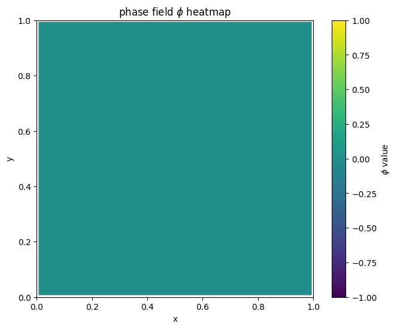
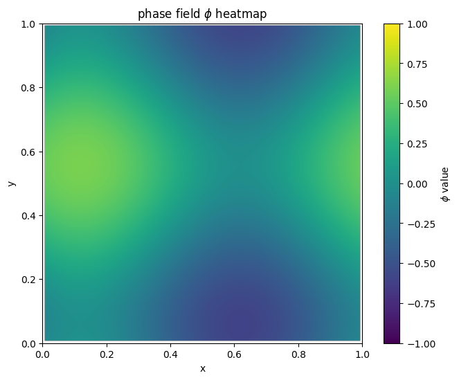
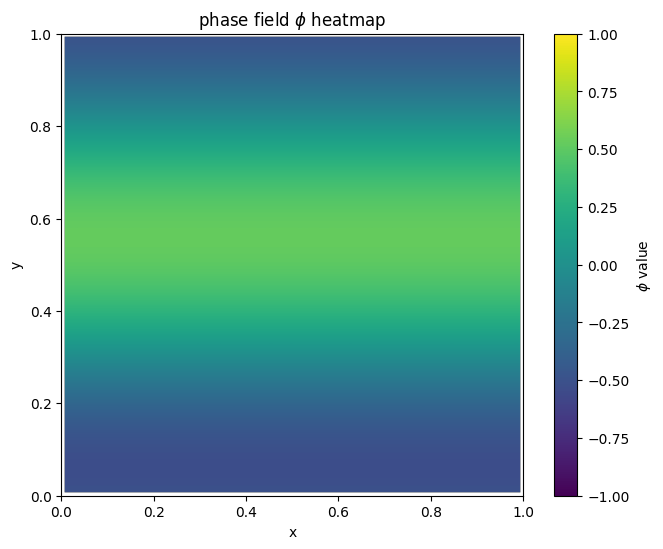

```python
import sys
import os

# 将 code 文件夹添加到系统路径中
sys.path.append(os.path.abspath(os.path.join(os.getcwd(), '..', 'depart-code')))

```


```python
import Landscape
import numpy as np

# import packages needed
```
For a 2D phase field model:

$$
E(\phi) = \int_{\Omega} \left( \frac{\kappa}{2} |\nabla \phi|^2 + \frac{1}{4} (1 - \phi^2)^2 \right) dx
$$

The Allen-Cahn equation is:

$$
\dot{\phi} = \kappa \Delta \phi + \phi - \phi^3
$$

We consider $\Omega = [0,1]^{2}$ with periodic boundary condition. 
We discrete it using finite difference scheme of mesh grids $64 \times 64$. 

```python
import numpy as np
from scipy.ndimage import convolve

def gradient_PF(x, opt):
    kappa = opt['kappa']
    n2 = len(x)
    n = int(np.sqrt(n2))
    phi = x.reshape(n, n)
    h = opt['h']

    # 定义二阶导数卷积核 (3x3)
    D2 = np.array([[0, 1, 0],
                   [1, -4, 1],
                   [0, 1, 0]]) / h**2

    # 执行循环卷积（对应 MATLAB 的 'circular'）
    conv_term = convolve(phi, D2, mode='wrap')

    # 计算 F 的表达式
    F = -(kappa * conv_term + phi - phi**3)

    # 重塑为列向量
    return F.reshape(n2, 1)

```


```python
def SameSaddle(x, y):
    """
    验证是否可以通过平移操作使得两个二维数组的误差不超过epsilon。

    参数:
    A (numpy.ndarray): 第一个二维数组，形状为(64, 64)。
    B (numpy.ndarray): 第二个二维数组，形状为(64, 64)。
    epsilon (float): 允许的最大误差阈值。

    返回:
    bool: 如果存在平移使得所有元素误差不超过epsilon，返回True，否则返回False。
    """
    n= 64
    A = x.reshape(n,n)
    B = y.reshape(n,n)
    epsilon = 0.05
    # 预计算所有行和列的索引
    row_indices = np.array([(np.arange(n) - dx) % n for dx in range(n)])
    col_indices = np.array([(np.arange(n) - dy) % n for dy in range(n)])

    # 预计算所有行平移后的B数组
    row_shifted = np.zeros((n, n, n), dtype=B.dtype)
    for dx in range(n):
        row_shifted[dx] = B[row_indices[dx], :]

    # 遍历所有可能的平移量
    for dx in range(n):
        for dy in range(n):
            # 获取列平移后的数组
            shifted_B = row_shifted[dx][:, col_indices[dy]]
            # 计算最大绝对误差
            max_diff = np.max(np.abs(A - shifted_B))
            if max_diff <= epsilon:
                return True
    return False

```


```python
# 示例输入
N=64
opt = {
    'kappa': 0.02,
    'N': N,
    'h': 1/N,
}

GradFunc = lambda x: gradient_PF(x, opt)

```


```python
# parameter initialization
N = 64
x0 = np.array([0 for i in range(N**2)]) # initial point
dt = 1e-2 # time step
k = 5 # the index of expected saddle point
acceme = 'nesterov'
neschoice = 1
nesres = 200
mom = 0.8
maxiter = 2000 # max iter
```


```python
MyLandscape = Landscape.Landscape(MaxIndex=k, WhetherAutoGrad=False, Grad=GradFunc, DimerLength=1e-3, LOfCalEigen=1e-3, DSOfEuler=1e-7, InitialPoint=x0, TimeStep=dt, AccelerateMethod=acceme, SearchArea=1e4, WhetherCheckSym=False,Tolerance=1e-4, MaxSearchGapOfIndex=3, CombinationOrder='min',
                   WhetherBBStep=True, NesterovChoice=neschoice, NesterovRestart=nesres, Momentum=mom, MaxIter=maxiter, WhetherReport=True, PrintStepInterval=10, MaxIterOfCalEigen=2, PerturbationNumber=1,SameJudgementMethod=SameSaddle, PerturbationLength=5.0)
# Instantiation
MyLandscape.run()
# Calculate
```

    Parameters of HiSD solver:
    According to the dimension if the 'InitialPoint' parameter, the 'Dim'parameter was automatically set as 4096.
    The 'InexactGrad' parameter was not passed in. Default value False was used.
    The 'EigenMethod' parameter was not passed in. Default value lobpcg was used.
    The 'ExactHessian' parameter was not passed in. Default value False was used.
    The system is not a gradient system, where GHiSD is used!
    Lobpcg method can not be used in Non-gradient system. Using power method as an alternative.
    Parameters of Landscape:
    The 'PerturbationMethod' parameter was not passed in. Default value uniform was used
    The 'InitialEigenVectors' parameter was not passed in. Default value None was used
    The 'WhetherSaveDetail' parameter was not passed in. Default value True was used
    The index of the final saddle point is 5.
    Iteration: 10|| Norm of gradient: 619.346136
    Iteration: 20|| Norm of gradient: 16.083373
    Iteration: 30|| Norm of gradient: 2.488944
    Iteration: 40|| Norm of gradient: 0.980796
    Iteration: 50|| Norm of gradient: 0.574637
    Iteration: 60|| Norm of gradient: 0.378629
    Iteration: 70|| Norm of gradient: 0.267255
    Iteration: 80|| Norm of gradient: 0.207545
    Iteration: 90|| Norm of gradient: 0.154422
    Iteration: 100|| Norm of gradient: 0.119420
    Iteration: 110|| Norm of gradient: 0.097449
    Iteration: 120|| Norm of gradient: 0.080215
    Iteration: 130|| Norm of gradient: 0.067141
    Iteration: 140|| Norm of gradient: 0.058299
    Iteration: 150|| Norm of gradient: 0.052993
    Iteration: 160|| Norm of gradient: 0.050370
    Iteration: 170|| Norm of gradient: 0.048548
    Iteration: 180|| Norm of gradient: 0.054746
    Iteration: 190|| Norm of gradient: 0.076002
    Iteration: 200|| Norm of gradient: 0.074170
    Iteration: 210|| Norm of gradient: 0.075175
    Iteration: 220|| Norm of gradient: 3.217345
    Iteration: 230|| Norm of gradient: 0.470796
    Iteration: 240|| Norm of gradient: 1.768606
    Iteration: 250|| Norm of gradient: 11.320682
    Iteration: 260|| Norm of gradient: 7.564030
    Iteration: 270|| Norm of gradient: 5.213437
    Iteration: 280|| Norm of gradient: 2.340070
    Iteration: 290|| Norm of gradient: 1.602305
    Iteration: 300|| Norm of gradient: 3.511633
    Iteration: 310|| Norm of gradient: 2.903247
    Iteration: 320|| Norm of gradient: 5.591401
    Iteration: 330|| Norm of gradient: 2.871595
    Iteration: 340|| Norm of gradient: 5.043487
    Iteration: 350|| Norm of gradient: 4.549599
    Iteration: 360|| Norm of gradient: 4.023123
    Iteration: 370|| Norm of gradient: 3.186957
    Iteration: 380|| Norm of gradient: 4.708849
    Iteration: 390|| Norm of gradient: 3.869570
    Iteration: 400|| Norm of gradient: 3.376282
    Iteration: 410|| Norm of gradient: 0.703372
    Iteration: 420|| Norm of gradient: 0.665870
    Iteration: 430|| Norm of gradient: 0.630158
    Iteration: 440|| Norm of gradient: 0.595754
    Iteration: 450|| Norm of gradient: 0.559233
    Iteration: 460|| Norm of gradient: 0.519038
    Iteration: 470|| Norm of gradient: 0.474960
    Iteration: 480|| Norm of gradient: 0.428004
    Iteration: 490|| Norm of gradient: 0.379700
    Iteration: 500|| Norm of gradient: 0.331597
    Iteration: 510|| Norm of gradient: 0.285274
    Iteration: 520|| Norm of gradient: 0.242443
    Iteration: 530|| Norm of gradient: 0.204760
    Iteration: 540|| Norm of gradient: 0.173455
    Iteration: 550|| Norm of gradient: 0.149760
    Iteration: 560|| Norm of gradient: 0.309063
    Iteration: 570|| Norm of gradient: 0.097444
    Iteration: 580|| Norm of gradient: 0.088064
    Iteration: 590|| Norm of gradient: 0.231008
    Iteration: 600|| Norm of gradient: 0.162877
    Iteration: 610|| Norm of gradient: 0.130110
    Iteration: 620|| Norm of gradient: 0.112499
    Iteration: 630|| Norm of gradient: 0.101875
    Iteration: 640|| Norm of gradient: 0.094142
    Iteration: 650|| Norm of gradient: 0.087701
    Iteration: 660|| Norm of gradient: 0.081261
    Iteration: 670|| Norm of gradient: 0.074248
    Iteration: 680|| Norm of gradient: 0.066777
    Iteration: 690|| Norm of gradient: 0.077409
    Iteration: 700|| Norm of gradient: 0.045900
    Iteration: 710|| Norm of gradient: 0.043174
    Iteration: 720|| Norm of gradient: 0.045666
    Iteration: 730|| Norm of gradient: 0.068482
    Iteration: 740|| Norm of gradient: 0.071443
    Iteration: 750|| Norm of gradient: 0.059650
    Iteration: 760|| Norm of gradient: 0.052077
    Iteration: 770|| Norm of gradient: 0.052032
    Iteration: 780|| Norm of gradient: 0.046406
    Iteration: 790|| Norm of gradient: 0.051779
    Iteration: 800|| Norm of gradient: 0.051935
    Iteration: 810|| Norm of gradient: 0.039899
    Iteration: 820|| Norm of gradient: 0.037903
    Iteration: 830|| Norm of gradient: 0.036179
    Iteration: 840|| Norm of gradient: 0.034580
    Iteration: 850|| Norm of gradient: 0.032736
    Iteration: 860|| Norm of gradient: 0.030640
    Iteration: 870|| Norm of gradient: 0.028385
    Iteration: 880|| Norm of gradient: 0.026023
    Iteration: 890|| Norm of gradient: 0.023598
    Iteration: 900|| Norm of gradient: 0.021409
    Iteration: 910|| Norm of gradient: 0.058408
    Iteration: 920|| Norm of gradient: 0.027546
    Iteration: 930|| Norm of gradient: 0.049420
    Iteration: 940|| Norm of gradient: 0.111473
    Iteration: 950|| Norm of gradient: 0.022343
    Iteration: 960|| Norm of gradient: 0.337680
    Iteration: 970|| Norm of gradient: 0.259532
    Iteration: 980|| Norm of gradient: 0.235828
    Iteration: 990|| Norm of gradient: 0.239848
    Iteration: 1000|| Norm of gradient: 0.256012
    Iteration: 1010|| Norm of gradient: 0.241480
    Iteration: 1020|| Norm of gradient: 0.232255
    Iteration: 1030|| Norm of gradient: 0.220522
    Iteration: 1040|| Norm of gradient: 0.206808
    Iteration: 1050|| Norm of gradient: 0.190918
    Iteration: 1060|| Norm of gradient: 0.173245
    Iteration: 1070|| Norm of gradient: 0.154370
    Iteration: 1080|| Norm of gradient: 0.134863
    Iteration: 1090|| Norm of gradient: 0.115297
    Iteration: 1100|| Norm of gradient: 0.096208
    Iteration: 1110|| Norm of gradient: 0.078055
    Iteration: 1120|| Norm of gradient: 0.061219
    Iteration: 1130|| Norm of gradient: 0.046018
    Iteration: 1140|| Norm of gradient: 0.032733
    Iteration: 1150|| Norm of gradient: 0.028474
    Iteration: 1160|| Norm of gradient: 0.021542
    Iteration: 1170|| Norm of gradient: 0.021747
    Iteration: 1180|| Norm of gradient: 0.034579
    Iteration: 1190|| Norm of gradient: 0.008371
    Iteration: 1200|| Norm of gradient: 0.008749
    Iteration: 1210|| Norm of gradient: 0.004287
    Iteration: 1220|| Norm of gradient: 0.003568
    Iteration: 1230|| Norm of gradient: 0.003178
    Iteration: 1240|| Norm of gradient: 0.002971
    Iteration: 1250|| Norm of gradient: 0.002755
    Iteration: 1260|| Norm of gradient: 0.002511
    Iteration: 1270|| Norm of gradient: 0.002259
    Iteration: 1280|| Norm of gradient: 0.002004
    Iteration: 1290|| Norm of gradient: 0.001752
    Iteration: 1300|| Norm of gradient: 0.001513
    Iteration: 1310|| Norm of gradient: 0.001293
    Iteration: 1320|| Norm of gradient: 0.001097
    Iteration: 1330|| Norm of gradient: 0.000932
    Iteration: 1340|| Norm of gradient: 0.000797
    Iteration: 1350|| Norm of gradient: 0.000857
    Iteration: 1360|| Norm of gradient: 0.000750
    Iteration: 1370|| Norm of gradient: 0.002054
    Iteration: 1380|| Norm of gradient: 0.001055
    Iteration: 1390|| Norm of gradient: 0.001363
    Iteration: 1400|| Norm of gradient: 0.007116
    Iteration: 1410|| Norm of gradient: 0.001791
    Iteration: 1420|| Norm of gradient: 0.001709
    Iteration: 1430|| Norm of gradient: 0.001631
    Iteration: 1440|| Norm of gradient: 0.001539
    Iteration: 1450|| Norm of gradient: 0.001431
    Iteration: 1460|| Norm of gradient: 0.001310
    Iteration: 1470|| Norm of gradient: 0.001179
    Iteration: 1480|| Norm of gradient: 0.001041
    Iteration: 1490|| Norm of gradient: 0.000901
    Iteration: 1500|| Norm of gradient: 0.000761
    Iteration: 1510|| Norm of gradient: 0.000625
    Iteration: 1520|| Norm of gradient: 0.000496
    Iteration: 1530|| Norm of gradient: 0.000374
    Iteration: 1540|| Norm of gradient: 0.000306
    Iteration: 1550|| Norm of gradient: 0.000253
    Iteration: 1560|| Norm of gradient: 0.000592
    The final saddle point has 0 as an eigenvalue. It's a critical saddle point.
    It has 2 negative eigenvalues, 2 0 eigenvalues and 4092 eigenvalues.
    Iteration: 10|| Norm of gradient: 619.346136
    Iteration: 20|| Norm of gradient: 16.083373
    Iteration: 30|| Norm of gradient: 2.488944
    Iteration: 40|| Norm of gradient: 0.980796
    Iteration: 50|| Norm of gradient: 0.574637
    Iteration: 60|| Norm of gradient: 0.378629
    Iteration: 70|| Norm of gradient: 0.267255
    Iteration: 80|| Norm of gradient: 0.207545
    Iteration: 90|| Norm of gradient: 0.154422
    Iteration: 100|| Norm of gradient: 0.119420
    Iteration: 110|| Norm of gradient: 0.097449
    Iteration: 120|| Norm of gradient: 0.080215
    Iteration: 130|| Norm of gradient: 0.067141
    Iteration: 140|| Norm of gradient: 0.058299
    Iteration: 150|| Norm of gradient: 0.052993
    Iteration: 160|| Norm of gradient: 0.050370
    Iteration: 170|| Norm of gradient: 0.048548
    Iteration: 180|| Norm of gradient: 0.054745
    Iteration: 190|| Norm of gradient: 0.076269
    Iteration: 200|| Norm of gradient: 0.521490
    Iteration: 210|| Norm of gradient: 0.072105
    Iteration: 220|| Norm of gradient: 0.075111
    Iteration: 230|| Norm of gradient: 0.079792
    Iteration: 240|| Norm of gradient: 0.313560
    Iteration: 250|| Norm of gradient: 0.219534
    Iteration: 260|| Norm of gradient: 0.258715
    Iteration: 270|| Norm of gradient: 0.305836
    Iteration: 280|| Norm of gradient: 12.351352
    Iteration: 290|| Norm of gradient: 1.359476
    Iteration: 300|| Norm of gradient: 22.929318
    Iteration: 310|| Norm of gradient: 19.663738
    Iteration: 320|| Norm of gradient: 14.552431
    Iteration: 330|| Norm of gradient: 11.366615
    Iteration: 340|| Norm of gradient: 9.551829
    Iteration: 350|| Norm of gradient: 7.614049
    Iteration: 360|| Norm of gradient: 6.459562
    Iteration: 370|| Norm of gradient: 5.373385
    Iteration: 380|| Norm of gradient: 4.741497
    Iteration: 390|| Norm of gradient: 4.127145
    Iteration: 400|| Norm of gradient: 3.642231
    Iteration: 410|| Norm of gradient: 2.393174
    Iteration: 420|| Norm of gradient: 1.933155
    Iteration: 430|| Norm of gradient: 1.722258
    Iteration: 440|| Norm of gradient: 1.562624
    Iteration: 450|| Norm of gradient: 1.382420
    Iteration: 460|| Norm of gradient: 1.199012
    Iteration: 470|| Norm of gradient: 1.016071
    Iteration: 480|| Norm of gradient: 0.841745
    Iteration: 490|| Norm of gradient: 0.681440
    Iteration: 500|| Norm of gradient: 0.539364
    Iteration: 510|| Norm of gradient: 0.418923
    Iteration: 520|| Norm of gradient: 0.322416
    Iteration: 530|| Norm of gradient: 0.251905
    Iteration: 540|| Norm of gradient: 0.207588
    Iteration: 550|| Norm of gradient: 0.185891
    Iteration: 560|| Norm of gradient: 0.178623
    Iteration: 570|| Norm of gradient: 0.177072
    Iteration: 580|| Norm of gradient: 0.178455
    Iteration: 590|| Norm of gradient: 0.168347
    Iteration: 600|| Norm of gradient: 0.157126
    Iteration: 610|| Norm of gradient: 0.114842
    Iteration: 620|| Norm of gradient: 0.111416
    Iteration: 630|| Norm of gradient: 0.106290
    Iteration: 640|| Norm of gradient: 0.099910
    Iteration: 650|| Norm of gradient: 0.092422
    Iteration: 660|| Norm of gradient: 0.084049
    Iteration: 670|| Norm of gradient: 0.075063
    Iteration: 680|| Norm of gradient: 0.065753
    Iteration: 690|| Norm of gradient: 0.056419
    Iteration: 700|| Norm of gradient: 0.047369
    Iteration: 710|| Norm of gradient: 0.038908
    Iteration: 720|| Norm of gradient: 0.031349
    Iteration: 730|| Norm of gradient: 0.025005
    Iteration: 740|| Norm of gradient: 0.020175
    Iteration: 750|| Norm of gradient: 0.017040
    Iteration: 760|| Norm of gradient: 0.015469
    Iteration: 770|| Norm of gradient: 0.014951
    Iteration: 780|| Norm of gradient: 0.014852
    Iteration: 790|| Norm of gradient: 0.017918
    Iteration: 800|| Norm of gradient: 0.018899
    Iteration: 810|| Norm of gradient: 0.004699
    Iteration: 820|| Norm of gradient: 0.004551
    Iteration: 830|| Norm of gradient: 0.004334
    Iteration: 840|| Norm of gradient: 0.004064
    Iteration: 850|| Norm of gradient: 0.003749
    Iteration: 860|| Norm of gradient: 0.003398
    Iteration: 870|| Norm of gradient: 0.003024
    Iteration: 880|| Norm of gradient: 0.002638
    Iteration: 890|| Norm of gradient: 0.002253
    Iteration: 900|| Norm of gradient: 0.001882
    Iteration: 910|| Norm of gradient: 0.001536
    Iteration: 920|| Norm of gradient: 0.001229
    Iteration: 930|| Norm of gradient: 0.000972
    Iteration: 940|| Norm of gradient: 0.000776
    Iteration: 950|| Norm of gradient: 0.000651
    Iteration: 960|| Norm of gradient: 0.000590
    Iteration: 970|| Norm of gradient: 0.000572
    Iteration: 980|| Norm of gradient: 0.000571
    Iteration: 990|| Norm of gradient: 0.003986
    Iteration: 1000|| Norm of gradient: 0.003375
    Iteration: 1010|| Norm of gradient: 0.001041
    Iteration: 1020|| Norm of gradient: 0.000971
    Iteration: 1030|| Norm of gradient: 0.000913
    Iteration: 1040|| Norm of gradient: 0.000849
    Iteration: 1050|| Norm of gradient: 0.000781
    Iteration: 1060|| Norm of gradient: 0.000706
    Iteration: 1070|| Norm of gradient: 0.000627
    Iteration: 1080|| Norm of gradient: 0.000546
    Iteration: 1090|| Norm of gradient: 0.000466
    Iteration: 1100|| Norm of gradient: 0.000389
    Iteration: 1110|| Norm of gradient: 0.000318
    Iteration: 1120|| Norm of gradient: 0.000255
    Iteration: 1130|| Norm of gradient: 0.000203
    Iteration: 1140|| Norm of gradient: 0.000163
    Iteration: 1150|| Norm of gradient: 0.000138
    Iteration: 1160|| Norm of gradient: 0.000126
    Iteration: 1170|| Norm of gradient: 0.000123
    Iteration: 1180|| Norm of gradient: 0.000122
    Iteration: 1190|| Norm of gradient: 0.000129
    Iteration: 1200|| Norm of gradient: 0.000116
    The final saddle point has 0 as an eigenvalue. It's a critical saddle point.
    It has 2 negative eigenvalues, 2 0 eigenvalues and 4092 eigenvalues.
    Iteration: 10|| Norm of gradient: 627.547368
    Iteration: 20|| Norm of gradient: 16.057111
    Iteration: 30|| Norm of gradient: 2.391192
    Iteration: 40|| Norm of gradient: 1.010743
    Iteration: 50|| Norm of gradient: 0.562343
    Iteration: 60|| Norm of gradient: 0.372529
    Iteration: 70|| Norm of gradient: 0.256106
    Iteration: 80|| Norm of gradient: 0.200190
    Iteration: 90|| Norm of gradient: 0.149679
    Iteration: 100|| Norm of gradient: 0.118105
    Iteration: 110|| Norm of gradient: 0.096157
    Iteration: 120|| Norm of gradient: 0.083393
    Iteration: 130|| Norm of gradient: 0.075220
    Iteration: 140|| Norm of gradient: 0.071397
    Iteration: 150|| Norm of gradient: 0.086039
    Iteration: 160|| Norm of gradient: 0.472725
    Iteration: 170|| Norm of gradient: 0.566807
    Iteration: 180|| Norm of gradient: 0.559075
    Iteration: 190|| Norm of gradient: 0.921083
    Iteration: 200|| Norm of gradient: 0.470703
    Iteration: 210|| Norm of gradient: 0.448172
    Iteration: 220|| Norm of gradient: 0.434699
    Iteration: 230|| Norm of gradient: 0.730204
    Iteration: 240|| Norm of gradient: 1.294918
    Iteration: 250|| Norm of gradient: 2.999628
    Iteration: 260|| Norm of gradient: 1.317233
    Iteration: 270|| Norm of gradient: 3.854037
    Iteration: 280|| Norm of gradient: 1.474241
    Iteration: 290|| Norm of gradient: 3.559131
    Iteration: 300|| Norm of gradient: 2.183728
    Iteration: 310|| Norm of gradient: 2.720986
    Iteration: 320|| Norm of gradient: 2.045407
    Iteration: 330|| Norm of gradient: 1.960318
    Iteration: 340|| Norm of gradient: 2.052473
    Iteration: 350|| Norm of gradient: 2.167920
    Iteration: 360|| Norm of gradient: 2.257707
    Iteration: 370|| Norm of gradient: 2.301878
    Iteration: 380|| Norm of gradient: 2.322155
    Iteration: 390|| Norm of gradient: 2.347520
    Iteration: 400|| Norm of gradient: 2.405147
    Iteration: 410|| Norm of gradient: 1.564292
    Iteration: 420|| Norm of gradient: 1.536303
    Iteration: 430|| Norm of gradient: 1.498007
    Iteration: 440|| Norm of gradient: 1.450381
    Iteration: 450|| Norm of gradient: 1.394113
    Iteration: 460|| Norm of gradient: 1.329817
    Iteration: 470|| Norm of gradient: 1.283052
    Iteration: 480|| Norm of gradient: 1.150094
    Iteration: 490|| Norm of gradient: 0.973424
    Iteration: 500|| Norm of gradient: 1.034520
    Iteration: 510|| Norm of gradient: 2.275781
    Iteration: 520|| Norm of gradient: 14.489718
    Iteration: 530|| Norm of gradient: 54.327238
    Iteration: 540|| Norm of gradient: 14.695053
    Iteration: 550|| Norm of gradient: 9.924755
    Iteration: 560|| Norm of gradient: 6.479178
    Iteration: 570|| Norm of gradient: 14.352980
    Iteration: 580|| Norm of gradient: 4.190927
    Iteration: 590|| Norm of gradient: 3.493793
    Iteration: 600|| Norm of gradient: 2.543757
    Iteration: 610|| Norm of gradient: 1.733540
    Iteration: 620|| Norm of gradient: 1.816121
    Iteration: 630|| Norm of gradient: 1.669043
    Iteration: 640|| Norm of gradient: 1.691653
    Iteration: 650|| Norm of gradient: 1.721221
    Iteration: 660|| Norm of gradient: 2.136822
    Iteration: 670|| Norm of gradient: 3.227702
    Iteration: 680|| Norm of gradient: 4.884642
    Iteration: 690|| Norm of gradient: 3.094062
    Iteration: 700|| Norm of gradient: 4.729836
    Iteration: 710|| Norm of gradient: 2.157552
    Iteration: 720|| Norm of gradient: 1.688284
    Iteration: 730|| Norm of gradient: 1.594623
    Iteration: 740|| Norm of gradient: 1.551789
    Iteration: 750|| Norm of gradient: 1.537164
    Iteration: 760|| Norm of gradient: 1.555904
    Iteration: 770|| Norm of gradient: 1.602949
    Iteration: 780|| Norm of gradient: 1.658220
    Iteration: 790|| Norm of gradient: 1.695090
    Iteration: 800|| Norm of gradient: 2.112636
    Iteration: 810|| Norm of gradient: 1.686972
    Iteration: 820|| Norm of gradient: 1.641416
    Iteration: 830|| Norm of gradient: 1.578813
    Iteration: 840|| Norm of gradient: 1.499608
    Iteration: 850|| Norm of gradient: 1.405578
    Iteration: 860|| Norm of gradient: 1.300176
    Iteration: 870|| Norm of gradient: 1.130096
    Iteration: 880|| Norm of gradient: 0.956141
    Iteration: 890|| Norm of gradient: 1.588741
    Iteration: 900|| Norm of gradient: 2.291413
    Iteration: 910|| Norm of gradient: 1.184169
    Iteration: 920|| Norm of gradient: 1.484323
    Iteration: 930|| Norm of gradient: 1.606365
    Iteration: 940|| Norm of gradient: 1.686653
    Iteration: 950|| Norm of gradient: 1.733828
    Iteration: 960|| Norm of gradient: 1.740273
    Iteration: 970|| Norm of gradient: 6.844930
    Iteration: 980|| Norm of gradient: 2.535677
    Iteration: 990|| Norm of gradient: 11.633365
    Iteration: 1000|| Norm of gradient: 11.427286
    Iteration: 1010|| Norm of gradient: 1.622990
    Iteration: 1020|| Norm of gradient: 1.354514
    Iteration: 1030|| Norm of gradient: 1.138948
    Iteration: 1040|| Norm of gradient: 1.034069
    Iteration: 1050|| Norm of gradient: 1.023139
    Iteration: 1060|| Norm of gradient: 1.069674
    Iteration: 1070|| Norm of gradient: 1.151297
    Iteration: 1080|| Norm of gradient: 1.263988
    Iteration: 1090|| Norm of gradient: 1.410860
    Iteration: 1100|| Norm of gradient: 1.598603
    Iteration: 1110|| Norm of gradient: 1.841097
    Iteration: 1120|| Norm of gradient: 2.161284
    Iteration: 1130|| Norm of gradient: 2.591298
    Iteration: 1140|| Norm of gradient: 3.175806
    Iteration: 1150|| Norm of gradient: 3.982046
    Iteration: 1160|| Norm of gradient: 5.120634
    Iteration: 1170|| Norm of gradient: 6.788178
    Iteration: 1180|| Norm of gradient: 9.362301
    Iteration: 1190|| Norm of gradient: 13.641188
    Iteration: 1200|| Norm of gradient: 21.542633
    Iteration: 1210|| Norm of gradient: 18.834749
    Iteration: 1220|| Norm of gradient: 21.897000
    Iteration: 1230|| Norm of gradient: 27.654241
    Iteration: 1240|| Norm of gradient: 39.294957
    Iteration: 1250|| Norm of gradient: 65.963073
    Iteration: 1260|| Norm of gradient: 143.921065
    Iteration: 1270|| Norm of gradient: 415.193363
    Iteration: 1280|| Norm of gradient: 4173.217507
    Iteration: 1290|| Norm of gradient: 53874.494955
    Iteration: 1300|| Norm of gradient: 376593.239497
    Iteration: 1310|| Norm of gradient: 1765122.958227
    Iteration: 1320|| Norm of gradient: 6365735.721523
    Iteration: 1330|| Norm of gradient: 19092791.607767
    Iteration: 1340|| Norm of gradient: 49912209.631769
    Iteration: 1350|| Norm of gradient: 117183608.836866
    Iteration: 1360|| Norm of gradient: 252018889.579246
    The search point is out of the allowed area! The algorithm didn't converge.
    Iteration: 10|| Norm of gradient: 627.547368
    Iteration: 20|| Norm of gradient: 16.057111
    Iteration: 30|| Norm of gradient: 2.391192
    Iteration: 40|| Norm of gradient: 1.010743
    Iteration: 50|| Norm of gradient: 0.562343
    Iteration: 60|| Norm of gradient: 0.372529
    Iteration: 70|| Norm of gradient: 0.256106
    Iteration: 80|| Norm of gradient: 0.200190
    Iteration: 90|| Norm of gradient: 0.149679
    Iteration: 100|| Norm of gradient: 0.118105
    Iteration: 110|| Norm of gradient: 0.096157
    Iteration: 120|| Norm of gradient: 0.083393
    Iteration: 130|| Norm of gradient: 0.075220
    Iteration: 140|| Norm of gradient: 0.071397
    Iteration: 150|| Norm of gradient: 0.086045
    Iteration: 160|| Norm of gradient: 0.509043
    Iteration: 170|| Norm of gradient: 0.885168
    Iteration: 180|| Norm of gradient: 1.434746
    Iteration: 190|| Norm of gradient: 1.395864
    Iteration: 200|| Norm of gradient: 3.656119
    Iteration: 210|| Norm of gradient: 0.731487
    Iteration: 220|| Norm of gradient: 0.548019
    Iteration: 230|| Norm of gradient: 0.494462
    Iteration: 240|| Norm of gradient: 0.522335
    Iteration: 250|| Norm of gradient: 0.906028
    Iteration: 260|| Norm of gradient: 1.020549
    Iteration: 270|| Norm of gradient: 1.314198
    Iteration: 280|| Norm of gradient: 1.551161
    Iteration: 290|| Norm of gradient: 3.713699
    Iteration: 300|| Norm of gradient: 8.170228
    Iteration: 310|| Norm of gradient: 14.656263
    Iteration: 320|| Norm of gradient: 8.937874
    Iteration: 330|| Norm of gradient: 6.949250
    Iteration: 340|| Norm of gradient: 5.554953
    Iteration: 350|| Norm of gradient: 4.436633
    Iteration: 360|| Norm of gradient: 3.714415
    Iteration: 370|| Norm of gradient: 3.159572
    Iteration: 380|| Norm of gradient: 2.811637
    Iteration: 390|| Norm of gradient: 2.629125
    Iteration: 400|| Norm of gradient: 2.543013
    Iteration: 410|| Norm of gradient: 1.850324
    Iteration: 420|| Norm of gradient: 1.787627
    Iteration: 430|| Norm of gradient: 1.729596
    Iteration: 440|| Norm of gradient: 1.657754
    Iteration: 450|| Norm of gradient: 1.573189
    Iteration: 460|| Norm of gradient: 1.477281
    Iteration: 470|| Norm of gradient: 1.372095
    Iteration: 480|| Norm of gradient: 1.224442
    Iteration: 490|| Norm of gradient: 1.036604
    Iteration: 500|| Norm of gradient: 6.392357
    Iteration: 510|| Norm of gradient: 0.696067
    Iteration: 520|| Norm of gradient: 2524.529464
    Iteration: 530|| Norm of gradient: 2199.352980
    Iteration: 540|| Norm of gradient: 1273.077046
    Iteration: 550|| Norm of gradient: 137.807297
    Iteration: 560|| Norm of gradient: 37.968079
    Iteration: 570|| Norm of gradient: 62.903842
    Iteration: 580|| Norm of gradient: 150.118293
    Iteration: 590|| Norm of gradient: 448.346842
    Iteration: 600|| Norm of gradient: 6490.038249
    Iteration: 610|| Norm of gradient: 20672.549233
    Iteration: 620|| Norm of gradient: 79480.964998
    Iteration: 630|| Norm of gradient: 292508.949896
    Iteration: 640|| Norm of gradient: 970693.723643
    Iteration: 650|| Norm of gradient: 2886736.245180
    Iteration: 660|| Norm of gradient: 7763833.832152
    Iteration: 670|| Norm of gradient: 19114304.495859
    Iteration: 680|| Norm of gradient: 43567571.530735
    Iteration: 690|| Norm of gradient: 92806707.721762
    Iteration: 700|| Norm of gradient: 186122216.242072
    Iteration: 710|| Norm of gradient: 353304642.060418
    The search point is out of the allowed area! The algorithm didn't converge.
    Iteration: 10|| Norm of gradient: 694.017275
    Iteration: 20|| Norm of gradient: 17.296335
    Iteration: 30|| Norm of gradient: 2.546297
    Iteration: 40|| Norm of gradient: 1.005337
    Iteration: 50|| Norm of gradient: 0.548636
    Iteration: 60|| Norm of gradient: 0.347598
    Iteration: 70|| Norm of gradient: 0.237974
    Iteration: 80|| Norm of gradient: 0.180086
    Iteration: 90|| Norm of gradient: 0.132025
    Iteration: 100|| Norm of gradient: 0.101181
    Iteration: 110|| Norm of gradient: 0.082033
    Iteration: 120|| Norm of gradient: 0.069208
    Iteration: 130|| Norm of gradient: 0.058009
    Iteration: 140|| Norm of gradient: 0.050880
    Iteration: 150|| Norm of gradient: 0.047077
    Iteration: 160|| Norm of gradient: 0.045419
    Iteration: 170|| Norm of gradient: 0.055980
    Iteration: 180|| Norm of gradient: 0.104621
    Iteration: 190|| Norm of gradient: 1.287503
    Iteration: 200|| Norm of gradient: 0.240535
    Iteration: 210|| Norm of gradient: 0.112037
    Iteration: 220|| Norm of gradient: 0.115083
    Iteration: 230|| Norm of gradient: 0.374982
    Iteration: 240|| Norm of gradient: 0.470844
    Iteration: 250|| Norm of gradient: 0.288163
    Iteration: 260|| Norm of gradient: 10.823266
    Iteration: 270|| Norm of gradient: 7.255174
    Iteration: 280|| Norm of gradient: 6.900204
    Iteration: 290|| Norm of gradient: 5.833365
    Iteration: 300|| Norm of gradient: 6.519584
    Iteration: 310|| Norm of gradient: 6.665522
    Iteration: 320|| Norm of gradient: 4.769877
    Iteration: 330|| Norm of gradient: 20.216391
    Iteration: 340|| Norm of gradient: 12.487677
    Iteration: 350|| Norm of gradient: 6.082056
    Iteration: 360|| Norm of gradient: 3.546684
    Iteration: 370|| Norm of gradient: 2.798538
    Iteration: 380|| Norm of gradient: 2.494546
    Iteration: 390|| Norm of gradient: 2.330878
    Iteration: 400|| Norm of gradient: 2.245077
    Iteration: 410|| Norm of gradient: 1.236651
    Iteration: 420|| Norm of gradient: 1.219454
    Iteration: 430|| Norm of gradient: 1.195385
    Iteration: 440|| Norm of gradient: 1.167408
    Iteration: 450|| Norm of gradient: 1.137023
    Iteration: 460|| Norm of gradient: 1.105820
    Iteration: 470|| Norm of gradient: 1.075295
    Iteration: 480|| Norm of gradient: 1.046812
    Iteration: 490|| Norm of gradient: 1.021602
    Iteration: 500|| Norm of gradient: 1.000763
    Iteration: 510|| Norm of gradient: 0.985674
    Iteration: 520|| Norm of gradient: 632.858463
    Iteration: 530|| Norm of gradient: 95.391432
    Iteration: 540|| Norm of gradient: 240.723458
    Iteration: 550|| Norm of gradient: 2154.047607
    Iteration: 560|| Norm of gradient: 39129.702867
    Iteration: 570|| Norm of gradient: 356512.989044
    Iteration: 580|| Norm of gradient: 1984295.020243
    Iteration: 590|| Norm of gradient: 8039397.516518
    Iteration: 600|| Norm of gradient: 26178155.838578
    Iteration: 610|| Norm of gradient: 35894859.231123
    Iteration: 620|| Norm of gradient: 54497128.616296
    Iteration: 630|| Norm of gradient: 87293708.475478
    Iteration: 640|| Norm of gradient: 143116713.185808
    Iteration: 650|| Norm of gradient: 235636725.228519
    Iteration: 660|| Norm of gradient: 384780262.608517
    The search point is out of the allowed area! The algorithm didn't converge.
    Iteration: 10|| Norm of gradient: 694.017275
    Iteration: 20|| Norm of gradient: 17.296335
    Iteration: 30|| Norm of gradient: 2.546297
    Iteration: 40|| Norm of gradient: 1.005337
    Iteration: 50|| Norm of gradient: 0.548636
    Iteration: 60|| Norm of gradient: 0.347598
    Iteration: 70|| Norm of gradient: 0.237974
    Iteration: 80|| Norm of gradient: 0.180086
    Iteration: 90|| Norm of gradient: 0.132025
    Iteration: 100|| Norm of gradient: 0.101181
    Iteration: 110|| Norm of gradient: 0.082033
    Iteration: 120|| Norm of gradient: 0.069208
    Iteration: 130|| Norm of gradient: 0.058009
    Iteration: 140|| Norm of gradient: 0.050880
    Iteration: 150|| Norm of gradient: 0.047077
    Iteration: 160|| Norm of gradient: 0.045419
    Iteration: 170|| Norm of gradient: 0.055977
    Iteration: 180|| Norm of gradient: 0.108389
    Iteration: 190|| Norm of gradient: 0.707278
    Iteration: 200|| Norm of gradient: 2.625700
    Iteration: 210|| Norm of gradient: 0.610832
    Iteration: 220|| Norm of gradient: 0.255648
    Iteration: 230|| Norm of gradient: 0.196004
    Iteration: 240|| Norm of gradient: 0.190515
    Iteration: 250|| Norm of gradient: 0.202391
    Iteration: 260|| Norm of gradient: 0.277506
    Iteration: 270|| Norm of gradient: 7.125738
    Iteration: 280|| Norm of gradient: 0.938894
    Iteration: 290|| Norm of gradient: 3.078668
    Iteration: 300|| Norm of gradient: 0.717105
    Iteration: 310|| Norm of gradient: 1.649012
    Iteration: 320|| Norm of gradient: 1.020897
    Iteration: 330|| Norm of gradient: 1.306874
    Iteration: 340|| Norm of gradient: 2.254101
    Iteration: 350|| Norm of gradient: 11.106416
    Iteration: 360|| Norm of gradient: 2.877598
    Iteration: 370|| Norm of gradient: 7.052265
    Iteration: 380|| Norm of gradient: 2.636870
    Iteration: 390|| Norm of gradient: 2.184879
    Iteration: 400|| Norm of gradient: 2.311397
    Iteration: 410|| Norm of gradient: 1.627167
    Iteration: 420|| Norm of gradient: 1.612005
    Iteration: 430|| Norm of gradient: 1.588651
    Iteration: 440|| Norm of gradient: 1.558456
    Iteration: 450|| Norm of gradient: 1.520580
    Iteration: 460|| Norm of gradient: 1.474728
    Iteration: 470|| Norm of gradient: 1.421265
    Iteration: 480|| Norm of gradient: 1.361383
    Iteration: 490|| Norm of gradient: 1.297383
    Iteration: 500|| Norm of gradient: 1.232929
    Iteration: 510|| Norm of gradient: 1.173131
    Iteration: 520|| Norm of gradient: 1.124156
    Iteration: 530|| Norm of gradient: 1.092069
    Iteration: 540|| Norm of gradient: 1.080958
    Iteration: 550|| Norm of gradient: 1.091196
    Iteration: 560|| Norm of gradient: 1.119034
    Iteration: 570|| Norm of gradient: 1.157961
    Iteration: 580|| Norm of gradient: 1.200967
    Iteration: 590|| Norm of gradient: 1.242561
    Iteration: 600|| Norm of gradient: 1.279988
    Iteration: 610|| Norm of gradient: 1.240493
    Iteration: 620|| Norm of gradient: 1.232549
    Iteration: 630|| Norm of gradient: 1.221368
    Iteration: 640|| Norm of gradient: 1.208041
    Iteration: 650|| Norm of gradient: 1.193460
    Iteration: 660|| Norm of gradient: 1.178768
    Iteration: 670|| Norm of gradient: 1.165239
    Iteration: 680|| Norm of gradient: 1.154223
    Iteration: 690|| Norm of gradient: 1.147128
    Iteration: 700|| Norm of gradient: 1.145424
    Iteration: 710|| Norm of gradient: 1.150702
    Iteration: 720|| Norm of gradient: 1.164765
    Iteration: 730|| Norm of gradient: 1.189765
    Iteration: 740|| Norm of gradient: 1.228393
    Iteration: 750|| Norm of gradient: 1.284150
    Iteration: 760|| Norm of gradient: 1.361747
    Iteration: 770|| Norm of gradient: 1.467725
    Iteration: 780|| Norm of gradient: 1.611449
    Iteration: 790|| Norm of gradient: 1.806727
    Iteration: 800|| Norm of gradient: 2.074584
    Iteration: 810|| Norm of gradient: 1.872991
    Iteration: 820|| Norm of gradient: 1.909104
    Iteration: 830|| Norm of gradient: 1.963812
    Iteration: 840|| Norm of gradient: 2.043020
    Iteration: 850|| Norm of gradient: 2.153201
    Iteration: 860|| Norm of gradient: 2.304371
    Iteration: 870|| Norm of gradient: 2.511752
    Iteration: 880|| Norm of gradient: 2.798662
    Iteration: 890|| Norm of gradient: 3.201798
    Iteration: 900|| Norm of gradient: 3.781076
    Iteration: 910|| Norm of gradient: 4.638910
    Iteration: 920|| Norm of gradient: 5.960495
    Iteration: 930|| Norm of gradient: 8.104942
    Iteration: 940|| Norm of gradient: 11.833006
    Iteration: 950|| Norm of gradient: 18.954953
    Iteration: 960|| Norm of gradient: 34.530798
    Iteration: 970|| Norm of gradient: 76.573385
    Iteration: 980|| Norm of gradient: 200.264035
    Iteration: 990|| Norm of gradient: 1222.765637
    Iteration: 1000|| Norm of gradient: 24708.922220
    Iteration: 1010|| Norm of gradient: 65161.135157
    Iteration: 1020|| Norm of gradient: 208141.649800
    Iteration: 1030|| Norm of gradient: 662648.994911
    Iteration: 1040|| Norm of gradient: 1971504.895033
    Iteration: 1050|| Norm of gradient: 5396100.802484
    Iteration: 1060|| Norm of gradient: 13605293.165423
    Iteration: 1070|| Norm of gradient: 31806688.951904
    Iteration: 1080|| Norm of gradient: 69452289.787164
    Iteration: 1090|| Norm of gradient: 142563530.672991
    Iteration: 1100|| Norm of gradient: 276459109.686845
    The search point is out of the allowed area! The algorithm didn't converge.
    Iteration: 10|| Norm of gradient: 714.267338
    Iteration: 20|| Norm of gradient: 18.967839
    Iteration: 30|| Norm of gradient: 2.537971
    Iteration: 40|| Norm of gradient: 1.084887
    Iteration: 50|| Norm of gradient: 0.636892
    Iteration: 60|| Norm of gradient: 0.419636
    Iteration: 70|| Norm of gradient: 0.296144
    Iteration: 80|| Norm of gradient: 0.224425
    Iteration: 90|| Norm of gradient: 0.164220
    Iteration: 100|| Norm of gradient: 0.127864
    Iteration: 110|| Norm of gradient: 0.104854
    Iteration: 120|| Norm of gradient: 0.086064
    Iteration: 130|| Norm of gradient: 0.072189
    Iteration: 140|| Norm of gradient: 0.062853
    Iteration: 150|| Norm of gradient: 0.056008
    Iteration: 160|| Norm of gradient: 0.051247
    Iteration: 170|| Norm of gradient: 0.047702
    Iteration: 180|| Norm of gradient: 0.049251
    Iteration: 190|| Norm of gradient: 0.062927
    Iteration: 200|| Norm of gradient: 0.057977
    Iteration: 210|| Norm of gradient: 0.057975
    Iteration: 220|| Norm of gradient: 1.483759
    Iteration: 230|| Norm of gradient: 0.210483
    Iteration: 240|| Norm of gradient: 0.205839
    Iteration: 250|| Norm of gradient: 0.385094
    Iteration: 260|| Norm of gradient: 0.206890
    Iteration: 270|| Norm of gradient: 0.124651
    Iteration: 280|| Norm of gradient: 0.595527
    Iteration: 290|| Norm of gradient: 0.372479
    Iteration: 300|| Norm of gradient: 0.296348
    Iteration: 310|| Norm of gradient: 0.253418
    Iteration: 320|| Norm of gradient: 0.325296
    Iteration: 330|| Norm of gradient: 0.257522
    Iteration: 340|| Norm of gradient: 0.588038
    Iteration: 350|| Norm of gradient: 0.438499
    Iteration: 360|| Norm of gradient: 2.258479
    Iteration: 370|| Norm of gradient: 0.689569
    Iteration: 380|| Norm of gradient: 1.473368
    Iteration: 390|| Norm of gradient: 1.028144
    Iteration: 400|| Norm of gradient: 6.984121
    Iteration: 410|| Norm of gradient: 0.809179
    Iteration: 420|| Norm of gradient: 1.912091
    Iteration: 430|| Norm of gradient: 0.622049
    Iteration: 440|| Norm of gradient: 7.515335
    Iteration: 450|| Norm of gradient: 5.749657
    Iteration: 460|| Norm of gradient: 29.116454
    Iteration: 470|| Norm of gradient: 5.227171
    Iteration: 480|| Norm of gradient: 4.590292
    Iteration: 490|| Norm of gradient: 4.265682
    Iteration: 500|| Norm of gradient: 3.500897
    Iteration: 510|| Norm of gradient: 3.259091
    Iteration: 520|| Norm of gradient: 5.208732
    Iteration: 530|| Norm of gradient: 2.207141
    Iteration: 540|| Norm of gradient: 1.738893
    Iteration: 550|| Norm of gradient: 1.135687
    Iteration: 560|| Norm of gradient: 0.852925
    Iteration: 570|| Norm of gradient: 0.723140
    Iteration: 580|| Norm of gradient: 0.637840
    Iteration: 590|| Norm of gradient: 0.568703
    Iteration: 600|| Norm of gradient: 0.510943
    Iteration: 610|| Norm of gradient: 0.249658
    Iteration: 620|| Norm of gradient: 0.241107
    Iteration: 630|| Norm of gradient: 0.228257
    Iteration: 640|| Norm of gradient: 0.212415
    Iteration: 650|| Norm of gradient: 0.194095
    Iteration: 660|| Norm of gradient: 0.173978
    Iteration: 670|| Norm of gradient: 0.152825
    Iteration: 680|| Norm of gradient: 0.131401
    Iteration: 690|| Norm of gradient: 0.110455
    Iteration: 700|| Norm of gradient: 0.090702
    Iteration: 710|| Norm of gradient: 0.072822
    Iteration: 720|| Norm of gradient: 0.057468
    Iteration: 730|| Norm of gradient: 0.045275
    Iteration: 740|| Norm of gradient: 0.036754
    Iteration: 750|| Norm of gradient: 0.031948
    Iteration: 760|| Norm of gradient: 0.030038
    Iteration: 770|| Norm of gradient: 0.029614
    Iteration: 780|| Norm of gradient: 0.030121
    Iteration: 790|| Norm of gradient: 0.029062
    Iteration: 800|| Norm of gradient: 0.027223
    Iteration: 810|| Norm of gradient: 0.019142
    Iteration: 820|| Norm of gradient: 0.018525
    Iteration: 830|| Norm of gradient: 0.017598
    Iteration: 840|| Norm of gradient: 0.016453
    Iteration: 850|| Norm of gradient: 0.015120
    Iteration: 860|| Norm of gradient: 0.013641
    Iteration: 870|| Norm of gradient: 0.012069
    Iteration: 880|| Norm of gradient: 0.010458
    Iteration: 890|| Norm of gradient: 0.008862
    Iteration: 900|| Norm of gradient: 0.007338
    Iteration: 910|| Norm of gradient: 0.005939
    Iteration: 920|| Norm of gradient: 0.004719
    Iteration: 930|| Norm of gradient: 0.003731
    Iteration: 940|| Norm of gradient: 0.003021
    Iteration: 950|| Norm of gradient: 0.002605
    Iteration: 960|| Norm of gradient: 0.002430
    Iteration: 970|| Norm of gradient: 0.002387
    Iteration: 980|| Norm of gradient: 0.002581
    Iteration: 990|| Norm of gradient: 0.002331
    Iteration: 1000|| Norm of gradient: 0.002192
    Iteration: 1010|| Norm of gradient: 0.001445
    Iteration: 1020|| Norm of gradient: 0.001398
    Iteration: 1030|| Norm of gradient: 0.001328
    Iteration: 1040|| Norm of gradient: 0.001241
    Iteration: 1050|| Norm of gradient: 0.001140
    Iteration: 1060|| Norm of gradient: 0.001028
    Iteration: 1070|| Norm of gradient: 0.000909
    Iteration: 1080|| Norm of gradient: 0.000787
    Iteration: 1090|| Norm of gradient: 0.000667
    Iteration: 1100|| Norm of gradient: 0.000552
    Iteration: 1110|| Norm of gradient: 0.000446
    Iteration: 1120|| Norm of gradient: 0.000354
    Iteration: 1130|| Norm of gradient: 0.000280
    Iteration: 1140|| Norm of gradient: 0.000227
    Iteration: 1150|| Norm of gradient: 0.000196
    Iteration: 1160|| Norm of gradient: 0.000183
    Iteration: 1170|| Norm of gradient: 0.000179
    Iteration: 1180|| Norm of gradient: 0.000227
    Iteration: 1190|| Norm of gradient: 0.000180
    Iteration: 1200|| Norm of gradient: 0.000165
    The final saddle point has 0 as an eigenvalue. It's a critical saddle point.
    It has 1 negative eigenvalues, 1 0 eigenvalues and 4094 eigenvalues.
    Iteration: 10|| Norm of gradient: 714.286809
    Iteration: 20|| Norm of gradient: 18.960666
    Iteration: 30|| Norm of gradient: 2.542954
    Iteration: 40|| Norm of gradient: 1.086974
    Iteration: 50|| Norm of gradient: 0.637967
    Iteration: 60|| Norm of gradient: 0.419589
    Iteration: 70|| Norm of gradient: 0.296004
    Iteration: 80|| Norm of gradient: 0.224160
    Iteration: 90|| Norm of gradient: 0.163650
    Iteration: 100|| Norm of gradient: 0.127377
    Iteration: 110|| Norm of gradient: 0.104526
    Iteration: 120|| Norm of gradient: 0.085816
    Iteration: 130|| Norm of gradient: 0.072079
    Iteration: 140|| Norm of gradient: 0.062834
    Iteration: 150|| Norm of gradient: 0.056065
    Iteration: 160|| Norm of gradient: 0.051342
    Iteration: 170|| Norm of gradient: 0.047795
    Iteration: 180|| Norm of gradient: 0.046722
    Iteration: 190|| Norm of gradient: 0.112089
    Iteration: 200|| Norm of gradient: 0.108870
    Iteration: 210|| Norm of gradient: 0.073575
    Iteration: 220|| Norm of gradient: 0.064029
    Iteration: 230|| Norm of gradient: 0.062806
    Iteration: 240|| Norm of gradient: 0.165132
    Iteration: 250|| Norm of gradient: 0.112308
    Iteration: 260|| Norm of gradient: 0.120513
    Iteration: 270|| Norm of gradient: 0.172278
    Iteration: 280|| Norm of gradient: 0.388822
    Iteration: 290|| Norm of gradient: 2.730185
    Iteration: 300|| Norm of gradient: 1.854435
    Iteration: 310|| Norm of gradient: 2.918774
    Iteration: 320|| Norm of gradient: 2.532936
    Iteration: 330|| Norm of gradient: 2.068135
    Iteration: 340|| Norm of gradient: 1.752690
    Iteration: 350|| Norm of gradient: 1.361801
    Iteration: 360|| Norm of gradient: 1.115475
    Iteration: 370|| Norm of gradient: 0.946208
    Iteration: 380|| Norm of gradient: 0.800073
    Iteration: 390|| Norm of gradient: 0.717654
    Iteration: 400|| Norm of gradient: 0.660519
    Iteration: 410|| Norm of gradient: 0.646766
    Iteration: 420|| Norm of gradient: 12.806841
    Iteration: 430|| Norm of gradient: 6.923669
    Iteration: 440|| Norm of gradient: 2.548006
    Iteration: 450|| Norm of gradient: 3.255267
    Iteration: 460|| Norm of gradient: 8.320994
    Iteration: 470|| Norm of gradient: 13.959423
    Iteration: 480|| Norm of gradient: 25.346490
    Iteration: 490|| Norm of gradient: 29.716971
    Iteration: 500|| Norm of gradient: 16.927826
    Iteration: 510|| Norm of gradient: 15.179282
    Iteration: 520|| Norm of gradient: 11.289579
    Iteration: 530|| Norm of gradient: 10.743504
    Iteration: 540|| Norm of gradient: 8.351166
    Iteration: 550|| Norm of gradient: 7.144815
    Iteration: 560|| Norm of gradient: 5.854945
    Iteration: 570|| Norm of gradient: 4.901992
    Iteration: 580|| Norm of gradient: 4.107320
    Iteration: 590|| Norm of gradient: 3.798085
    Iteration: 600|| Norm of gradient: 2.804139
    Iteration: 610|| Norm of gradient: 0.916270
    Iteration: 620|| Norm of gradient: 0.302782
    Iteration: 630|| Norm of gradient: 0.235926
    Iteration: 640|| Norm of gradient: 0.187742
    Iteration: 650|| Norm of gradient: 0.167924
    Iteration: 660|| Norm of gradient: 0.146261
    Iteration: 670|| Norm of gradient: 0.127959
    Iteration: 680|| Norm of gradient: 0.109589
    Iteration: 690|| Norm of gradient: 0.092121
    Iteration: 700|| Norm of gradient: 0.075750
    Iteration: 710|| Norm of gradient: 0.060915
    Iteration: 720|| Norm of gradient: 0.048206
    Iteration: 730|| Norm of gradient: 0.038033
    Iteration: 740|| Norm of gradient: 0.030883
    Iteration: 750|| Norm of gradient: 0.026754
    Iteration: 760|| Norm of gradient: 0.025041
    Iteration: 770|| Norm of gradient: 0.024585
    Iteration: 780|| Norm of gradient: 0.024390
    Iteration: 790|| Norm of gradient: 0.023873
    Iteration: 800|| Norm of gradient: 0.022771
    Iteration: 810|| Norm of gradient: 0.017093
    Iteration: 820|| Norm of gradient: 0.016540
    Iteration: 830|| Norm of gradient: 0.015711
    Iteration: 840|| Norm of gradient: 0.014689
    Iteration: 850|| Norm of gradient: 0.013498
    Iteration: 860|| Norm of gradient: 0.012178
    Iteration: 870|| Norm of gradient: 0.010774
    Iteration: 880|| Norm of gradient: 0.009336
    Iteration: 890|| Norm of gradient: 0.007912
    Iteration: 900|| Norm of gradient: 0.006551
    Iteration: 910|| Norm of gradient: 0.005303
    Iteration: 920|| Norm of gradient: 0.004214
    Iteration: 930|| Norm of gradient: 0.003332
    Iteration: 940|| Norm of gradient: 0.002699
    Iteration: 950|| Norm of gradient: 0.002327
    Iteration: 960|| Norm of gradient: 0.002170
    Iteration: 970|| Norm of gradient: 0.002131
    Iteration: 980|| Norm of gradient: 0.002124
    Iteration: 990|| Norm of gradient: 0.002079
    Iteration: 1000|| Norm of gradient: 0.001989
    Iteration: 1010|| Norm of gradient: 0.001509
    Iteration: 1020|| Norm of gradient: 0.001460
    Iteration: 1030|| Norm of gradient: 0.001387
    Iteration: 1040|| Norm of gradient: 0.001296
    Iteration: 1050|| Norm of gradient: 0.001191
    Iteration: 1060|| Norm of gradient: 0.001074
    Iteration: 1070|| Norm of gradient: 0.000949
    Iteration: 1080|| Norm of gradient: 0.000822
    Iteration: 1090|| Norm of gradient: 0.000696
    Iteration: 1100|| Norm of gradient: 0.000576
    Iteration: 1110|| Norm of gradient: 0.000466
    Iteration: 1120|| Norm of gradient: 0.000370
    Iteration: 1130|| Norm of gradient: 0.000292
    Iteration: 1140|| Norm of gradient: 0.000237
    Iteration: 1150|| Norm of gradient: 0.000204
    Iteration: 1160|| Norm of gradient: 0.000191
    Iteration: 1170|| Norm of gradient: 0.000187
    Iteration: 1180|| Norm of gradient: 0.000195
    Iteration: 1190|| Norm of gradient: 0.000182
    Iteration: 1200|| Norm of gradient: 0.000173
    Iteration: 1210|| Norm of gradient: 0.000122
    Iteration: 1220|| Norm of gradient: 0.000118
    Iteration: 1230|| Norm of gradient: 0.000112
    Iteration: 1240|| Norm of gradient: 0.000105
    The final saddle point has 0 as an eigenvalue. It's a critical saddle point.
    It has 1 negative eigenvalues, 1 0 eigenvalues and 4094 eigenvalues.
    Iteration: 10|| Norm of gradient: 615.782488
    Iteration: 20|| Norm of gradient: 16.661058
    Iteration: 30|| Norm of gradient: 2.617772
    Iteration: 40|| Norm of gradient: 1.105375
    Iteration: 50|| Norm of gradient: 0.625974
    Iteration: 60|| Norm of gradient: 0.408304
    Iteration: 70|| Norm of gradient: 0.279419
    Iteration: 80|| Norm of gradient: 0.214689
    Iteration: 90|| Norm of gradient: 0.158506
    Iteration: 100|| Norm of gradient: 0.129508
    Iteration: 110|| Norm of gradient: 0.115143
    Iteration: 120|| Norm of gradient: 0.154716
    Iteration: 130|| Norm of gradient: 0.834834
    Iteration: 140|| Norm of gradient: 1.560648
    Iteration: 150|| Norm of gradient: 4.128919
    Iteration: 160|| Norm of gradient: 74.657696
    Iteration: 170|| Norm of gradient: 45.314834
    Iteration: 180|| Norm of gradient: 35.192608
    Iteration: 190|| Norm of gradient: 46.069802
    Iteration: 200|| Norm of gradient: 124.342672
    Iteration: 210|| Norm of gradient: 22.503120
    Iteration: 220|| Norm of gradient: 21.776217
    Iteration: 230|| Norm of gradient: 20.757943
    Iteration: 240|| Norm of gradient: 18.891768
    Iteration: 250|| Norm of gradient: 15.795511
    Iteration: 260|| Norm of gradient: 11.795535
    Iteration: 270|| Norm of gradient: 8.408012
    Iteration: 280|| Norm of gradient: 7.004119
    Iteration: 290|| Norm of gradient: 6.388167
    Iteration: 300|| Norm of gradient: 5.352801
    Iteration: 310|| Norm of gradient: 4.192708
    Iteration: 320|| Norm of gradient: 3.392639
    Iteration: 330|| Norm of gradient: 2.959893
    Iteration: 340|| Norm of gradient: 2.681804
    Iteration: 350|| Norm of gradient: 2.419528
    Iteration: 360|| Norm of gradient: 2.141134
    Iteration: 370|| Norm of gradient: 1.876454
    Iteration: 380|| Norm of gradient: 1.670096
    Iteration: 390|| Norm of gradient: 1.533455
    Iteration: 400|| Norm of gradient: 1.424341
    Iteration: 410|| Norm of gradient: 0.985339
    Iteration: 420|| Norm of gradient: 0.812960
    Iteration: 430|| Norm of gradient: 0.599307
    Iteration: 440|| Norm of gradient: 0.400686
    Iteration: 450|| Norm of gradient: 0.243683
    Iteration: 460|| Norm of gradient: 0.150275
    Iteration: 470|| Norm of gradient: 0.117975
    Iteration: 480|| Norm of gradient: 0.107908
    Iteration: 490|| Norm of gradient: 0.093963
    Iteration: 500|| Norm of gradient: 0.075320
    Iteration: 510|| Norm of gradient: 0.059526
    Iteration: 520|| Norm of gradient: 0.050565
    Iteration: 530|| Norm of gradient: 0.046094
    Iteration: 540|| Norm of gradient: 0.042160
    Iteration: 550|| Norm of gradient: 0.036965
    Iteration: 560|| Norm of gradient: 0.031364
    Iteration: 570|| Norm of gradient: 0.027296
    Iteration: 580|| Norm of gradient: 0.025318
    Iteration: 590|| Norm of gradient: 0.023981
    Iteration: 600|| Norm of gradient: 0.021795
    Iteration: 610|| Norm of gradient: 0.009366
    Iteration: 620|| Norm of gradient: 0.007639
    Iteration: 630|| Norm of gradient: 0.005507
    Iteration: 640|| Norm of gradient: 0.003551
    Iteration: 650|| Norm of gradient: 0.002088
    Iteration: 660|| Norm of gradient: 0.001338
    Iteration: 670|| Norm of gradient: 0.001124
    Iteration: 680|| Norm of gradient: 0.001002
    Iteration: 690|| Norm of gradient: 0.000819
    Iteration: 700|| Norm of gradient: 0.000644
    Iteration: 710|| Norm of gradient: 0.000537
    Iteration: 720|| Norm of gradient: 0.000471
    Iteration: 730|| Norm of gradient: 0.000412
    Iteration: 740|| Norm of gradient: 0.000360
    Iteration: 750|| Norm of gradient: 0.000319
    Iteration: 760|| Norm of gradient: 0.000282
    Iteration: 770|| Norm of gradient: 0.000246
    Iteration: 780|| Norm of gradient: 0.000219
    Iteration: 790|| Norm of gradient: 0.000204
    Iteration: 800|| Norm of gradient: 0.000189
    Iteration: 810|| Norm of gradient: 0.000109
    The index of the final saddle point is 0.
    Iteration: 10|| Norm of gradient: 615.792933
    Iteration: 20|| Norm of gradient: 16.657143
    Iteration: 30|| Norm of gradient: 2.611196
    Iteration: 40|| Norm of gradient: 1.101759
    Iteration: 50|| Norm of gradient: 0.623094
    Iteration: 60|| Norm of gradient: 0.406449
    Iteration: 70|| Norm of gradient: 0.277740
    Iteration: 80|| Norm of gradient: 0.213209
    Iteration: 90|| Norm of gradient: 0.157420
    Iteration: 100|| Norm of gradient: 0.128918
    Iteration: 110|| Norm of gradient: 0.115486
    Iteration: 120|| Norm of gradient: 0.247280
    Iteration: 130|| Norm of gradient: 0.195869
    Iteration: 140|| Norm of gradient: 3.045304
    Iteration: 150|| Norm of gradient: 3.065314
    Iteration: 160|| Norm of gradient: 17.470700
    Iteration: 170|| Norm of gradient: 11.673397
    Iteration: 180|| Norm of gradient: 21296.166032
    Iteration: 190|| Norm of gradient: 8977.648413
    Iteration: 200|| Norm of gradient: 10298.638718
    Iteration: 210|| Norm of gradient: 207.780716
    Iteration: 220|| Norm of gradient: 119.114081
    Iteration: 230|| Norm of gradient: 64.766968
    Iteration: 240|| Norm of gradient: 22.474219
    Iteration: 250|| Norm of gradient: 18.169979
    Iteration: 260|| Norm of gradient: 15.110614
    Iteration: 270|| Norm of gradient: 12.043709
    Iteration: 280|| Norm of gradient: 9.203078
    Iteration: 290|| Norm of gradient: 7.298003
    Iteration: 300|| Norm of gradient: 6.537748
    Iteration: 310|| Norm of gradient: 6.013130
    Iteration: 320|| Norm of gradient: 4.953911
    Iteration: 330|| Norm of gradient: 3.798662
    Iteration: 340|| Norm of gradient: 3.232587
    Iteration: 350|| Norm of gradient: 3.059208
    Iteration: 360|| Norm of gradient: 2.869583
    Iteration: 370|| Norm of gradient: 2.536968
    Iteration: 380|| Norm of gradient: 2.186395
    Iteration: 390|| Norm of gradient: 1.958765
    Iteration: 400|| Norm of gradient: 1.844044
    Iteration: 410|| Norm of gradient: 1.501622
    Iteration: 420|| Norm of gradient: 1.263589
    Iteration: 430|| Norm of gradient: 0.960953
    Iteration: 440|| Norm of gradient: 0.667481
    Iteration: 450|| Norm of gradient: 0.417384
    Iteration: 460|| Norm of gradient: 0.248249
    Iteration: 470|| Norm of gradient: 0.182432
    Iteration: 480|| Norm of gradient: 0.174568
    Iteration: 490|| Norm of gradient: 0.159029
    Iteration: 500|| Norm of gradient: 0.129375
    Iteration: 510|| Norm of gradient: 0.097902
    Iteration: 520|| Norm of gradient: 0.081594
    Iteration: 530|| Norm of gradient: 0.077946
    Iteration: 540|| Norm of gradient: 0.074217
    Iteration: 550|| Norm of gradient: 0.064246
    Iteration: 560|| Norm of gradient: 0.052655
    Iteration: 570|| Norm of gradient: 0.046397
    Iteration: 580|| Norm of gradient: 0.044686
    Iteration: 590|| Norm of gradient: 0.042853
    Iteration: 600|| Norm of gradient: 0.038302
    Iteration: 610|| Norm of gradient: 0.008208
    Iteration: 620|| Norm of gradient: 0.006961
    Iteration: 630|| Norm of gradient: 0.005342
    Iteration: 640|| Norm of gradient: 0.003726
    Iteration: 650|| Norm of gradient: 0.002341
    Iteration: 660|| Norm of gradient: 0.001403
    Iteration: 670|| Norm of gradient: 0.001032
    Iteration: 680|| Norm of gradient: 0.000973
    Iteration: 690|| Norm of gradient: 0.000895
    Iteration: 700|| Norm of gradient: 0.000728
    Iteration: 710|| Norm of gradient: 0.000553
    Iteration: 720|| Norm of gradient: 0.000458
    Iteration: 730|| Norm of gradient: 0.000433
    Iteration: 740|| Norm of gradient: 0.000412
    Iteration: 750|| Norm of gradient: 0.000359
    Iteration: 760|| Norm of gradient: 0.000296
    Iteration: 770|| Norm of gradient: 0.000258
    Iteration: 780|| Norm of gradient: 0.000247
    Iteration: 790|| Norm of gradient: 0.000238
    Iteration: 800|| Norm of gradient: 0.000213
    The index of the final saddle point is 0.
    Iteration: 10|| Norm of gradient: 610.464268
    Iteration: 20|| Norm of gradient: 15.722360
    Iteration: 30|| Norm of gradient: 2.503950
    Iteration: 40|| Norm of gradient: 1.021209
    Iteration: 50|| Norm of gradient: 0.591429
    Iteration: 60|| Norm of gradient: 0.377935
    Iteration: 70|| Norm of gradient: 0.265514
    Iteration: 80|| Norm of gradient: 0.194363
    Iteration: 90|| Norm of gradient: 0.145347
    Iteration: 100|| Norm of gradient: 0.110103
    Iteration: 110|| Norm of gradient: 0.093067
    Iteration: 120|| Norm of gradient: 0.080512
    Iteration: 130|| Norm of gradient: 0.077079
    Iteration: 140|| Norm of gradient: 0.310919
    Iteration: 150|| Norm of gradient: 3.634351
    Iteration: 160|| Norm of gradient: 1.813124
    Iteration: 170|| Norm of gradient: 2.498574
    Iteration: 180|| Norm of gradient: 3.839902
    Iteration: 190|| Norm of gradient: 3.525128
    Iteration: 200|| Norm of gradient: 2.893961
    Iteration: 210|| Norm of gradient: 24.293665
    Iteration: 220|| Norm of gradient: 12.569026
    Iteration: 230|| Norm of gradient: 7.715993
    Iteration: 240|| Norm of gradient: 7.730459
    Iteration: 250|| Norm of gradient: 9.746810
    Iteration: 260|| Norm of gradient: 21.246985
    Iteration: 270|| Norm of gradient: 43.050555
    Iteration: 280|| Norm of gradient: 47.726235
    Iteration: 290|| Norm of gradient: 82.499162
    Iteration: 300|| Norm of gradient: 74.625032
    Iteration: 310|| Norm of gradient: 63.421110
    Iteration: 320|| Norm of gradient: 43.765639
    Iteration: 330|| Norm of gradient: 26.383753
    Iteration: 340|| Norm of gradient: 21.447661
    Iteration: 350|| Norm of gradient: 20.762929
    Iteration: 360|| Norm of gradient: 20.531528
    Iteration: 370|| Norm of gradient: 20.701370
    Iteration: 380|| Norm of gradient: 20.823703
    Iteration: 390|| Norm of gradient: 19.935394
    Iteration: 400|| Norm of gradient: 18.851531
    Iteration: 410|| Norm of gradient: 14.759163
    Iteration: 420|| Norm of gradient: 11.786246
    Iteration: 430|| Norm of gradient: 8.355798
    Iteration: 440|| Norm of gradient: 5.401442
    Iteration: 450|| Norm of gradient: 3.173900
    Iteration: 460|| Norm of gradient: 1.874791
    Iteration: 470|| Norm of gradient: 1.469414
    Iteration: 480|| Norm of gradient: 1.400620
    Iteration: 490|| Norm of gradient: 1.257663
    Iteration: 500|| Norm of gradient: 1.003282
    Iteration: 510|| Norm of gradient: 0.766985
    Iteration: 520|| Norm of gradient: 0.654266
    Iteration: 530|| Norm of gradient: 0.624466
    Iteration: 540|| Norm of gradient: 0.583818
    Iteration: 550|| Norm of gradient: 0.498308
    Iteration: 560|| Norm of gradient: 0.409790
    Iteration: 570|| Norm of gradient: 0.364218
    Iteration: 580|| Norm of gradient: 0.350972
    Iteration: 590|| Norm of gradient: 0.334106
    Iteration: 600|| Norm of gradient: 0.296235
    Iteration: 610|| Norm of gradient: 0.062126
    Iteration: 620|| Norm of gradient: 0.051771
    Iteration: 630|| Norm of gradient: 0.038669
    Iteration: 640|| Norm of gradient: 0.026118
    Iteration: 650|| Norm of gradient: 0.016010
    Iteration: 660|| Norm of gradient: 0.009837
    Iteration: 670|| Norm of gradient: 0.007649
    Iteration: 680|| Norm of gradient: 0.007020
    Iteration: 690|| Norm of gradient: 0.006154
    Iteration: 700|| Norm of gradient: 0.004939
    Iteration: 710|| Norm of gradient: 0.003886
    Iteration: 720|| Norm of gradient: 0.003291
    Iteration: 730|| Norm of gradient: 0.003009
    Iteration: 740|| Norm of gradient: 0.002761
    Iteration: 750|| Norm of gradient: 0.002421
    Iteration: 760|| Norm of gradient: 0.002050
    Iteration: 770|| Norm of gradient: 0.001784
    Iteration: 780|| Norm of gradient: 0.001657
    Iteration: 790|| Norm of gradient: 0.001572
    Iteration: 800|| Norm of gradient: 0.001428
    Iteration: 810|| Norm of gradient: 0.000607
    Iteration: 820|| Norm of gradient: 0.000497
    Iteration: 830|| Norm of gradient: 0.000359
    Iteration: 840|| Norm of gradient: 0.000233
    Iteration: 850|| Norm of gradient: 0.000138
    The index of the final saddle point is 0.
    Iteration: 10|| Norm of gradient: 610.432408
    Iteration: 20|| Norm of gradient: 15.700832
    Iteration: 30|| Norm of gradient: 2.503923
    Iteration: 40|| Norm of gradient: 1.022127
    Iteration: 50|| Norm of gradient: 0.592951
    Iteration: 60|| Norm of gradient: 0.379042
    Iteration: 70|| Norm of gradient: 0.266319
    Iteration: 80|| Norm of gradient: 0.195121
    Iteration: 90|| Norm of gradient: 0.146195
    Iteration: 100|| Norm of gradient: 0.111150
    Iteration: 110|| Norm of gradient: 0.094565
    Iteration: 120|| Norm of gradient: 0.082777
    Iteration: 130|| Norm of gradient: 0.097559
    Iteration: 140|| Norm of gradient: 0.242725
    Iteration: 150|| Norm of gradient: 0.719395
    Iteration: 160|| Norm of gradient: 0.741384
    Iteration: 170|| Norm of gradient: 1.389529
    Iteration: 180|| Norm of gradient: 5.080760
    Iteration: 190|| Norm of gradient: 3.280522
    Iteration: 200|| Norm of gradient: 6.138895
    Iteration: 210|| Norm of gradient: 3.843587
    Iteration: 220|| Norm of gradient: 4.244243
    Iteration: 230|| Norm of gradient: 8.035474
    Iteration: 240|| Norm of gradient: 12.599228
    Iteration: 250|| Norm of gradient: 1030.477608
    Iteration: 260|| Norm of gradient: 2697.507725
    Iteration: 270|| Norm of gradient: 31.161924
    Iteration: 280|| Norm of gradient: 33.834476
    Iteration: 290|| Norm of gradient: 34.063069
    Iteration: 300|| Norm of gradient: 31.327691
    Iteration: 310|| Norm of gradient: 28.840491
    Iteration: 320|| Norm of gradient: 26.371079
    Iteration: 330|| Norm of gradient: 19.401482
    Iteration: 340|| Norm of gradient: 14.105932
    Iteration: 350|| Norm of gradient: 12.235007
    Iteration: 360|| Norm of gradient: 11.631007
    Iteration: 370|| Norm of gradient: 10.954471
    Iteration: 380|| Norm of gradient: 10.062612
    Iteration: 390|| Norm of gradient: 9.178512
    Iteration: 400|| Norm of gradient: 8.517752
    Iteration: 410|| Norm of gradient: 6.082836
    Iteration: 420|| Norm of gradient: 4.827948
    Iteration: 430|| Norm of gradient: 3.373021
    Iteration: 440|| Norm of gradient: 2.135604
    Iteration: 450|| Norm of gradient: 1.247916
    Iteration: 460|| Norm of gradient: 0.792363
    Iteration: 470|| Norm of gradient: 0.655066
    Iteration: 480|| Norm of gradient: 0.588020
    Iteration: 490|| Norm of gradient: 0.491511
    Iteration: 500|| Norm of gradient: 0.389909
    Iteration: 510|| Norm of gradient: 0.318219
    Iteration: 520|| Norm of gradient: 0.275882
    Iteration: 530|| Norm of gradient: 0.245836
    Iteration: 540|| Norm of gradient: 0.219142
    Iteration: 550|| Norm of gradient: 0.192915
    Iteration: 560|| Norm of gradient: 0.166657
    Iteration: 570|| Norm of gradient: 0.145029
    Iteration: 580|| Norm of gradient: 0.132408
    Iteration: 590|| Norm of gradient: 0.124398
    Iteration: 600|| Norm of gradient: 0.113661
    Iteration: 610|| Norm of gradient: 0.053972
    Iteration: 620|| Norm of gradient: 0.043451
    Iteration: 630|| Norm of gradient: 0.030623
    Iteration: 640|| Norm of gradient: 0.019098
    Iteration: 650|| Norm of gradient: 0.010857
    Iteration: 660|| Norm of gradient: 0.007212
    Iteration: 670|| Norm of gradient: 0.006397
    Iteration: 680|| Norm of gradient: 0.005604
    Iteration: 690|| Norm of gradient: 0.004349
    Iteration: 700|| Norm of gradient: 0.003373
    Iteration: 710|| Norm of gradient: 0.002948
    Iteration: 720|| Norm of gradient: 0.002658
    Iteration: 730|| Norm of gradient: 0.002254
    Iteration: 740|| Norm of gradient: 0.001897
    Iteration: 750|| Norm of gradient: 0.001706
    Iteration: 760|| Norm of gradient: 0.001562
    Iteration: 770|| Norm of gradient: 0.001361
    Iteration: 780|| Norm of gradient: 0.001177
    Iteration: 790|| Norm of gradient: 0.001086
    Iteration: 800|| Norm of gradient: 0.001024
    Iteration: 810|| Norm of gradient: 0.000678
    Iteration: 820|| Norm of gradient: 0.000542
    Iteration: 830|| Norm of gradient: 0.000376
    Iteration: 840|| Norm of gradient: 0.000228
    Iteration: 850|| Norm of gradient: 0.000126
    The index of the final saddle point is 0.
    Iteration: 10|| Norm of gradient: 719.335024
    Iteration: 20|| Norm of gradient: 17.746354
    Iteration: 30|| Norm of gradient: 2.536636
    Iteration: 40|| Norm of gradient: 1.055354
    Iteration: 50|| Norm of gradient: 0.601789
    Iteration: 60|| Norm of gradient: 0.382242
    Iteration: 70|| Norm of gradient: 0.272998
    Iteration: 80|| Norm of gradient: 0.204079
    Iteration: 90|| Norm of gradient: 0.151200
    Iteration: 100|| Norm of gradient: 0.120926
    Iteration: 110|| Norm of gradient: 0.105759
    Iteration: 120|| Norm of gradient: 0.096886
    Iteration: 130|| Norm of gradient: 1.794783
    Iteration: 140|| Norm of gradient: 0.301339
    Iteration: 150|| Norm of gradient: 139.898641
    Iteration: 160|| Norm of gradient: 5.667157
    Iteration: 170|| Norm of gradient: 5.274424
    Iteration: 180|| Norm of gradient: 9.223095
    Iteration: 190|| Norm of gradient: 8.792813
    Iteration: 200|| Norm of gradient: 28.786969
    Iteration: 210|| Norm of gradient: 42.748261
    Iteration: 220|| Norm of gradient: 20.698543
    Iteration: 230|| Norm of gradient: 20.999249
    Iteration: 240|| Norm of gradient: 21.158709
    Iteration: 250|| Norm of gradient: 38.486892
    Iteration: 260|| Norm of gradient: 37.361460
    Iteration: 270|| Norm of gradient: 32.777897
    Iteration: 280|| Norm of gradient: 27.719168
    Iteration: 290|| Norm of gradient: 25.855954
    Iteration: 300|| Norm of gradient: 21.717552
    Iteration: 310|| Norm of gradient: 15.498190
    Iteration: 320|| Norm of gradient: 11.540301
    Iteration: 330|| Norm of gradient: 10.109105
    Iteration: 340|| Norm of gradient: 9.471972
    Iteration: 350|| Norm of gradient: 8.792858
    Iteration: 360|| Norm of gradient: 7.928757
    Iteration: 370|| Norm of gradient: 7.063818
    Iteration: 380|| Norm of gradient: 6.440334
    Iteration: 390|| Norm of gradient: 5.988949
    Iteration: 400|| Norm of gradient: 5.502334
    Iteration: 410|| Norm of gradient: 3.576526
    Iteration: 420|| Norm of gradient: 2.940902
    Iteration: 430|| Norm of gradient: 2.163255
    Iteration: 440|| Norm of gradient: 1.446107
    Iteration: 450|| Norm of gradient: 0.878344
    Iteration: 460|| Norm of gradient: 0.533591
    Iteration: 470|| Norm of gradient: 0.413245
    Iteration: 480|| Norm of gradient: 0.383119
    Iteration: 490|| Norm of gradient: 0.339645
    Iteration: 500|| Norm of gradient: 0.272843
    Iteration: 510|| Norm of gradient: 0.212308
    Iteration: 520|| Norm of gradient: 0.179420
    Iteration: 530|| Norm of gradient: 0.166275
    Iteration: 540|| Norm of gradient: 0.154089
    Iteration: 550|| Norm of gradient: 0.134183
    Iteration: 560|| Norm of gradient: 0.112314
    Iteration: 570|| Norm of gradient: 0.098121
    Iteration: 580|| Norm of gradient: 0.092348
    Iteration: 590|| Norm of gradient: 0.087940
    Iteration: 600|| Norm of gradient: 0.079231
    Iteration: 610|| Norm of gradient: 0.028325
    Iteration: 620|| Norm of gradient: 0.023268
    Iteration: 630|| Norm of gradient: 0.016977
    Iteration: 640|| Norm of gradient: 0.011127
    Iteration: 650|| Norm of gradient: 0.006643
    Iteration: 660|| Norm of gradient: 0.004190
    Iteration: 670|| Norm of gradient: 0.003429
    Iteration: 680|| Norm of gradient: 0.003086
    Iteration: 690|| Norm of gradient: 0.002584
    Iteration: 700|| Norm of gradient: 0.002047
    Iteration: 710|| Norm of gradient: 0.001670
    Iteration: 720|| Norm of gradient: 0.001448
    Iteration: 730|| Norm of gradient: 0.001286
    Iteration: 740|| Norm of gradient: 0.001142
    Iteration: 750|| Norm of gradient: 0.001009
    Iteration: 760|| Norm of gradient: 0.000878
    Iteration: 770|| Norm of gradient: 0.000764
    Iteration: 780|| Norm of gradient: 0.000691
    Iteration: 790|| Norm of gradient: 0.000648
    Iteration: 800|| Norm of gradient: 0.000596
    Iteration: 810|| Norm of gradient: 0.000312
    Iteration: 820|| Norm of gradient: 0.000252
    Iteration: 830|| Norm of gradient: 0.000178
    Iteration: 840|| Norm of gradient: 0.000112
    The index of the final saddle point is 0.
    Iteration: 10|| Norm of gradient: 719.296563
    Iteration: 20|| Norm of gradient: 17.757823
    Iteration: 30|| Norm of gradient: 2.539134
    Iteration: 40|| Norm of gradient: 1.057345
    Iteration: 50|| Norm of gradient: 0.603281
    Iteration: 60|| Norm of gradient: 0.383403
    Iteration: 70|| Norm of gradient: 0.273992
    Iteration: 80|| Norm of gradient: 0.204961
    Iteration: 90|| Norm of gradient: 0.151906
    Iteration: 100|| Norm of gradient: 0.121189
    Iteration: 110|| Norm of gradient: 0.105347
    Iteration: 120|| Norm of gradient: 0.095609
    Iteration: 130|| Norm of gradient: 0.119463
    Iteration: 140|| Norm of gradient: 0.181040
    Iteration: 150|| Norm of gradient: 20.426935
    Iteration: 160|| Norm of gradient: 2.432735
    Iteration: 170|| Norm of gradient: 4.179088
    Iteration: 180|| Norm of gradient: 4.170168
    Iteration: 190|| Norm of gradient: 5.728503
    Iteration: 200|| Norm of gradient: 8.037948
    Iteration: 210|| Norm of gradient: 7.598887
    Iteration: 220|| Norm of gradient: 595.172471
    Iteration: 230|| Norm of gradient: 24.867659
    Iteration: 240|| Norm of gradient: 29.880742
    Iteration: 250|| Norm of gradient: 26.562782
    Iteration: 260|| Norm of gradient: 23.516215
    Iteration: 270|| Norm of gradient: 18.308027
    Iteration: 280|| Norm of gradient: 15.116924
    Iteration: 290|| Norm of gradient: 14.179576
    Iteration: 300|| Norm of gradient: 11.918218
    Iteration: 310|| Norm of gradient: 8.783835
    Iteration: 320|| Norm of gradient: 6.792570
    Iteration: 330|| Norm of gradient: 6.083753
    Iteration: 340|| Norm of gradient: 5.687444
    Iteration: 350|| Norm of gradient: 5.133267
    Iteration: 360|| Norm of gradient: 4.496375
    Iteration: 370|| Norm of gradient: 3.982162
    Iteration: 380|| Norm of gradient: 3.638822
    Iteration: 390|| Norm of gradient: 3.349533
    Iteration: 400|| Norm of gradient: 3.040395
    Iteration: 410|| Norm of gradient: 1.897452
    Iteration: 420|| Norm of gradient: 1.554498
    Iteration: 430|| Norm of gradient: 1.138010
    Iteration: 440|| Norm of gradient: 0.757473
    Iteration: 450|| Norm of gradient: 0.459634
    Iteration: 460|| Norm of gradient: 0.282993
    Iteration: 470|| Norm of gradient: 0.222159
    Iteration: 480|| Norm of gradient: 0.203656
    Iteration: 490|| Norm of gradient: 0.177556
    Iteration: 500|| Norm of gradient: 0.142183
    Iteration: 510|| Norm of gradient: 0.112206
    Iteration: 520|| Norm of gradient: 0.095385
    Iteration: 530|| Norm of gradient: 0.087128
    Iteration: 540|| Norm of gradient: 0.079762
    Iteration: 550|| Norm of gradient: 0.069828
    Iteration: 560|| Norm of gradient: 0.059121
    Iteration: 570|| Norm of gradient: 0.051503
    Iteration: 580|| Norm of gradient: 0.047892
    Iteration: 590|| Norm of gradient: 0.045386
    Iteration: 600|| Norm of gradient: 0.041163
    Iteration: 610|| Norm of gradient: 0.017073
    Iteration: 620|| Norm of gradient: 0.013914
    Iteration: 630|| Norm of gradient: 0.010022
    Iteration: 640|| Norm of gradient: 0.006459
    Iteration: 650|| Norm of gradient: 0.003798
    Iteration: 660|| Norm of gradient: 0.002435
    Iteration: 670|| Norm of gradient: 0.002046
    Iteration: 680|| Norm of gradient: 0.001825
    Iteration: 690|| Norm of gradient: 0.001489
    Iteration: 700|| Norm of gradient: 0.001171
    Iteration: 710|| Norm of gradient: 0.000977
    Iteration: 720|| Norm of gradient: 0.000858
    Iteration: 730|| Norm of gradient: 0.000750
    Iteration: 740|| Norm of gradient: 0.000654
    Iteration: 750|| Norm of gradient: 0.000581
    Iteration: 760|| Norm of gradient: 0.000514
    Iteration: 770|| Norm of gradient: 0.000447
    Iteration: 780|| Norm of gradient: 0.000399
    Iteration: 790|| Norm of gradient: 0.000371
    Iteration: 800|| Norm of gradient: 0.000344
    Iteration: 810|| Norm of gradient: 0.000197
    Iteration: 820|| Norm of gradient: 0.000158
    Iteration: 830|| Norm of gradient: 0.000111
    The index of the final saddle point is 0.
    


```python
MyLandscape.DrawHeatmap(ContourGridNum=100, ContourGridOut=25)
# Draw the search path. But because of the large dimension, we cannot draw the picture.
```

    Sorry! The dimension is larger than 2, where we cannot draw the search path. You can use the method 'DrawConnection' instead.
    


```python
MyLandscape.DrawConnection()
# Draw the decline curve of the norm of gradient vector
MyLandscape.Save('Ex_phasefield','mat')
# Save the landscape object
```


    

    


```python
import numpy as np
import matplotlib.pyplot as plt
from scipy.interpolate import griddata

def plot_phi_heatmap(phi_vector, N):
    """
    根据给定的100维向量绘制相场phi的热力图。

    参数:
    phi_vector: 100维数组，代表 [0, 1]^2 上均匀网格的phi值
    N: 网格的维度，默认为10
    """
    # 确保输入向量的长度为100
    if len(phi_vector) != N * N:
        raise ValueError(f"输入向量的长度应为 {N * N}，但实际长度为 {len(phi_vector)}")
    
    h=1/N

    # 生成网格点
    x = np.linspace(h/2, 1-h/2, N)
    y = np.linspace(h/2, 1-h/2, N)
    X, Y = np.meshgrid(x, y)

    # 将向量转换为二维数组
    phi = phi_vector.reshape((N, N))

    # 使用插值方法进行连续化
    grid_x, grid_y = np.mgrid[0:1:N*10j, 0:1:N*10j]  # 生成更细的网格
    grid_phi = griddata((X.flatten(), Y.flatten()), phi.flatten(), (grid_x, grid_y), method='cubic')

    # 绘制热力图
    plt.figure(figsize=(8, 6))
    plt.imshow(grid_phi, extent=(0, 1, 0, 1), origin='lower', cmap='viridis',vmin=-1, vmax=1)
    plt.colorbar(label='$\phi$ value')
    plt.title('phase field $\phi$ heatmap')
    plt.xlabel('x')
    plt.ylabel('y')
    plt.show()

# 绘制相场phi的热力图
```


```python
for i in range(len(MyLandscape.SaddleList)):
    plot_phi_heatmap(MyLandscape.SaddleList[i][1],N)
```


    

    


    

    


    

    


    

    


    

    


    

    

