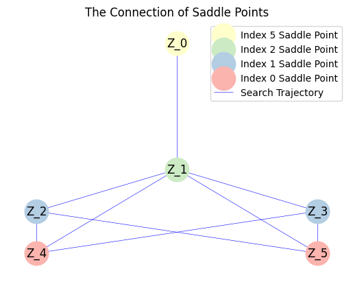
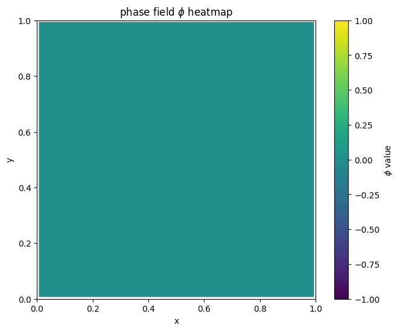
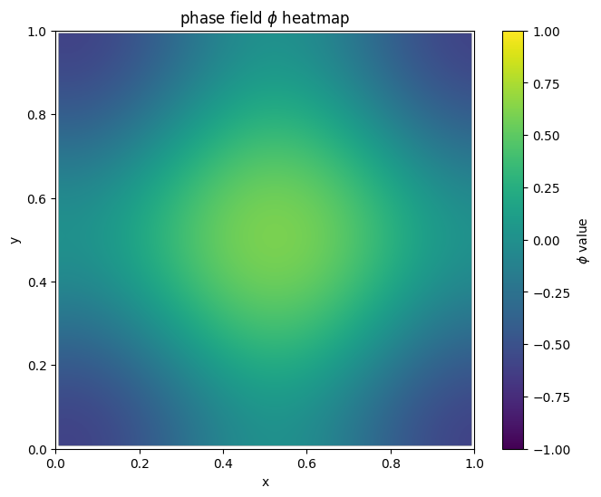
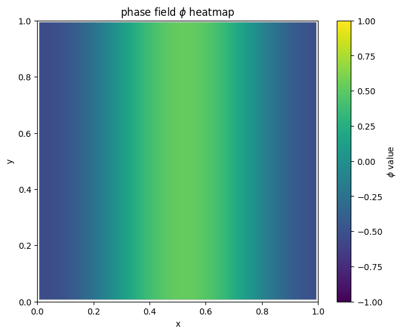
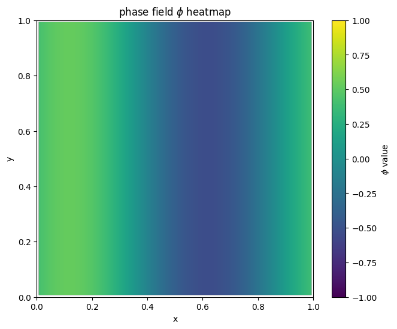
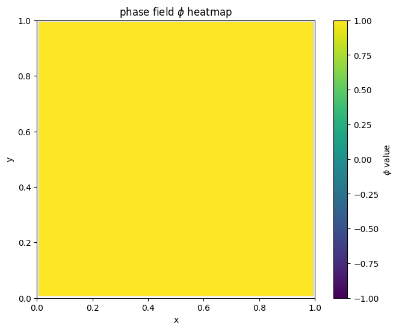
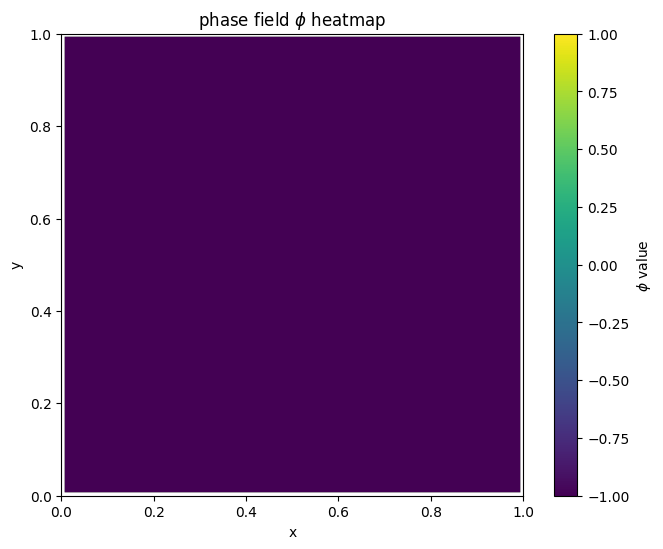

In this example, we consider a 2D phase field model:

$$
E(\phi) = \int_{\Omega} \left( \frac{\kappa}{2} |\nabla \phi|^2 + \frac{1}{4} (1 - \phi^2)^2 \right) dx
$$

The Allen-Cahn equation is:

$$
\dot{\phi} = \kappa \Delta \phi + \phi - \phi^3
$$

We consider $\Omega = [0,1]^{2}$ with periodic boundary condition. 
We discrete it using finite difference scheme of mesh grids $64 \times 64$. 

First, we add the path of the `solscape-1.0` directory to the system path.


```python
import sys
import os

sys.path.append(os.path.abspath(os.path.join(os.getcwd(), '..', 'solscape-1.0')))

```

Then, we import the main class.


```python
from solscape import Landscape
import numpy as np

# import packages needed
```

We define the vector field by 2-D convolution.


```python
from scipy.ndimage import convolve

def gradient_PF(x, opt):
    kappa = opt['kappa']
    n2 = len(x)
    n = int(np.sqrt(n2))
    phi = x.reshape(n, n)
    h = opt['h']

    D2 = np.array([[0, 1, 0],
                   [1, -4, 1],
                   [0, 1, 0]]) / h**2

    conv_term = convolve(phi, D2, mode='wrap')

    F = -(kappa * conv_term + phi - phi**3)

    return F.reshape(n2, 1)

```

Then, we define the judgement function with translational invariance.


```python
def SameSaddle(x, y):
    n= 64
    A = x.reshape(n,n)
    B = y.reshape(n,n)
    epsilon = 0.05

    row_indices = np.array([(np.arange(n) - dx) % n for dx in range(n)])
    col_indices = np.array([(np.arange(n) - dy) % n for dy in range(n)])

    row_shifted = np.zeros((n, n, n), dtype=B.dtype)
    for dx in range(n):
        row_shifted[dx] = B[row_indices[dx], :]

    for dx in range(n):
        for dy in range(n):
            shifted_B = row_shifted[dx][:, col_indices[dy]]
            max_diff = np.max(np.abs(A - shifted_B))
            if max_diff <= epsilon:
                return True
    return False

```

Define the system with $\kappa=0.02$.


```python
N = 64
opt = {
    'kappa': 0.02,
    'N': N,
    'h': 1/N,
}

GradFunc = lambda x: gradient_PF(x, opt)

```

We initialize the solver and run it.


```python
# parameter initialization
x0 = np.array([0 for i in range(N**2)]) # initial point
dt = 1e-2 # time step
k = 5
acceme = 'nesterov'
neschoice = 1
nesres = 200
mom = 0.8
maxiter = 2000 # max iter
```


```python
MyLandscape = Landscape(MaxIndex=k, AutoGrad=False, Grad=GradFunc, DimerLength=1e-3, 
                        HessianDimerLength=1e-3, EigenStepSize=1e-7, InitialPoint=x0, 
                        TimeStep=dt, Acceleration=acceme, SearchArea=1e4, SymmetryCheck=False,
                        Tolerance=1e-4, MaxIndexGap=3, EigenCombination='min',
                        BBStep=True, NesterovChoice=neschoice, NesterovRestart=nesres, 
                        Momentum=mom, MaxIter=maxiter, Verbose=True, ReportInterval=10, 
                        EigenMaxIter=2, PerturbationNumber=1,
                        SameJudgementMethod=SameSaddle, PerturbationRadius=5.0)
# Instantiation
MyLandscape.Run()
# Calculate
```

    HiSD Solver Configuration:
    ------------------------------
    [HiSD] Current parameters (initialized):
    [Config Sync] `Dim` parameter auto-adjusted to 4096 based on `InitialPoint` dimensionality.
    Parameter `NumericalGrad` not specified - using default value False.
    Parameter `EigenMethod` not specified - using default value lobpcg.
    Parameter `ExactHessian` not specified - using default value False.
    Parameter `PrecisionTol` not specified - using default value 1e-05.
    Parameter 'GradientSystem' not provided. Enabling automatic symmetry detection.
    
    
    Non-gradient system detected. Activating GHiSD algorithm.
    'lobpcg' incompatible with non-gradient systems. Reverting to 'power' method.
    
    
    Landscape Configuration:
    ------------------------------
    [Landscape] Current parameters (initialized):
    Parameter `PerturbationMethod` not specified - using default value uniform.
    Parameter `InitialEigenVectors` not specified - using default value None.
    Parameter `SaveTrajectory` not specified - using default value True.
    
    
    Start running:
    ------------------------------
    
    
    
    
    From initial point search index-5:
    ------------------------------
    
    
    Non-degenerate saddle point identified: Morse index =5 (number of negative eigenvalues).
    
    
    From saddle point (index-5, ID-0) search index-4:
    ------------------------------
    
    
    Iteration: 10|| Norm of gradient: 619.346136
    Iteration: 20|| Norm of gradient: 16.083373
    Iteration: 30|| Norm of gradient: 2.488944
    Iteration: 40|| Norm of gradient: 0.980796
    Iteration: 50|| Norm of gradient: 0.574637
    Iteration: 60|| Norm of gradient: 0.378629
    Iteration: 70|| Norm of gradient: 0.267255
    Iteration: 80|| Norm of gradient: 0.207545
    Iteration: 90|| Norm of gradient: 0.154422
    Iteration: 100|| Norm of gradient: 0.119420
    Iteration: 110|| Norm of gradient: 0.097449
    Iteration: 120|| Norm of gradient: 0.080215
    Iteration: 130|| Norm of gradient: 0.067141
    Iteration: 140|| Norm of gradient: 0.058299
    Iteration: 150|| Norm of gradient: 0.052993
    Iteration: 160|| Norm of gradient: 0.050370
    Iteration: 170|| Norm of gradient: 0.048548
    Iteration: 180|| Norm of gradient: 0.054746
    Iteration: 190|| Norm of gradient: 0.076002
    Iteration: 200|| Norm of gradient: 0.074170
    Iteration: 210|| Norm of gradient: 0.075175
    Iteration: 220|| Norm of gradient: 3.217345
    Iteration: 230|| Norm of gradient: 0.470796
    Iteration: 240|| Norm of gradient: 1.768606
    Iteration: 250|| Norm of gradient: 11.320682
    Iteration: 260|| Norm of gradient: 7.564030
    Iteration: 270|| Norm of gradient: 5.213437
    Iteration: 280|| Norm of gradient: 2.340070
    Iteration: 290|| Norm of gradient: 1.602305
    Iteration: 300|| Norm of gradient: 3.511633
    Iteration: 310|| Norm of gradient: 2.903247
    Iteration: 320|| Norm of gradient: 5.591401
    Iteration: 330|| Norm of gradient: 2.871595
    Iteration: 340|| Norm of gradient: 5.043487
    Iteration: 350|| Norm of gradient: 4.549599
    Iteration: 360|| Norm of gradient: 4.023123
    Iteration: 370|| Norm of gradient: 3.186957
    Iteration: 380|| Norm of gradient: 4.708849
    Iteration: 390|| Norm of gradient: 3.869570
    Iteration: 400|| Norm of gradient: 3.376282
    Iteration: 410|| Norm of gradient: 0.703372
    Iteration: 420|| Norm of gradient: 0.665870
    Iteration: 430|| Norm of gradient: 0.630158
    Iteration: 440|| Norm of gradient: 0.595754
    Iteration: 450|| Norm of gradient: 0.559233
    Iteration: 460|| Norm of gradient: 0.519038
    Iteration: 470|| Norm of gradient: 0.474960
    Iteration: 480|| Norm of gradient: 0.428004
    Iteration: 490|| Norm of gradient: 0.379700
    Iteration: 500|| Norm of gradient: 0.331597
    Iteration: 510|| Norm of gradient: 0.285274
    Iteration: 520|| Norm of gradient: 0.242443
    Iteration: 530|| Norm of gradient: 0.204760
    Iteration: 540|| Norm of gradient: 0.173455
    Iteration: 550|| Norm of gradient: 0.149760
    Iteration: 560|| Norm of gradient: 0.309063
    Iteration: 570|| Norm of gradient: 0.097444
    Iteration: 580|| Norm of gradient: 0.088064
    Iteration: 590|| Norm of gradient: 0.231008
    Iteration: 600|| Norm of gradient: 0.162877
    Iteration: 610|| Norm of gradient: 0.130110
    Iteration: 620|| Norm of gradient: 0.112499
    Iteration: 630|| Norm of gradient: 0.101875
    Iteration: 640|| Norm of gradient: 0.094142
    Iteration: 650|| Norm of gradient: 0.087701
    Iteration: 660|| Norm of gradient: 0.081261
    Iteration: 670|| Norm of gradient: 0.074248
    Iteration: 680|| Norm of gradient: 0.066777
    Iteration: 690|| Norm of gradient: 0.077409
    Iteration: 700|| Norm of gradient: 0.045900
    Iteration: 710|| Norm of gradient: 0.043174
    Iteration: 720|| Norm of gradient: 0.045666
    Iteration: 730|| Norm of gradient: 0.068482
    Iteration: 740|| Norm of gradient: 0.071443
    Iteration: 750|| Norm of gradient: 0.059650
    Iteration: 760|| Norm of gradient: 0.052077
    Iteration: 770|| Norm of gradient: 0.052032
    Iteration: 780|| Norm of gradient: 0.046406
    Iteration: 790|| Norm of gradient: 0.051779
    Iteration: 800|| Norm of gradient: 0.051935
    Iteration: 810|| Norm of gradient: 0.039899
    Iteration: 820|| Norm of gradient: 0.037903
    Iteration: 830|| Norm of gradient: 0.036179
    Iteration: 840|| Norm of gradient: 0.034580
    Iteration: 850|| Norm of gradient: 0.032736
    Iteration: 860|| Norm of gradient: 0.030640
    Iteration: 870|| Norm of gradient: 0.028385
    Iteration: 880|| Norm of gradient: 0.026023
    Iteration: 890|| Norm of gradient: 0.023598
    Iteration: 900|| Norm of gradient: 0.021409
    Iteration: 910|| Norm of gradient: 0.058408
    Iteration: 920|| Norm of gradient: 0.027546
    Iteration: 930|| Norm of gradient: 0.049420
    Iteration: 940|| Norm of gradient: 0.111473
    Iteration: 950|| Norm of gradient: 0.022343
    Iteration: 960|| Norm of gradient: 0.337680
    Iteration: 970|| Norm of gradient: 0.259532
    Iteration: 980|| Norm of gradient: 0.235828
    Iteration: 990|| Norm of gradient: 0.239848
    Iteration: 1000|| Norm of gradient: 0.256012
    Iteration: 1010|| Norm of gradient: 0.241480
    Iteration: 1020|| Norm of gradient: 0.232255
    Iteration: 1030|| Norm of gradient: 0.220522
    Iteration: 1040|| Norm of gradient: 0.206808
    Iteration: 1050|| Norm of gradient: 0.190918
    Iteration: 1060|| Norm of gradient: 0.173245
    Iteration: 1070|| Norm of gradient: 0.154370
    Iteration: 1080|| Norm of gradient: 0.134863
    Iteration: 1090|| Norm of gradient: 0.115297
    Iteration: 1100|| Norm of gradient: 0.096208
    Iteration: 1110|| Norm of gradient: 0.078055
    Iteration: 1120|| Norm of gradient: 0.061219
    Iteration: 1130|| Norm of gradient: 0.046018
    Iteration: 1140|| Norm of gradient: 0.032733
    Iteration: 1150|| Norm of gradient: 0.028474
    Iteration: 1160|| Norm of gradient: 0.021542
    Iteration: 1170|| Norm of gradient: 0.021747
    Iteration: 1180|| Norm of gradient: 0.034579
    Iteration: 1190|| Norm of gradient: 0.008371
    Iteration: 1200|| Norm of gradient: 0.008749
    Iteration: 1210|| Norm of gradient: 0.004287
    Iteration: 1220|| Norm of gradient: 0.003568
    Iteration: 1230|| Norm of gradient: 0.003178
    Iteration: 1240|| Norm of gradient: 0.002971
    Iteration: 1250|| Norm of gradient: 0.002755
    Iteration: 1260|| Norm of gradient: 0.002511
    Iteration: 1270|| Norm of gradient: 0.002259
    Iteration: 1280|| Norm of gradient: 0.002004
    Iteration: 1290|| Norm of gradient: 0.001752
    Iteration: 1300|| Norm of gradient: 0.001513
    Iteration: 1310|| Norm of gradient: 0.001293
    Iteration: 1320|| Norm of gradient: 0.001097
    Iteration: 1330|| Norm of gradient: 0.000932
    Iteration: 1340|| Norm of gradient: 0.000797
    Iteration: 1350|| Norm of gradient: 0.000857
    Iteration: 1360|| Norm of gradient: 0.000750
    Iteration: 1370|| Norm of gradient: 0.002054
    Iteration: 1380|| Norm of gradient: 0.001055
    Iteration: 1390|| Norm of gradient: 0.001363
    Iteration: 1400|| Norm of gradient: 0.007116
    Iteration: 1410|| Norm of gradient: 0.001791
    Iteration: 1420|| Norm of gradient: 0.001709
    Iteration: 1430|| Norm of gradient: 0.001631
    Iteration: 1440|| Norm of gradient: 0.001539
    Iteration: 1450|| Norm of gradient: 0.001431
    Iteration: 1460|| Norm of gradient: 0.001310
    Iteration: 1470|| Norm of gradient: 0.001179
    Iteration: 1480|| Norm of gradient: 0.001041
    Iteration: 1490|| Norm of gradient: 0.000901
    Iteration: 1500|| Norm of gradient: 0.000761
    Iteration: 1510|| Norm of gradient: 0.000625
    Iteration: 1520|| Norm of gradient: 0.000496
    Iteration: 1530|| Norm of gradient: 0.000374
    Iteration: 1540|| Norm of gradient: 0.000306
    Iteration: 1550|| Norm of gradient: 0.000253
    Iteration: 1560|| Norm of gradient: 0.000592
    [WARNING] Degenerate saddle point detected under precision tol=1e-05: Hessian matrix may contain zero eigenvalue(s).
    Eigenvalue spectrum: negative=2, zero=2, positive=4092. 


We can also draw the solution landscape and save the data.


```python
MyLandscape.DrawConnection()
MyLandscape.Save('Ex_PhaseField','mat')
# Save the data
```


    

    


Then, we can draw the function by post-processing.


```python
import matplotlib.pyplot as plt
from scipy.interpolate import griddata

def plot_phi_heatmap(phi_vector, N):
    if len(phi_vector) != N * N:
        raise ValueError(f"Input shape must be {N * N}, but got {len(phi_vector)}")
    
    h=1/N

    x = np.linspace(h/2, 1-h/2, N)
    y = np.linspace(h/2, 1-h/2, N)
    X, Y = np.meshgrid(x, y)

    phi = phi_vector.reshape((N, N))

    grid_x, grid_y = np.mgrid[0:1:N*10j, 0:1:N*10j] 
    grid_phi = griddata((X.flatten(), Y.flatten()), phi.flatten(), (grid_x, grid_y), method='cubic')

    # Draw heatmap
    plt.figure(figsize=(8, 6))
    plt.imshow(grid_phi, extent=(0, 1, 0, 1), origin='lower', cmap='viridis',vmin=-1, vmax=1)
    plt.colorbar(label='$\phi$ value')
    plt.title('phase field $\phi$ heatmap')
    plt.xlabel('x')
    plt.ylabel('y')
    plt.show()
```


```python
for i in range(len(MyLandscape.SaddleList)):
    plot_phi_heatmap(MyLandscape.SaddleList[i][1],N)
```


    

    


    

    


    

    


    

    


    

    


    

    


    
