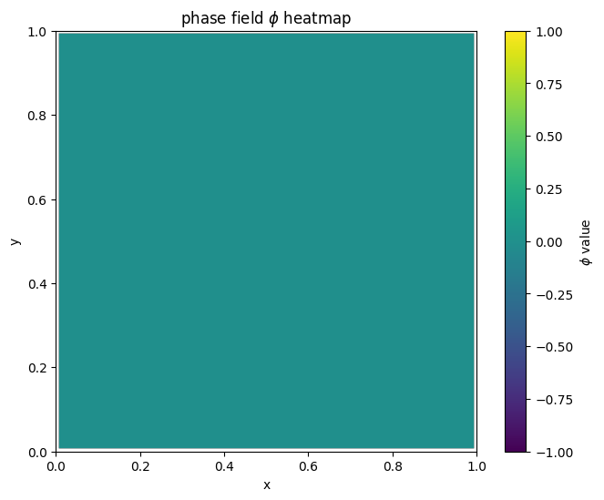
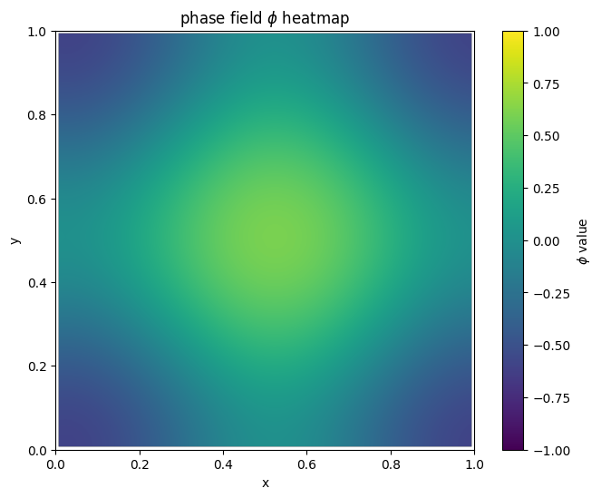
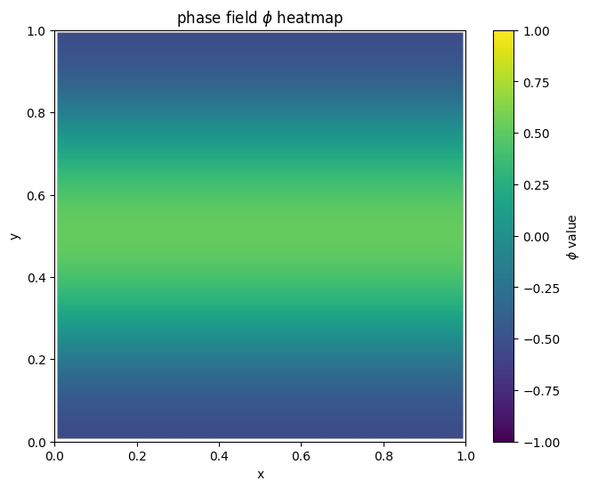
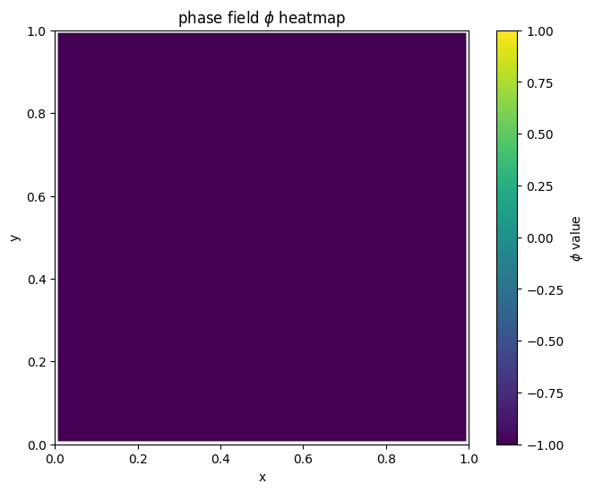
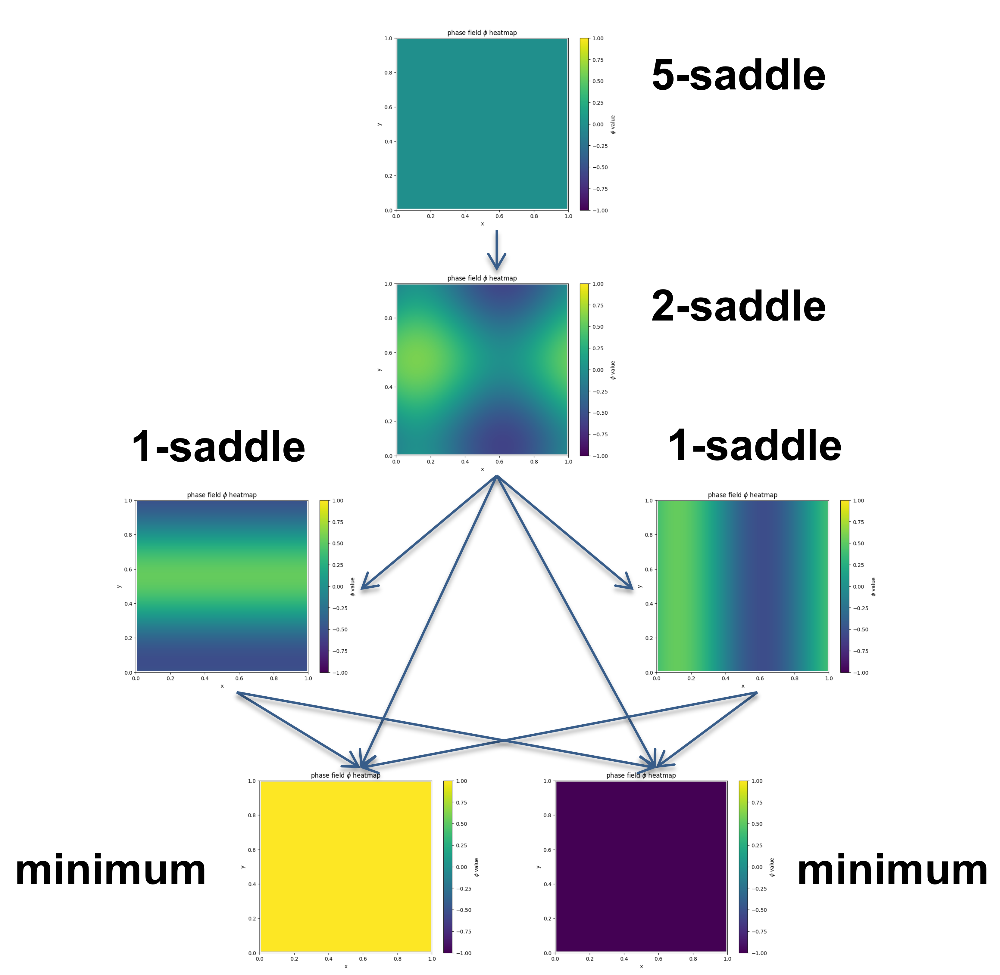

在这个示例中，我们考虑一个二维相场模型：

$$
E(\phi) = \int_{\Omega} \left( \frac{\kappa}{2} |\nabla \phi|^2 + \frac{1}{4} (1 - \phi^2)^2 \right) dx
$$

Allen-Cahn 方程如下：

$$
\dot{\phi} = \kappa \Delta \phi + \phi - \phi^3
$$

我们考虑定义域 $\Omega = [0,1]^{2}$ ，并采用周期性边界条件。 
我们使用有限差分法对其进行离散化，网格划分为 $64 \times 64$。

首先，我们将 `soluscape-1.0` 目录的路径添加到系统路径中：


```python
import sys
import os

sys.path.append(os.path.abspath(os.path.join(os.getcwd(), '..', 'soluscape-1.0')))

```

接着，我们导入主类：


```python
from soluscape import Landscape
import numpy as np

# import packages needed
```

定义能量函数：


```python
from scipy.ndimage import convolve

def gradient_PF(x, opt):
	kappa = opt['kappa']
	n2 = len(x)
	n = int(np.sqrt(n2))
	phi = x.reshape(n, n)
	h = opt['h']

	D2 = np.array([[0, 1, 0],
				   [1, -4, 1],
				   [0, 1, 0]]) / h**2

	conv_term = convolve(phi, D2, mode='wrap')

	F = -(kappa * conv_term + phi - phi**3)

	return F.reshape(n2, 1)

```

接着，我们定义了具有平移不变性的判断函数。


```python
def SameSaddle(x, y):
	n= 64
	A = x.reshape(n,n)
	B = y.reshape(n,n)
	epsilon = 0.05

	row_indices = np.array([(np.arange(n) - dx) % n for dx in range(n)])
	col_indices = np.array([(np.arange(n) - dy) % n for dy in range(n)])

	row_shifted = np.zeros((n, n, n), dtype=B.dtype)
	for dx in range(n):
		row_shifted[dx] = B[row_indices[dx], :]

	for dx in range(n):
		for dy in range(n):
			shifted_B = row_shifted[dx][:, col_indices[dy]]
			max_diff = np.max(np.abs(A - shifted_B))
			if max_diff <= epsilon:
				return True
	return False

```

定义系统参数$\kappa=0.02$.


```python
# parameter initialization
x0 = np.array([0 for i in range(N**2)]) # initial point
dt = 1e-3 # time step
k = 5
acceme = 'nesterov'
neschoice = 1
nesres = 200
mom = 0.8
maxiter = 2000 # max iter
```


```python
MyLandscape = Landscape(MaxIndex=k, AutoGrad=False, Grad=GradFunc, DimerLength=1e-3, 
						HessianDimerLength=1e-3, EigenStepSize=1e-7, InitialPoint=x0, 
						TimeStep=dt, Acceleration=acceme, SearchArea=1e4, SymmetryCheck=False,
						Tolerance=1e-4, MaxIndexGap=3, EigenCombination='min',
						BBStep=True, NesterovChoice=neschoice, NesterovRestart=nesres, 
						Momentum=mom, MaxIter=maxiter, Verbose=True, ReportInterval=10, 
						EigenMaxIter=2, PerturbationNumber=1, EigvecUnified=True,
						SameJudgementMethod=SameSaddle, PerturbationRadius=5.0)
# Instantiation
MyLandscape.Run()
# Calculate
```

    HiSD Solver Configuration:
    ------------------------------
    [HiSD] Current parameters (initialized):
    [Config Sync] `Dim` parameter auto-adjusted to 4096 based on `InitialPoint` dimensionality.
    Parameter `NumericalGrad` not specified - using default value False.
    Parameter `EigenMethod` not specified - using default value lobpcg.
    Parameter `ExactHessian` not specified - using default value False.
    Parameter `PrecisionTol` not specified - using default value 1e-05.
    Parameter 'GradientSystem' not provided. Enabling automatic symmetry detection.
    
    
    Non-gradient system detected. Activating GHiSD algorithm.
    'lobpcg' incompatible with non-gradient systems. Reverting to 'power' method.
    
    
    Landscape Configuration:
    ------------------------------
    [Landscape] Current parameters (initialized):
    Parameter `PerturbationMethod` not specified - using default value uniform.
    Parameter `InitialEigenVectors` not specified - using default value None.
    Parameter `SaveTrajectory` not specified - using default value True.
    
    Start running:
    ------------------------------
    
    
    
    From initial point search index-5:
    ------------------------------
    
    
    Non-degenerate saddle point identified: Morse index =5 (number of negative eigenvalues).
    
    
    From saddle point (index-5, ID-0) search index-4:
    ------------------------------
    
    
    Iteration: 10|| Norm of gradient: 20.485886
    Iteration: 20|| Norm of gradient: 4.285674
    Iteration: 30|| Norm of gradient: 1.408871
    Iteration: 40|| Norm of gradient: 0.656639
    Iteration: 50|| Norm of gradient: 0.381628
    Iteration: 60|| Norm of gradient: 0.244771
    Iteration: 70|| Norm of gradient: 0.177167
    Iteration: 80|| Norm of gradient: 0.138191
    Iteration: 90|| Norm of gradient: 0.104285
    Iteration: 100|| Norm of gradient: 0.082284
    Iteration: 110|| Norm of gradient: 0.069386
    Iteration: 120|| Norm of gradient: 0.059530
    Iteration: 130|| Norm of gradient: 0.053229
    Iteration: 140|| Norm of gradient: 0.050366
    Iteration: 150|| Norm of gradient: 0.057585
    Iteration: 160|| Norm of gradient: 0.060515
    Iteration: 170|| Norm of gradient: 0.119935
    Iteration: 180|| Norm of gradient: 0.223856
    Iteration: 190|| Norm of gradient: 1.142581
    Iteration: 200|| Norm of gradient: 3.623269
    Iteration: 210|| Norm of gradient: 0.288505
    Iteration: 220|| Norm of gradient: 0.259231
    Iteration: 230|| Norm of gradient: 0.421667
    Iteration: 240|| Norm of gradient: 0.264348
    Iteration: 250|| Norm of gradient: 0.310100
    Iteration: 260|| Norm of gradient: 3.550660
    Iteration: 270|| Norm of gradient: 0.606497
    Iteration: 280|| Norm of gradient: 0.454404
    Iteration: 290|| Norm of gradient: 0.433560
    Iteration: 300|| Norm of gradient: 0.865582
    Iteration: 310|| Norm of gradient: 0.568534
    Iteration: 320|| Norm of gradient: 1.099565
    Iteration: 330|| Norm of gradient: 3.935289
    Iteration: 340|| Norm of gradient: 14.056392
    Iteration: 350|| Norm of gradient: 20.013191
    Iteration: 360|| Norm of gradient: 26.276739
    Iteration: 370|| Norm of gradient: 17.973981
    Iteration: 380|| Norm of gradient: 9.570139
    Iteration: 390|| Norm of gradient: 7.898909
    Iteration: 400|| Norm of gradient: 5.530629
    Iteration: 410|| Norm of gradient: 1.682866
    Iteration: 420|| Norm of gradient: 1.534876
    Iteration: 430|| Norm of gradient: 1.415859
    Iteration: 440|| Norm of gradient: 1.287483
    Iteration: 450|| Norm of gradient: 1.147012
    Iteration: 460|| Norm of gradient: 0.999773
    Iteration: 470|| Norm of gradient: 0.852042
    Iteration: 480|| Norm of gradient: 0.709724
    Iteration: 490|| Norm of gradient: 0.577701
    Iteration: 500|| Norm of gradient: 0.459658
    Iteration: 510|| Norm of gradient: 0.358412
    Iteration: 520|| Norm of gradient: 0.276341
    Iteration: 530|| Norm of gradient: 0.215450
    Iteration: 540|| Norm of gradient: 0.176511
    Iteration: 550|| Norm of gradient: 0.157046
    Iteration: 560|| Norm of gradient: 0.150524
    Iteration: 570|| Norm of gradient: 0.149323
    Iteration: 580|| Norm of gradient: 0.163116
    Iteration: 590|| Norm of gradient: 0.145903
    Iteration: 600|| Norm of gradient: 0.133741
    Iteration: 610|| Norm of gradient: 0.078400
    Iteration: 620|| Norm of gradient: 0.075997
    Iteration: 630|| Norm of gradient: 0.072381
    Iteration: 640|| Norm of gradient: 0.067905
    Iteration: 650|| Norm of gradient: 0.062671
    Iteration: 660|| Norm of gradient: 0.056838
    Iteration: 670|| Norm of gradient: 0.050598
    Iteration: 680|| Norm of gradient: 0.044157
    Iteration: 690|| Norm of gradient: 0.037726
    Iteration: 700|| Norm of gradient: 0.031520
    Iteration: 710|| Norm of gradient: 0.025752
    Iteration: 720|| Norm of gradient: 0.020635
    Iteration: 730|| Norm of gradient: 0.016385
    Iteration: 740|| Norm of gradient: 0.013202
    Iteration: 750|| Norm of gradient: 0.011194
    Iteration: 760|| Norm of gradient: 0.010237
    Iteration: 770|| Norm of gradient: 0.009950
    Iteration: 780|| Norm of gradient: 0.011293
    Iteration: 790|| Norm of gradient: 0.009888
    Iteration: 800|| Norm of gradient: 0.009359
    Iteration: 810|| Norm of gradient: 0.006664
    Iteration: 820|| Norm of gradient: 0.006454
    Iteration: 830|| Norm of gradient: 0.006139
    Iteration: 840|| Norm of gradient: 0.005749
    Iteration: 850|| Norm of gradient: 0.005294
    Iteration: 860|| Norm of gradient: 0.004790
    Iteration: 870|| Norm of gradient: 0.004252
    Iteration: 880|| Norm of gradient: 0.003700
    Iteration: 890|| Norm of gradient: 0.003151
    Iteration: 900|| Norm of gradient: 0.002624
    Iteration: 910|| Norm of gradient: 0.002137
    Iteration: 920|| Norm of gradient: 0.001708
    Iteration: 930|| Norm of gradient: 0.001353
    Iteration: 940|| Norm of gradient: 0.001091
    Iteration: 950|| Norm of gradient: 0.000927
    Iteration: 960|| Norm of gradient: 0.000851
    Iteration: 970|| Norm of gradient: 0.000829
    Iteration: 980|| Norm of gradient: 0.002042
    Iteration: 990|| Norm of gradient: 0.000936
    Iteration: 1000|| Norm of gradient: 0.000801
    Iteration: 1010|| Norm of gradient: 0.000449
    Iteration: 1020|| Norm of gradient: 0.000434
    Iteration: 1030|| Norm of gradient: 0.000413
    Iteration: 1040|| Norm of gradient: 0.000387
    Iteration: 1050|| Norm of gradient: 0.000357
    Iteration: 1060|| Norm of gradient: 0.000323
    Iteration: 1070|| Norm of gradient: 0.000287
    Iteration: 1080|| Norm of gradient: 0.000249
    Iteration: 1090|| Norm of gradient: 0.000212
    Iteration: 1100|| Norm of gradient: 0.000177
    Iteration: 1110|| Norm of gradient: 0.000144
    Iteration: 1120|| Norm of gradient: 0.000115
    [WARNING] Degenerate saddle point detected under precision tol=1e-05: Hessian matrix may contain zero eigenvalue(s).
    Eigenvalue spectrum: negative=2, zero=2, positive=4092. 

......([完整的结果请参考GitHub仓库中的文件](https://github.com/HiSDpackage/soluscape/blob/main/_Examples/Ex_4_PhaseField.ipynb))


我们可以绘制解景观并保存数据。


```python
MyLandscape.DrawConnection()
MyLandscape.Save('output\Ex_PhaseField','mat')
# Save the data
```


    

    


然后，我们可以通过后处理来绘制该函数。


```python
import matplotlib.pyplot as plt
from scipy.interpolate import griddata

def plot_phi_heatmap(phi_vector, N):
    if len(phi_vector) != N * N:
        raise ValueError(f"Input shape must be {N * N}, but got {len(phi_vector)}")
    
    h=1/N

    x = np.linspace(h/2, 1-h/2, N)
    y = np.linspace(h/2, 1-h/2, N)
    X, Y = np.meshgrid(x, y)

    phi = phi_vector.reshape((N, N))

    grid_x, grid_y = np.mgrid[0:1:N*10j, 0:1:N*10j] 
    grid_phi = griddata((X.flatten(), Y.flatten()), phi.flatten(), (grid_x, grid_y), method='cubic')

    # Draw heatmap
    plt.figure(figsize=(8, 6))
    plt.imshow(grid_phi, extent=(0, 1, 0, 1), origin='lower', cmap='viridis',vmin=-1, vmax=1)
    plt.colorbar(label='$\phi$ value')
    plt.title('phase field $\phi$ heatmap')
    plt.xlabel('x')
    plt.ylabel('y')
    plt.show()
```


```python
for i in range(len(MyLandscape.SaddleList)):
    plot_phi_heatmap(MyLandscape.SaddleList[i][1],N)
```


    

    


    

    


    

    


    

    


    

    


    



我们把鞍点相场示意图结合解景观联系起来可以得到：


    


    
