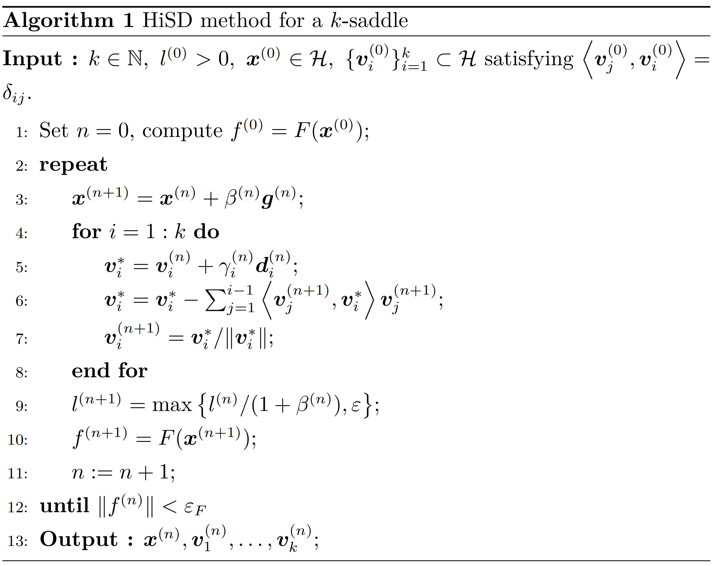

# 1 What is an Index-$k$ Saddle Point($k$-saddle)

Given a twice Fréchet differentiable energy functional
$E(\boldsymbol{x})$ defined on a real Hilbert space $\mathcal{H}$ with
an inner product $\langle \cdot,\cdot \rangle$, we let
$\boldsymbol{F}(\boldsymbol{x}) = -\nabla E(\boldsymbol{x})$ denote its
natural force and
$\mathbb{G}(\boldsymbol{x}) = \nabla^2E(\boldsymbol{x})$ denote its
Hessian matrix.By the Riesz representation theorem, we regard
$\boldsymbol{F}(\boldsymbol{x})$ as an element of $\mathcal{H}$.

-   $\boldsymbol{\hat{x}} \in \mathcal{H}$ is called a critical point of
    $E(\boldsymbol{x})$ if
    $\lVert \boldsymbol{F}(\boldsymbol{\hat{x}}) \rVert = 0$.

-   A critical point of $E(\boldsymbol{x})$ that is not a local extremum
    is called a saddle point of $E(\boldsymbol{x})$. Especially,
    sometimes we also refer to a local minimum as an index-$0$ saddle
    point and a local maximum as an index-$d$ saddle point (where $d$ is
    the system dimension).

-   A critical point $\boldsymbol{\hat{x}}$ is called nondegenerate if
    $\mathbb{G}(\boldsymbol{\hat{x}})$ has a bounded inverse.

-   According to Morse theory, the index (Morse index) of a
    nondegenerate critical point $\boldsymbol{\hat{x}}$ is the maximal
    dimension of a subspace $\mathcal{K}$ on which the operator
    $\mathbb{G}(\boldsymbol{\hat{x}})$ is negative definite. Our goal is
    to find an index-$k$ saddle point ,or for short,$k$-saddle,on the
    potential energy surface(PES).

-   For simplicity, we assume that the dimension of $\mathcal{H}$ is $d$
    and write the inner product
    $\langle \boldsymbol{x}, \boldsymbol{y} \rangle$ as
    $\boldsymbol{x}^{\top} \boldsymbol{y}$.

Next, we provide an intuitive understanding of the index of a saddle
point from the perspective of eigenvalues and eigenvectors, which will
be useful for developing the subsequent discussion.

We note that the Hessian matrix is a real symmetric matrix (owing to the
earlier assumption of quadratic Fréchet differentiability), and thus it
is orthogonally similar to a diagonal matrix, meaning there exist an
orthogonal matrix $\mathbb{T}$ and a diagonal matrix $\mathbb{D}$ such
that
$\mathbb{T}^{-1} \mathbb{G}(\boldsymbol{\hat{x}}) \mathbb{T} = \mathbb{D}$.
In fact, the diagonal elements of this diagonal matrix are the
eigenvalues $\hat{\lambda}_1, \hat{\lambda}_2, \ldots, \hat{\lambda}_d$
of the real symmetric matrix, and without loss of generality we can
assume that
$\hat{\lambda}_1 \leq \hat{\lambda}_2 \leq \ldots \leq \hat{\lambda}_d$,
with the corresponding eigenvectors
$\boldsymbol{\hat{v}}_1, \boldsymbol{\hat{v}}_2, \ldots, \boldsymbol{\hat{v}}_d$.

It can be proven that for a nondegenerate critical point $\hat{x}$, if
$$
\hat{\lambda}_1 \leq \ldots \leq \hat{\lambda}_k < 0 < \hat{\lambda}_{k+1} \leq \ldots \leq \hat{\lambda}_d
$$
,then $k$ is the index of the saddle point.

On one hand, $\mathbb{G}(\boldsymbol{\hat{x}})$ is negative definite on
the subspace $\hat{\mathcal{V}}$ spanned by
$\boldsymbol{\hat{v}}_1, \boldsymbol{\hat{v}}_2, \ldots, \boldsymbol{\hat{v}}_k$,
so $\boldsymbol{\hat{x}}$ is at least a $k$-saddle point;

On the other hand, for any subspace $\mathcal{K'}$ of $\mathcal{H}$ with
dimension $k+1$ , the subspace $\hat{\mathcal{V}}^{\perp}$ spanned by
$$
\boldsymbol{\hat{v}}_{k+1}, \ldots, \boldsymbol{\hat{v}}_d
$$
intersects
with $\mathcal{K'}$ non-trivially (otherwise, by adding
$$
\boldsymbol{\hat{v}}_{k+1}, \ldots, \boldsymbol{\hat{v}}_d
$$
to
$\mathcal{K'}$, we would generate a space with dimension $d+1$, which is
a contradiction!). Let a non-zero element in the intersection be

$$
\boldsymbol{w} = \sum_{i=k+1}^{d} a_i \boldsymbol{\hat{v}}_i
$$

then we
have

$$
\boldsymbol{w}^{\top} \mathbb{G}(\hat{x}) \boldsymbol{w} = \sum_{i=k+1}^{d} a_i \boldsymbol{\hat{v}}_i^{\top} \sum_{i=k+1}^{d} \hat{\lambda}_i a_i \boldsymbol{\hat{v}}_i = \sum_{i=k+1}^{d} \hat{\lambda}_i a_i^2 > 0
$$

Thus, $\mathbb{G}(\boldsymbol{\hat{x}})$ is not negative definite on
$\mathcal{K'}$, meaning the index of $\boldsymbol{\hat{x}}$ is $k$.

In fact, if one is familiar with the canonical form of a real symmetric
matrix, it can be seen that the index of a saddle point here is
essentially the negative inertia index of the Hessian matrix.

# 2 Transforming the Search for a $k$-saddle into an Optimization Problem

Continuing with the previous notation, note that
$\mathbb{G}(\boldsymbol{\hat{x}})$ is negative definite on
$\hat{\mathcal{V}}$ and positive definite on its orthogonal complement
$\hat{\mathcal{V}}^{\perp}$, which implies that $\boldsymbol{\hat{x}}$
is a local maximum on the linear manifold
$\boldsymbol{\hat{x}} + \hat{\mathcal{V}}$ and a local minimum on the
linear manifold $\boldsymbol{\hat{x}} + \hat{\mathcal{V}}^{\perp}$.

Consider
$$
\boldsymbol{\hat{x}}_{\hat{\mathcal{V}}}, \boldsymbol{\hat{x}}_{\hat{\mathcal{V}}^{\perp}}
$$
as the projections of $\boldsymbol{\hat{x}}$ onto
$$
\hat{\mathcal{V}}, \hat{\mathcal{V}}^{\perp}
$$
, respectively, then
$$
(\boldsymbol{v}, \boldsymbol{w}) = (\boldsymbol{\hat{x}}_{\hat{\mathcal{V}}}, \boldsymbol{\hat{x}}_{\hat{\mathcal{V}}^{\perp}})
$$
is a solution to the minimax problem

$$
\min_{\boldsymbol{w} \in \hat{\mathcal{V}}^{\perp}} \max_{\boldsymbol{v} \in \hat{\mathcal{V}}} E(\boldsymbol{v} + \boldsymbol{w}).
$$

However, this is not a classical minimax problem because the space
$\hat{\mathcal{V}}$ is unknown. Therefore, in the process of solving the
optimization problem, our iterative method should include two parts: one
is to update $\boldsymbol{v}$ and $\boldsymbol{w}$ (in this problem,
also update $\boldsymbol{x} = \boldsymbol{v} + \boldsymbol{w}$), and the
other is to update the space $\mathcal{V}$ (which is used to approximate
$\hat{\mathcal{V}}$, typically described by the subspace spanned by the
eigenvectors corresponding to the $k$ smallest eigenvalues of the
Hessian matrix at the current $\boldsymbol{x}$).

# 3 The Dynamics of $\boldsymbol{x}$

Updating $\boldsymbol{x}$ intuitively involves making the projection of
$\boldsymbol{\dot{x}}$ onto the space $\mathcal{V}$,
$$
\mathcal{P}_{\mathcal{V}} \boldsymbol{\dot{x}}
$$
, the ascent direction
of the energy function 
$$
E(\boldsymbol{x})
$$
, while the projection onto
its complement 
$$
\mathcal{V}^{\perp}
$$
,
$$
\mathcal{P}_{\mathcal{V}^{\perp}} \boldsymbol{\dot{x}}
$$
, is the descent
direction.

In particular, since the natural force
$\boldsymbol{F}(\boldsymbol{x}) = -\nabla E(\boldsymbol{x})$ is the
steepest descent direction, we can consider setting
$$
\mathcal{P}_{\mathcal{V}} \boldsymbol{\dot{x}} = -\mathcal{P}_{\mathcal{V}} \boldsymbol{F}(\boldsymbol{x})
$$
and
$$
\mathcal{P}_{\mathcal{V}^{\perp}} \boldsymbol{\dot{x}} = \mathcal{P}_{\mathcal{V}^{\perp}} \boldsymbol{F}(\boldsymbol{x}) = \boldsymbol{F}(\boldsymbol{x}) - \mathcal{P}_{\mathcal{V}} \boldsymbol{F}(\boldsymbol{x})
$$
,
and then introducing two positive relaxation constants
$\beta_{\mathcal{V}}$ and $\beta_{\mathcal{V}^{\perp}}$, we can give the
dynamics of $\boldsymbol{x}$ as

$$
\boldsymbol{\dot{x}} = \beta_{\mathcal{V}} (-\mathcal{P}_{\mathcal{V}} \boldsymbol{F}(\boldsymbol{x})) + \beta_{\mathcal{V}^{\perp}} (\boldsymbol{F}(\boldsymbol{x}) - \mathcal{P}_{\mathcal{V}} \boldsymbol{F}(\boldsymbol{x})).
$$

Furthermore, if we simply set
$\beta_{\mathcal{V}} = \beta_{\mathcal{V}^{\perp}} = \beta$, the
equation becomes

$$
\beta^{-1} \boldsymbol{\dot{x}} = \boldsymbol{F}(\boldsymbol{x}) - 2 \mathcal{P}_{\mathcal{V}} \boldsymbol{F}(\boldsymbol{x})
\tag{1}
$$ 

In particular, if a set of
standard orthonormal basis
$\boldsymbol{v_1}, \boldsymbol{v_2}, \ldots, \boldsymbol{v_k}$ for the
space $\mathcal{V}$ is given, the projection transformation is
$$
\mathcal{P}_{\mathcal{V}} = \sum_{i=1}^{k} \boldsymbol{v}_i \boldsymbol{v}^{\top}_i
$$
,
so equation
(1) becomes

$$
\beta^{-1} \boldsymbol{\dot{x}} = \left(\mathbb{I} - 2 \sum_{i=1}^{k} \boldsymbol{v}_i \boldsymbol{v}^{\top}_i \right) \boldsymbol{F}(\boldsymbol{x})
\tag{2}
$$ 

where $\mathbb{I}$ is the
identity matrix.

# 4 Updating the Subspace $\mathcal{V}$

Our goal is to use $\mathcal{V}$ to approximate $\hat{\mathcal{V}}$.
Note that $\hat{\mathcal{V}}$ is the subspace spanned by the
eigenvectors corresponding to the $k$ smallest eigenvalues of the
Hessian matrix $\mathbb{G}(\boldsymbol{\hat{x}})$, so we can consider
using the subspace generated by the eigenvectors corresponding to the
$k$ smallest eigenvalues of $\mathbb{G}(\boldsymbol{x})$ as
$\mathcal{V}$.

## 4.1 Basic Method: Transforming to a Constrained Optimization Problem and Constructing Dynamics Using the Gradient Flow of the Lagrangian Function

Let's first focus on the simplest case: how to find the smallest
eigenvalue and its corresponding eigenvector? We can solve the
constrained optimization problem

$$
\min_{\boldsymbol{v}_1} \langle \boldsymbol{v}_1, \mathbb{G}(\boldsymbol{x}) \boldsymbol{v}_1 \rangle \quad \text{s.t.} \quad \langle \boldsymbol{v}_1, \boldsymbol{v}_1 \rangle = 1
$$

to achieve it.

Similarly, given
$\boldsymbol{v}_1, \boldsymbol{v}_2, \ldots, \boldsymbol{v}_{i-1}$, to
find the $i$-th smallest eigenvalue and its corresponding eigenvector,
we can solve the following constrained optimization problem:

$$
\min_{\boldsymbol{v}_i} \langle \boldsymbol{v}_i, \mathbb{G}(\boldsymbol{x}) \boldsymbol{v}_i \rangle \quad \text{s.t.} \quad \langle \boldsymbol{v}_i, \boldsymbol{v}_j \rangle = \delta_{ij} \quad j=1,2,\ldots,i
\tag{3}
$$

where 

$$
\delta_{ij} =
\begin{cases}
    1 & \text{if } i = j \\
    0 & \text{if } i \neq j
\end{cases}
$$

We consider the dynamics of this series of constrained
optimization problems. Consider the Lagrangian function

$$
\mathcal{L}_i(\boldsymbol{v}_i; \xi^{(i)}_1, \ldots, \xi^{(i)}_{i-1}, \xi^{(i)}_i) = \langle \boldsymbol{v}_i, \mathbb{G}(\boldsymbol{x}) \boldsymbol{v}_i \rangle - \xi^{(i)}_i (\langle \boldsymbol{v}_i, \boldsymbol{v}_i \rangle - 1) - \sum_{j=1}^{i-1} \xi^{(i)}_j \tag{4}
$$

Taking the gradient with respect to $\boldsymbol{v}_i$, we get

$$
\frac{\partial}{\partial \boldsymbol{v}_i} \mathcal{L}_i(\boldsymbol{v}_i; \xi^{(i)}_1, \ldots, \xi^{(i)}_{i-1}, \xi^{(i)}_i) = 2 \mathbb{G}(\boldsymbol{x}) \boldsymbol{v}_i - 2 \xi^{(i)}_i \boldsymbol{v}_i - \sum_{j=1}^{i-1} \xi^{(i)}_j \boldsymbol{v}_j
$$

Now, taking a relaxation constant $\gamma > 0$, the dynamics of
$\boldsymbol{v}_i$ given by the gradient flow of the Lagrangian function
(with undetermined coefficients) is 

$$
\begin{aligned}
\boldsymbol{\dot{v}}_i 
&= -\frac{\gamma}{2} \frac{\partial}{\partial \boldsymbol{v}_i} \mathcal{L}_i(\boldsymbol{v}_i; \xi^{(i)}_1, \ldots, \xi^{(i)}_{i-1}, \xi^{(i)}_i) \nonumber \\
&= -\gamma \left( \mathbb{G}(\boldsymbol{x}) \boldsymbol{v}_i - \xi^{(i)}_i \boldsymbol{v}_i - \frac{1}{2} \sum_{j=1}^{i-1} \xi^{(i)}_j \boldsymbol{v}_j \right)
\label{the dynamics of v_i with undetermined coefficient}\end{aligned}
$$

The factor $-\frac{\gamma}{2}$ is used here instead of $-\gamma$ for
simplicity in the expression later. The next step is to determine each
$\xi_i$. Notice the equality constraints

$$
c^{(i)}_i(t) = \langle \boldsymbol{v}_i, \boldsymbol{v}_i \rangle - 1 = 0
$$

$$
c^{(i)}_j(t) = \langle \boldsymbol{v}_i, \boldsymbol{v}_j \rangle = 0 \quad j=1,2,\ldots,i-1
$$

To ensure that the initial values satisfy the equality constraints, we
require:

$$
\dot{c}^{(i)}_i(t) = 2 \langle \boldsymbol{\dot{v}}_i, \boldsymbol{v}_i \rangle = 0
$$

$$
\dot{c}^{(i)}_j(t) = \langle \boldsymbol{\dot{v}}_i, \boldsymbol{v}_j \rangle + \langle \boldsymbol{v}_i, \boldsymbol{\dot{v}}_j \rangle = 0 \quad j=1,2,\ldots,i-1
$$

Substituting equation
(4) into
these equations (solving in the order of superscripts), we obtain

$$
\xi^{(i)}_i = \langle \boldsymbol{v}_i, \mathbb{G} \boldsymbol{v}_i \rangle
$$

$$
\xi^{(i)}_j = 4 \langle \boldsymbol{v}_j, \mathbb{G} \boldsymbol{v}_i \rangle \quad j=1,2,\ldots,i-1
$$

Substituting these back into equation
(4), we
obtain the final dynamics of $\boldsymbol{v}_i$: 

$$
\begin{aligned}
\gamma^{-1} \boldsymbol{\dot{v}}_i 
&= - \mathbb{G}(\boldsymbol{x}) \boldsymbol{v}_i + \langle \boldsymbol{v}_i, \mathbb{G} \boldsymbol{v}_i \rangle \boldsymbol{v}_i + 2 \sum_{j=1}^{i-1} \langle \boldsymbol{v}_j, \mathbb{G} \boldsymbol{v}_i \rangle \boldsymbol{v}_j \nonumber \\
&= - (\mathbb{I} - \boldsymbol{v}_i \boldsymbol{v}_i^\top - 2 \sum_{j=1}^{i-1} \boldsymbol{v}_j \boldsymbol{v}_j^\top) \mathbb{G}(\boldsymbol{x}) \boldsymbol{v}_i \quad i=1,2,\ldots,k
\end{aligned}
\tag{5}
$$ 

Combining equations
(2) and
(5), we obtain the dynamics of the entire
problem:

$$
\begin{cases}
     & \beta^{-1} \boldsymbol{\dot{x}} = \left( \mathbb{I} - 2 \sum_{i=1}^{k} \boldsymbol{v}_i \boldsymbol{v}_i^\top \right) \boldsymbol{F}(\boldsymbol{x}) \\
     & \gamma^{-1} \boldsymbol{\dot{v}}_i = - \left( \mathbb{I} - \boldsymbol{v}_i \boldsymbol{v}_i^\top - 2 \sum_{j=1}^{i-1} \boldsymbol{v}_j \boldsymbol{v}_j^\top \right) \mathbb{G}(\boldsymbol{x}) \boldsymbol{v}_i \quad i=1,2,\ldots,k
\end{cases}
\tag{6}
$$

## 4.2 Cases Requiring Numerical Approximation of the Hessian Matrix --- Shrinking Dimer Method

In equation
(6), if the exact Hessian
is available, then it can be used directly. However, for many problems,
the Hessian matrix cannot be computed or the cost of computation is too
high. We need numerical approximation methods to handle the Hessian
matrix. In particular, in equation
(6), we don't need to
approximate the entire matrix, but only need to handle the form of the
Hessian matrix multiplied by a vector
$\mathbb{G}(\boldsymbol{x}) \boldsymbol{v}_i$, which can be done through
finite differences.

Consider approximating the vector
$\mathbb{G}(\boldsymbol{x}) \boldsymbol{v}$, noting that

$$
-\boldsymbol{F}(\boldsymbol{x}+l\boldsymbol{v}) \approx \nabla E(\boldsymbol{x}+l\boldsymbol{v}) = \nabla E(\boldsymbol{x}) + \mathbb{G}(\boldsymbol{x}) l \boldsymbol{v} + o(\lVert l \boldsymbol{v} \rVert^2) \quad (l \to 0)
$$

$$
-\boldsymbol{F}(\boldsymbol{x}-l\boldsymbol{v}) \approx \nabla E(\boldsymbol{x}-l\boldsymbol{v}) = \nabla E(\boldsymbol{x}) - \mathbb{G}(\boldsymbol{x}) l \boldsymbol{v} + o(\lVert l \boldsymbol{v} \rVert^2) \quad (l \to 0)
$$

Thus, we can approximate

$$
\boldsymbol{H}(\boldsymbol{x}, \boldsymbol{v}, l) = -\frac{\boldsymbol{F}(\boldsymbol{x}+l\boldsymbol{v}) - \boldsymbol{F}(\boldsymbol{x}-l\boldsymbol{v})}{2l} \approx \mathbb{G}(\boldsymbol{x}) \boldsymbol{v}
\tag{7}
$$ 

In fact, the dimer method
intuitively estimates the Hessian matrix at the center point
$\boldsymbol{x}$ by using the gradients at the points
$\boldsymbol{x}+l\boldsymbol{v}$ and $\boldsymbol{x}-l\boldsymbol{v}$.
The shrinking dimer refers to the process of bringing these two points
closer together until they eventually converge at the center. This
estimation is exact in the limit, but in numerical calculations, $l$
should not become too small due to the appearance of $l$ in the
denominator to ensure numerical stability.

The \"shrinking\" process in numerical algorithms can be implemented by
introducing dynamics for $l$. The simplest choice is to consider
$\dot{l} = -l$, corresponding to the exponential decay of the dimer
length. This gives the dynamics for the entire problem when the Hessian
matrix needs to be numerically approximated: 

$$
\begin{cases}
     & \beta^{-1} \boldsymbol{\dot{x}} = \left( \mathbb{I} - 2 \sum_{i=1}^{k} \boldsymbol{v}_i \boldsymbol{v}_i^\top \right) \boldsymbol{F}(\boldsymbol{x}) \\
     & \gamma^{-1} \boldsymbol{\dot{v}}_i = - \left( \mathbb{I} - \boldsymbol{v}_i \boldsymbol{v}_i^\top - 2 \sum_{j=1}^{i-1} \boldsymbol{v}_j \boldsymbol{v}_j^\top \right) \boldsymbol{H}(\boldsymbol{x}, \boldsymbol{v}, l) \quad i=1,2,\ldots,k \\
     & \dot{l} = -l
\end{cases}
$$ 

The linear stability of this method can be found in Reference [1].

# 5 Direct Discretization of HiSD Dynamics

We directly discretize the dynamics given above and present the
following algorithm:

where

$$
\boldsymbol{g}^{(n)} = \boldsymbol{f}^{(n)} - 2 \sum_{i=1}^k \left\langle \boldsymbol{v}_i^{(n)}, \boldsymbol{f}^{(n)} \right\rangle \boldsymbol{v}_i^{(n)}
$$

$$
\boldsymbol{d}_i^{(n)} = -\boldsymbol{u}_i^{(n)} + \left\langle \boldsymbol{v}_i^{(n)}, \boldsymbol{u}_i^{(n)} \right\rangle \boldsymbol{v}_i^{(n)} + \sum_{j=1}^{i-1} 2 \left\langle \boldsymbol{v}_j^{(n)}, \boldsymbol{u}_i^{(n)} \right\rangle \boldsymbol{v}_j^{(n)}
$$

$$
\boldsymbol{u}_i^{(n)} = H\left( \boldsymbol{x}^{(n+1)}, \boldsymbol{v}_i^{(n)}, l^{(n)} \right)
$$

Step 6 and 7 use Gram-Schmidt orthogonalization to maintain the
orthogonality condition. Step 9 introduces $\varepsilon$ to prevent
$l^{(n)}$ in the denominator of
$H\left( \boldsymbol{x}^{(n+1)}, \boldsymbol{v}_i^{(n)}, l^{(n)} \right)$
from becoming too small, ensuring numerical stability.

Note that the dynamics provided earlier essentially give the iteration
direction in the discretized iteration process, while the algorithm
above also involves quantities like $\beta^{(n)}$ and $\gamma_i^{(n)}$,
which are step sizes in the iterative algorithm. Various methods for
selecting these step sizes are introduced in the next section.

# 6 Selection of Iterative Step Sizes

In simple terms, typical methods for selecting step sizes are as
follows:

## 6.1 Explicit Euler Method

Set $\beta^{(n)} = \gamma_i^{(n)} = \Delta t > 0$ as a fixed constant,
where $\Delta t$ should not be too small, as it may result in slow
convergence, nor should it be too large, as it may cause the algorithm
to diverge.

## 6.2 Line Search Method (for $\beta^{(n)}$)

Minimize
$\|\boldsymbol{F}(\boldsymbol{x}^{(n)} + \beta^{(n)} \boldsymbol{g}^{(n)})\|^2$
with respect to $\beta^{(n)}$, either using exact or inexact line
search. A practical approach is to set an upper bound $\tau$ for
$\beta^{(n)} \|\boldsymbol{g}^{(n)}\|$ to avoid large jumps between
states; simultaneously, set a lower bound for $\beta^{(n)}$ so that it
can escape from the neighborhood of a critical point, which is different
from finding the minimizer.

## 6.3 BB Gradient Method

Let
$\Delta \boldsymbol{x}^{(n)} = \boldsymbol{x}^{(n)} - \boldsymbol{x}^{(n-1)}$
and
$\Delta \boldsymbol{g}^{(n)} = \boldsymbol{g}^{(n)} - \boldsymbol{g}^{(n-1)}$.
Based on the quasi-Newton method, we solve the optimization problems

$$
\min_{\beta^{(n)}} \|\Delta \boldsymbol{x}^{(n)} - \beta^{(n)} \boldsymbol{g}^{(n)}\|
$$

$$
\min_{\beta^{(n)}} \|\Delta \boldsymbol{x}^{(n)} / \beta^{(n)} - \boldsymbol{g}^{(n)}\|
$$

to obtain the BB1 and BB2 step sizes:

$$
\beta_{\text{BB1}}^{(n)} = \frac{\langle \Delta \boldsymbol{x}^{(n)}, \Delta \boldsymbol{x}^{(n)} \rangle}{\langle \Delta \boldsymbol{x}^{(n)}, \Delta \boldsymbol{g}^{(n)} \rangle}
$$

$$
\beta_{\text{BB2}}^{(n)} = \frac{\langle \Delta \boldsymbol{x}^{(n)}, \Delta \boldsymbol{g}^{(n)} \rangle}{\langle \Delta \boldsymbol{g}^{(n)}, \Delta \boldsymbol{g}^{(n)} \rangle}
$$

In this problem, since the denominator of the BB1 step size may become
too small and cause numerical instability, we generally use the BB2 step
size. Of course, similar to the line search, we can set an upper bound
for $\beta^{(n)} \|\boldsymbol{g}^{(n)}\|$ and take the absolute value
of $\beta_{\text{BB2}}^{(n)}$ to avoid negative step sizes. Combining
these gives:

$$
\beta^{(n)} = \min \left\{ \frac{\tau}{\|\boldsymbol{g}^{(n)}\|}, \left| \frac{\langle \Delta \boldsymbol{x}^{(n)}, \Delta \boldsymbol{g}^{(n)} \rangle}{\langle \Delta \boldsymbol{g}^{(n)}, \Delta \boldsymbol{g}^{(n)} \rangle} \right| \right\}
$$

For $\gamma_i^{(n)}$, using the BB2 step size gives

$$
\gamma_i^{(n)} = \left| \frac{\langle \Delta \boldsymbol{v}_i^{(n)}, \Delta \boldsymbol{d}_i^{(n)} \rangle}{\langle \Delta \boldsymbol{d}_i^{(n)}, \Delta \boldsymbol{d}_i^{(n)} \rangle} \right|
$$

# 7 An Alternative Update of $\mathcal{V}$ --- Application of LOBPCG Method

In fact, besides directly discretizing the dynamics of HiSD, we can
also consider combining other classical methods with the dimer method to
update $\mathcal{V}$. Essentially, this still involves solving the
problem of finding the eigenvectors corresponding to the $k$ smallest
eigenvalues. Here, we use the LOBPCG (Locally Optimal Block
Preconditioned Conjugate Gradient) method, as it balances both
efficiency and speed well.

## 7.1 Basic Idea of the Method

The Rayleigh quotient optimization problem
(3) over the entire space is
transformed into an approximate solution in a subspace $\mathcal{U}$,
and with multiple iterations, the information in this subspace gradually
improves, leading to better approximations. That is, the eigenvectors
found are closer to the $k$ smallest eigenvectors in the full space. By
transforming it into a subspace eigenvalue problem, we can solve for the
eigenvalues of a smaller matrix.

Specifically, the problem we face is:

$$
\min \sum_{i=1}^{k} \langle \boldsymbol{v}_i, \mathbb{G}(\boldsymbol{x}) \boldsymbol{v}_i \rangle \quad \text{s.t.} \quad \boldsymbol{v}_i \in \mathcal{U}, \langle \boldsymbol{v}_i, \boldsymbol{v}_j \rangle = \delta_{ij}
$$

In the actual algorithm, we can consider performing one LOBPCG iteration
after each $\boldsymbol{x}$ update, or we can choose to perform multiple
iterations. Below is the case with just one iteration, where the
superscript $(n)$ denotes the number of $\boldsymbol{x}$ updates, and
particularly, in this case, also the number of $\boldsymbol{v}_i$
updates.

In the LOBPCG method, we apply the symmetric positive-definite
preconditioner $\mathbb{T}$ to the residual vector to obtain

$$
\boldsymbol{w}_i^{(n)} = \mathbb{T} \left( \mathbb{G}(\boldsymbol{x}^{(n+1)}) \boldsymbol{v}_i^{(n)} - \left\langle \boldsymbol{v}_i^{(n)}, \mathbb{G}(\boldsymbol{x}^{(n+1)}) \boldsymbol{v}_i^{(n)} \right\rangle \boldsymbol{v}_i^{(n)} \right)
$$

Then, we combine the current and previous approximate eigenvectors to
form the subspace in the LOBPCG method:

$$
\mathcal{U}_{\text{CG}}^{(n)} = \text{span} \left\{ \boldsymbol{v}_i^{(n-1)}, \boldsymbol{v}_i^{(n)}, \boldsymbol{w}_i^{(n)}, i=1,2,\ldots,k \right\}
$$

Let
$\boldsymbol{w}_{i+k}^{(n)} = \boldsymbol{v}_i^{(n-1)}, i = 1, 2, \ldots, k$,
and perform Gram-Schmidt orthogonalization:

$$
\tilde{\boldsymbol{w}}_i^{(n)} = \boldsymbol{w}_i^{(n)} - \sum_{j=1}^{k} \left\langle \boldsymbol{w}_i^{(n)}, \boldsymbol{v}_j^{(n)} \right\rangle \boldsymbol{v}_j^{(n)} - \sum_{\substack{j=1 \\ \|\tilde{\boldsymbol{w}}_j^{(n)}\| > \epsilon_w}}^{i-1} \frac{\left\langle \boldsymbol{w}_i^{(n)}, \tilde{\boldsymbol{w}}_j^{(n)} \right\rangle}{\left\| \tilde{\boldsymbol{w}}_j^{(n)} \right\|^2} \tilde{\boldsymbol{w}}_j^{(n)}, i=1,2,\ldots, 2k
$$

Vectors with small norms are discarded to maintain numerical stability.
This results in an orthogonal matrix of column vectors of size
$n \times K$ (where $k \leq K \leq 3k$):

$$
\mathbb{U}_{\text{CG}}^{(n)} = \left[ \boldsymbol{v}_1^{(n)}, \ldots, \boldsymbol{v}_k^{(n)}, \frac{\tilde{\boldsymbol{w}}_i^{(n)}}{\|\tilde{\boldsymbol{w}}_i^{(n)}\|} : \|\tilde{\boldsymbol{w}}_i^{(n)}\| > \epsilon_w, i = 1, \ldots, 2k \right]
\tag{8}
$$ 

Thus, the vectors in the subspace can be approximated as
$\mathbb{U}_{\text{CG}}^{(n)} \boldsymbol{\eta}$, where
$\boldsymbol{\eta} \in \mathbb{R}^{K \times 1}$.

Next, finding the $k$ smallest eigenvalues and corresponding
eigenvectors in $\mathcal{U}_{\text{CG}}^{(n)}$ is equivalent to solving
for $\boldsymbol{\eta}$ such that

$$
\mathbb{G}(\boldsymbol{x}^{(n+1)}) \mathbb{U}_{\text{CG}}^{(n)} \boldsymbol{\eta} = \lambda \mathbb{U}_{\text{CG}}^{(n)} \boldsymbol{\eta}
$$

That is,

$$
(\mathbb{U}_{\text{CG}}^{(n)})^{\top} \mathbb{G}(\boldsymbol{x}^{(n+1)}) \mathbb{U}_{\text{CG}}^{(n)} \boldsymbol{\eta} = \lambda \boldsymbol{\eta}
\tag{9}
$$

Thus, we only need to solve for the $k$
smallest eigenvalues and corresponding eigenvectors of the $K \times K$
symmetric matrix
$$
(\mathbb{U}_{\text{CG}}^{(n)})^{\top} \mathbb{G}(\boldsymbol{x}^{(n+1)}) \mathbb{U}_{\text{CG}}^{(n)}
$$
,
and once they are found, we can recover the eigenvectors in the original
space by multiplying the eigenvectors by $\mathbb{U}_{\text{CG}}^{(n)}$.

There are various methods to solve for the eigenvalues of a small
symmetric matrix (generally $K$ is small), such as the QR method, Jacobi
method, etc.

In fact, the matrix $\mathbb{G}(\boldsymbol{x}^{(n+1)})$ can still be
handled using the dimer method, as
$\mathbb{G}(\boldsymbol{x}^{(n+1)}) \mathbb{U}_{\text{CG}}^{(n)}$
essentially still involves the structure where we only need to focus on
multiplying the Hessian matrix by a vector, which we already
approximated earlier:

$$
\mathbb{G}(\boldsymbol{x}^{(n+1)}) \boldsymbol{v}_i^{(n)} \approx \boldsymbol{u}_i^{(n)} = H \left( \boldsymbol{x}^{(n+1)}, \boldsymbol{v}_i^{(n)}, l^{(n)} \right)
$$

Similarly, we define

$$
\boldsymbol{y}_i^{(n)} = \boldsymbol{H} \left( \boldsymbol{x}^{(n+1)}, \frac{\tilde{\boldsymbol{w}}_i^{(n)}}{\|\tilde{\boldsymbol{w}}_i^{(n)}\|}, l^{(n)} \right)
$$

Using the formula
(7), we can approximate

$$
\mathbb{Y}_{\text{CG}}^{(n)} = \left[ \boldsymbol{u}_1^{(n)}, \ldots, \boldsymbol{u}_k^{(n)}, \boldsymbol{y}_i^{(n)} : \|\tilde{\boldsymbol{w}}_i^{(n)}\| > \epsilon_w, i = 1, \ldots, 2k \right]
\tag{10}
$$ 

to approximate
$\mathbb{G}(\boldsymbol{x}^{(n+1)}) \mathbb{U}_{\text{CG}}^{(n)}$. Thus,
we can use

$$
\mathbb{P}_{\text{CG}}^{(n)} = (\mathbb{U}_{\text{CG}}^{(n)})^{\top} \mathbb{Y}_{\text{CG}}^{(n)}
$$

to approximate
$$
(\mathbb{U}_{\text{CG}}^{(n)})^{\top} \mathbb{G}(\boldsymbol{x}^{(n+1)}) \mathbb{U}_{\text{CG}}^{(n)}
$$
in equation
(9). To maintain the symmetry of
$$
\mathbb{P}_{\text{CG}}^{(n)}
$$
due to numerical errors, it is better to
use
$$
(\mathbb{P}_{\text{CG}}^{(n)} + (\mathbb{P}_{\text{CG}}^{(n)})^{\top}) / 2
$$
as a substitute for $\mathbb{P}_{\text{CG}}^{(n)}$.

## Algorithm Framework

Summarizing the content of the previous subsection, we obtain the
general framework of the HiSD-LOBPCG algorithm:

Note that the step size selection only appears in the choice of
$\beta^{(n)}$ in line 3, which can be referred to in Section 6.

# 8 Summary

Previously, we introduced the background of the problems targeted by the
HiSD series of algorithms and explained the significance of solving for
$k$-saddle. In this chapter, we first described $k$-saddle in more
detail from the perspective of eigenvalues. Subsequently, we transformed
the problem of solving for $k$-saddle into an optimization problem and
provided the dynamics for this problem. Direct discretization of these
dynamics led to the HiSD algorithm. Finally, based on this framework,
we presented several step size selection methods to further solidify the
algorithm's implementation, as well as integrated LOBPCG into the HiSD
method to offer alternative approaches to solving the problem.

 
# 9 References
1. Yin, J., Zhang, L., & Zhang, P. (2019). High-index optimization-based shrinking dimer method for finding high-index saddle points. _SIAM Journal on Scientific Computing_, ​**41**(6), A3576-A3595. [https://doi.org/10.1137/19M1253356](https://doi.org/10.1137/19M1253356)
